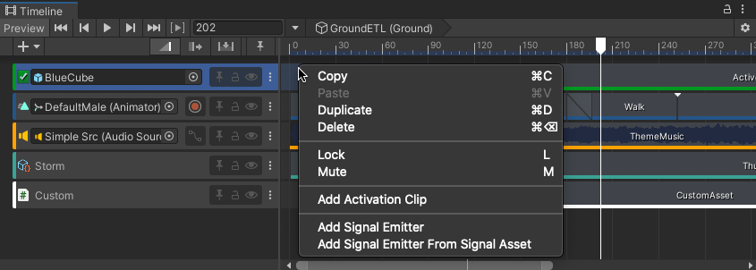

# Add clips

The Timeline window supports different methods of adding clips to tracks, depending on the type of track, where you click, where you drag, and whether a clip or track is already selected.

The quickest method to add a clip is to right-click on an empty area within a track and choose the appropriate Add option from the context menu. Depending on the track, the options for adding a clip change.

_Context menu for adding an Activation clip._

There are other ways to add clips:

* Select a clip option from the More (⋮) menu in the Track Header to add a clip at the location of the Timeline Playhead.
* Drag an animation source asset from the Project window to an empty area in the Timeline window to automatically create an Animation track and add an Animation clip.
* Drag an animation source asset from the Project window to an existing track in the Timeline window to add an Animation clip to the same track.
* Drag an audio source asset from the Project window to an empty area in the Timeline window to automatically create an Audio track and add an Audio clip.
* Drag a GameObject with a PlayableDirector component to create a Sub-Timeline instance. This automatically creates a Control track and adds a Control clip for the Sub-Timeline instance.
* Drag a Prefab from the Project window to an empty area in the Timeline window to add a Prefab instance to your Timeline instance. This automatically creates a Control track and adds a Control clip for the Prefab instance.
* Drag a GameObject with a Particle component to add a particle effect to your Timeline instance. This automatically creates a Control track and adds a Control clip for the duration of the Particle effect.

When you add a clip, the [selected Edit mode](clip-overview.md) determines how the added clip interacts with surrounding and intersecting clips. For example, if you add an Animation clip at the location of the Timeline Playhead, the added clip could blend, ripple, or replace clips on the same track.
