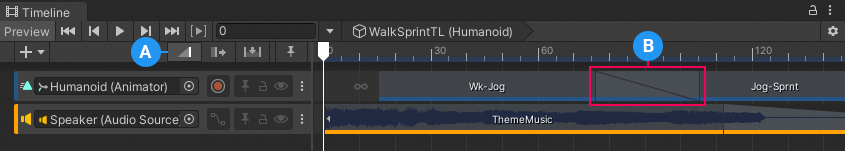
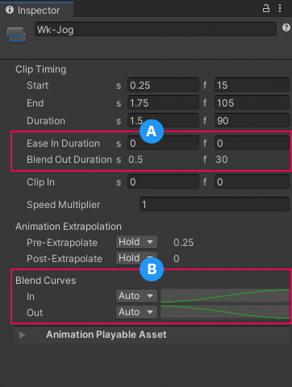
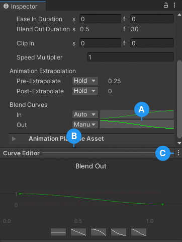

# Blend clips

Blend two clips on the same track to create a smooth transition between two Animation clips, two Audio clips, or two Playable clips. To blend two clips, select the Mix Edit mode and position or trim one clip until it overlaps an adjacent clip.

**(A)** The Mix Edit mode. 
**(B)** The blend area displays the transition between the outgoing clip and incoming clip. 

In a blend, the first clip is referred to as the **outgoing clip** and the second clip is referred to as the **incoming clip**. The area where the outgoing clip transitions to the incoming clip is referred to as the **blend area**. The blend area sets the duration of the transition.

Although the Content view represents a blend area as a single linear curve, the transition between clips is actually comprised of two blend curves. The blend curve for the outgoing clip is referred to as the **Blend Out** curve. The blend curve for the incoming clip is referred to as the **Blend In** curve. By default, each blend curve is automatically set to an ease-in and ease-out curve.

In the Inspector window, the label for the **Ease In Duration** or **Ease Out Duration** property changes to **Blend In Duration** or **Blend Out Duration** if either affects a blend. The blend duration properties cannot be edited when labelled **Blend In Duration** or **Blend Out Duration** because the duration of the blend area is only editable in the Content view.

**(A)** The **Ease Out Duration** property changes to **Blend Out Duration** because there is a blend between this clip and the next clip. 
**(B)** Use Blend Curves to customize the transition between clips. 

Use the **Blend Curves** in the Inspector window to change the shape for either the Blend In curve, labelled **In**, or Blend Out curve, labelled **Out**. The Inspector window only lets you edit the properties of one clip at a time. You cannot simultaneously customize both blend curves used in the same blend area.

To customize either the Blend Out curve or Blend In curve, use the drop-down menu to switch from **Auto** to **Manual**. With **Manual** selected, the Inspector window displays a preview of the blend curve. Click the Curve Preview to open the Curve Editor in the Inspector window.

**(A)** Curve Preview. 
**(B)** Click the Curve Editor header to expand or minimize the Curve Editor. 
**(C)** Use the Curve Editor menu to minimize, maximize, or open the Curve Editor in its own Preview window. 

Use the Curve Editor to customize the shape of the blend curve. By default, the blend curve includes a keyframe at the beginning of the curve and a keyframe at the end of the curve. The Curve Editor provides the following different methods of modifying the blend curve:

* Select a shape template from the bottom of the Curve Editor. The available shape templates differ depending on whether you are modifying the Blend In curve or the Blend Out curve.
* Double-click a location on the blend curve to add a new keyframe.
* Select a keyframe and use its tangent handles to adjust the interpolation between keyframes.
