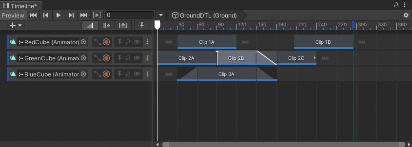
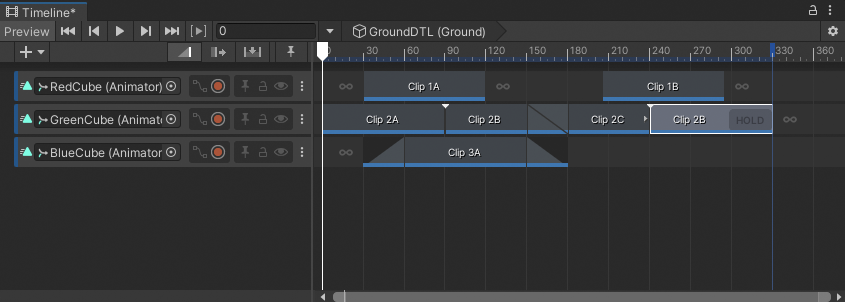
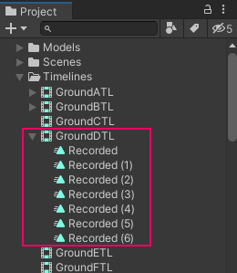

# Duplicate clips

There are many ways to duplicate clips in the Content view:

* Select a clip or multiple clips. Right-click in the Content view and choose **Duplicate** from the context menu.
* Select a clip or multiple clips. Hold Control (MacOS: Command) and press D.
* Right-click an unselected clip and choose **Duplicate** from the context menu.

Duplicating clips copies each selected clip and places the duplicates after the last clip on the same track. If you duplicate clips used in a blend or clips separated by a gap, the blend or gap is also duplicated.

If you duplicate an Animation clip that uses a recorded clip as its source asset, the recorded clip is also duplicated. This duplicate only appears in your Project window after you save the Scene or Project. For example, the following images demonstrates what happens if you duplicate an Animation clip named `Clip 2B` that uses the recorded clip named `Recorded (3)`.

_Select the `Clip 2B`, hold Control (MacOS: Command) and press D to duplicate_

_A duplicate Animation clip is placed at the end of the same track. The recorded clip associated with `Clip 2B` is also duplicated._

_The new `Recorded (6)` recorded clip appears in the Project window after you save the Scene or Project_
