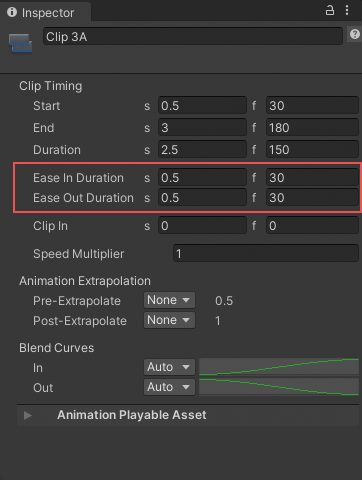
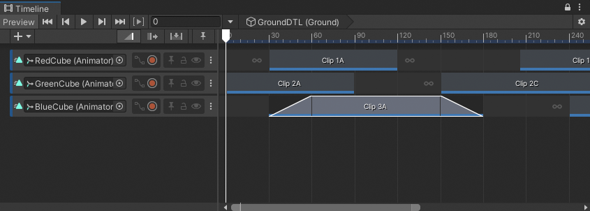
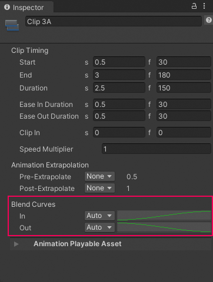
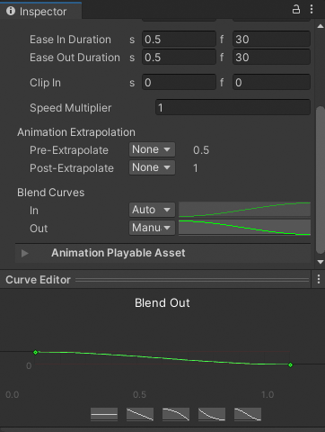

# Ease-in and ease-out clips

Ease-in and ease-out a clip to create a smooth transition between a clip and its surrounding gaps. To create an ease-in or ease-out transition, select a clip and, in the Inspector window, set either the **Ease In Duration** or the **Ease Out Duration**.

_Use Ease In Duration and Ease Out Duration to smoothly transition into and out of the selected clip._

Ease-in and ease-out transitions create different effects, depending on the track:

* On an Animation track or an Animation Override track, ease-in to an Animation clip to create a smooth transition between the animation in the gap before the clip and the Animation clip. Ease-out of an Animation clip to create a smooth transition between the Animation clip and the animation in the gap after the clip. To understand which animation occurs in the gap before or after an Animation clip, consult [Setting gap extrapolation](clip-gap-extrap.md).
* On an Audio track, ease-in to an Audio clip to fade in the volume of the audio waveform. Ease-out of an Audio clip to fade out the volume of the audio waveform specified by the Audio clip.
* On a Playable track, ease-in to a Playable clip to fade in its custom asset. Ease-out of a Playable clip to fade out its custom asset.

_Ease-in and ease-out an Animation clip to transition between its animation and its gaps_

Although the Content view represents each ease-in or ease-out transition as a linear curve, every transition is actually set to a gradual ease-in or ease-out curve by default. To change the shape of either the ease-in curve (labelled **In**) or the ease-out curve (labelled **Out**), use the **Blend Curves** in the Inspector window.

_Use the Blend Curves to customize ease-in or ease-out transitions_

To customize either the ease-in or ease-out transition, use the drop-down menu to switch from **Auto** to **Manual**. With **Manual** selected, the Inspector window displays a preview of the blend curve. Click the curve preview to open the Curve Editor below the Inspector window.

_Select Manual and click the preview to open the Curve Editor_

The Curve Editor is the same editor that is used to customize the shape of the blend curves when [blending between clips](clip-blend.md).

Note that the **Blend Curves** could affect the blend area used for blending between two clips. The label for the **Ease In Duration** or **Ease Out Duration** properties changes to **Blend In Duration** or **Blend Out Duration** if either effects a blend. In addition, the blend duration properties cannot be edited when they are labelled **Blend In Duration** or **Blend Out Duration** because the duration of the blend area is only editable in the Clips area.

When creating an ease-in or an ease-out transition with Animation clips, the Animation clip blends between its gaps and the Animation clip. The following factors affect the values of animated properties in the gaps surrounding an Animation clip:

* The [pre-extrapolate and post-extrapolate settings](clip-gap-extrap.md) for the Animation clip and for other Animation clips on the same track.
* Animation clips on other Animation tracks that are bound to the same GameObject.
* The position or animation of the GameObject in the Scene, outside the Timeline asset.
