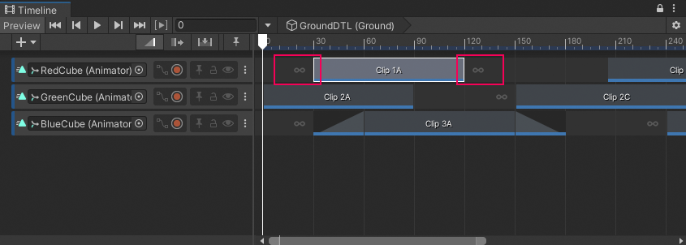
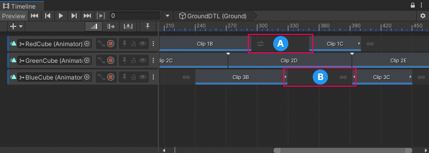
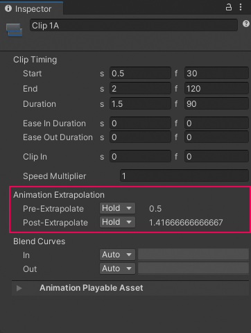
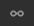
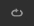
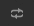
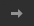

# Set gap extrapolation

Gap extrapolation refers to how an Animation track approximates animation data in the gaps before and after an Animation clip.

The main purpose for extrapolating animation data in the gaps between Animation clips is to avoid animation anomalies. Depending on the GameObject bound to the Animation track, these anomalies could be a GameObject jumping between two transformations, or a humanoid jumping between different poses.

Each Animation clip has two gap extrapolation properties:
* **Pre-Extrapolate**, which controls how animation data is approximated in the gap before an Animation clip.
* **Post-Extrapolate**, which controls how animation data extends in the gap after an Animation clip.

By default, Timeline sets both extrapolation properties to **Hold**. This sets the gap before the Animation clip to the animation on the first frame, and the gap after the Animation clip to the animation on the last frame. Each gap holds the animation at a certain frame. Icons before and after an Animation clip indicate the selected extrapolation modes.

_Icons indicate the pre-extrapolate and post-extrapolate modes_

When an Animation track contains a gap between two Animation clips, the **Post-Extrapolate** property of the left clip sets the gap extrapolation by default. If the **Post-Extrapolate** property of the clip to the left of a gap is set to **None**, the **Pre-Extrapolate** property of the right clip sets the gap extrapolation. Icons before and after Animation clips indicate whether the extrapolation for a gap is taken from the **Post-Extrapolate** property of the clip to the left or from the **Pre-Extrapolate** property of the clip to the right.

**(A)** The gap extrapolation is taken from the the Post-Extrapolate property of the left clip. 
**(B)** The gap extrapolation is taken from the Pre-Extrapolate property of the right clip.

To change the Pre-Extrapolate and Post-Extrapolate properties, select the Animation clip and use the Animation Extrapolation properties in the Inspector window.

_Use Pre-Extrapolate and Post-Extrapolate to set the extrapolation modes for the selected Animation clip_

The Pre-Extrapolate property is hidden when one of the following is true:

* The gap before the Animation clip is set by the Post-Extrapolation mode of the previous clip.
* There is no gap before the Animation clip.

Use the Pre-Extrapolation property to set the gap extrapolation of the gap before the selected Animation clip. The following table describes each pre-extrapolation mode.

|**Icon/Name** |**Description** |
|:---|:---|
|**None** (no icon)|Turns off pre-extrapolation. In the gap before the selected Animation clip, the GameObject uses its transform, pose, or state from the Scene. Select **None** if, for example, you want to create an ease-in between the motion of a GameObject in the Scene and an Animation clip. Consult [Easing-in and Easing-out Clips](clip-ease.md).|
| **Hold** (default)|In the gap before the selected Animation clip, the GameObject bound to the Animation track uses the values assigned at the start of the Animation clip.|
| **Loop**|Turns off pre-extrapolation. In the gap before the selected Animation clip, the GameObject uses its transform, pose, or state from the Scene. Select **None** if, for example, you want to create an ease-in between the motion of a GameObject in the Scene and an Animation clip. Consult [Easing-in and Easing-out Clips](clip-ease.md) for details.|
| **Ping Pong**|In the gap before the selected Animation clip, the GameObject bound to the Animation track repeats the entire animation forwards, then backwards. Use the **Clip In** property to offset the start of the loop. Changing the **Clip In** property affects the start of the loop when looping forward, and the end of the loop when looping backwards.|
| **Continue**|In the gap before the selected Animation clip, the GameObject bound to the Animation track either holds or loops the animation based on the settings of its source asset. For example, if the selected Animation clip uses the motion file `Recorded(2)` as its source asset and `Recorded(2)` is set to **Loop**, then selecting **Continue** loops the animation according to the `Recorded(2)` Loop Time settings.|

Use the Post-Extrapolate property to set the gap extrapolation of the gap after the selected Animation clip. The following table describes each post-extrapolation mode.

|**Icon/Name** |**Description** |
|:---|:---|
|**None** (no icon)|Turns off post-extrapolation. In the gap after the selected Animation clip, the GameObject uses its transform, pose, or state from the Scene. Selecting **None** is useful if, for example, you want to create an ease-out between an Animation clip and the motion of a GameObject in the Scene. Consult [Easing-in and Easing-out Clips](clip-ease.md) for details.|
| **Hold** (default)|In the gap after the selected Animation clip, the GameObject bound to the Animation track uses the values assigned at the end of the Animation clip.|
| **Loop**|In the gap after the selected Animation clip, the GameObject bound to the Animation track repeats the entire animation as a forward loop: from start to end. To offset the start of the loop, use the **Clip In** property..|
| **Ping Pong**|In the gap after the selected Animation clip, the GameObject bound to the Animation track repeats the entire animation forwards, then backwards. Use the **Clip In** property to offset the start of the loop. Changing the **Clip In** property affects the start of the loop when looping forward, and the end of the loop when looping backwards.|
| **Continue**|In the gap after the selected Animation clip, the GameObject bound to the Animation track either holds or loops the animation based on the settings of its source asset. For example, if the selected Animation clip uses the motion file `Recorded(2)` as its source asset and `Recorded(2)` is set to **Loop**, then selecting **Continue** loops the animation according to the `Recorded(2)` Loop Time settings.|
