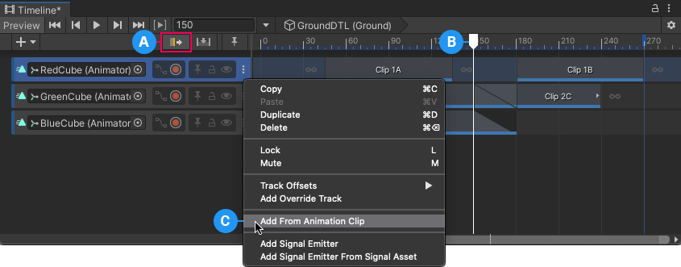
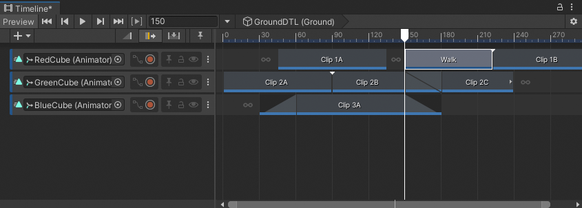

# Insert clips

The Timeline window supports different methods of inserting clips depending on the type of track, where you click, and whether a clip or track is already selected. In the Timeline window, inserting clips refers to adding and making space for a clip without blending or replacing intersecting clips.

To accurately insert a clip, select Ripple mode as the Edit mode, and position the Timeline Playhead to set the insertion point. Select **Add From Animation Clip** from the More (⋮) menu for the track where you want to insert the clip.

_Accurately insert a clip with the Ripple mode (A), the Timeline Playhead (B), and Add From Animation Clip in the More (⋮) menu (C)_

In the above example, the Timeline Playhead is the insertion point. You can specify the insertion point using these other methods:

* Right-click within a gap and add a clip with the context menu. The insertion point is where you right-click.
* Drag a source asset (animation or audio) to a track in the Content view. The insertion point is where you release dragging.

The location of the insertion point determines where the clip is inserted and how it affects the other clips and gaps on the same track:

* If the insertion point intersects a clip, the inserted clip is added at the insertion point. The intersected clip, and all subsequent clips and gaps, are rippled after the inserted clip.
* If the insertion point is within a gap and there is enough space between the insertion point and the next clip, then the inserted clip is added to the gap. The other clips on the track are not affected.
* If the insertion point is within a gap and the inserted clip overlaps the next clip, the inserted clips is added at the insertion point. The next clip, and all subsequent clips and gaps, are rippled to accommodate the inserted clip.

_For example, inserting a clip at the Timeline Playhead, in the gap between Clip 1A and Clip 1B, ripples Clip 1B to accommodate the 72 frame Walk clip_
