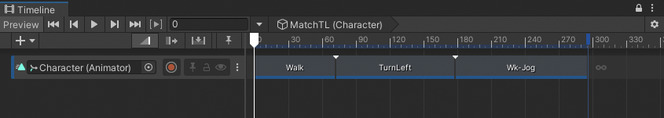
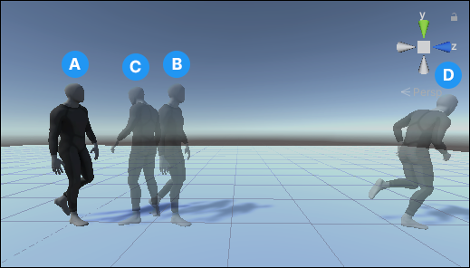
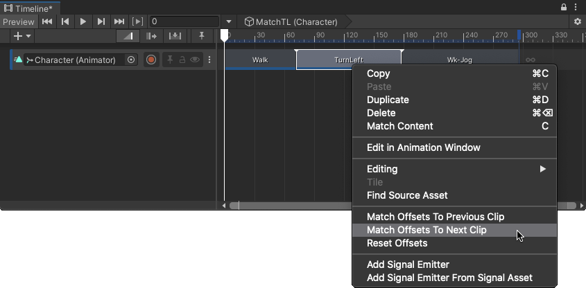
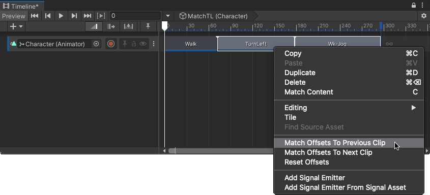

# Match clip offsets

Every Animation clip contains keyframe animation, or motion, that animates a GameObject, or character, bound to the Animation track.

When you add an Animation clip to an Animation track, its animation or motion does not automatically begin where the previous clip ends. By default, each Animation clip begins at the position and rotation of the GameObject, or character, at the start of the Timeline instance.

For example, three Animation clips create an animation sequence where a character walks (`Walk`), turns around and stops (`TurnLeft`), then walks to a jog (`Wk-Jog`).

_An animation sequence of three Animation clips: `Walk`, `TurnLeft`, `Wk-Jog`._

When first added, each Animation clip starts at the position and rotation of the character at the start of the Timeline instance. The following illustration shows the end of each Animation clip.

**(A)** The start of the Timeline instance. 
**(B)** The end of the `Walk` Animation clip. 
**(C)** The end of the `TurnLeft` Animation clip. 
**(D)** The end of the `Wk-Jog` Animation clip. 

For an animation sequence to flow seamlessly, the start position and rotation of each Animation clip must match the end position and rotation of the previous Animation clip.

These position and rotation offsets are named **Clip Transform Offsets** and they [can be set manually in the Inspector window](insp-clip-anim.md) or automatically. The following sections describe how to automatically set clip offsets by matching two or more Animation clips.

## Match two clips

To match the clip offsets between two clips, right-click the Animation clip that you want to match. From the context menu, select either **Match Offsets to Previous Clip** or **Match Offsets to Next Clip**.

_Matching an Animation clip with the next clip_

For example, right-click the middle Animation clip, named `TurnLeft`, and choose **Match Offsets To Next Clip** to match its offsets to the next clip. This selects the clip, then matches the end of the middle clip with the start of next clip.

The context menu only displays the match options available for the selected Animation clip. For example, if the first clip, `Walk` is selected, only the **Match Offsets to Next Clip** menu item is available.

## Match many clips

To match the clip offsets of many clips, select the adjacent Animation clips that you want to match and right-click one of the selected clips. From the context menu, select either **Match Offsets to Previous Clip** or **Match Offsets to Next Clip**.

_Matching many clips with previous clips_

For example, select the `TurnLeft` and `Wk-Jog` clips. Right-click one of the selected clips and choose **Match Offsets to Previous Clip**. This matches the `TurnLeft` clip with the previous `Walk` clip and matches the `Wk-Jog` clip with the previous `RunLeft` clip.
