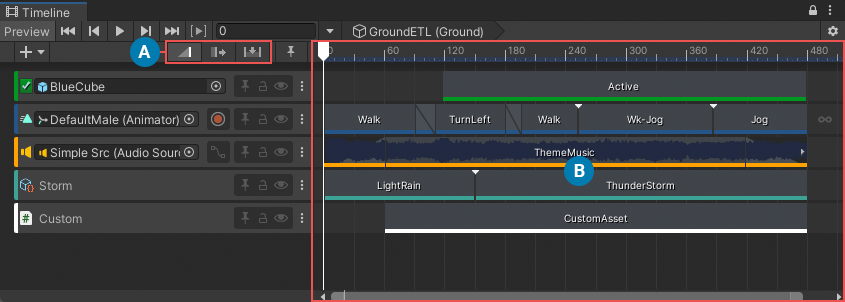
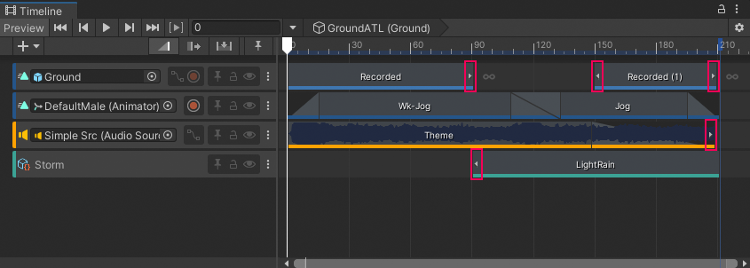
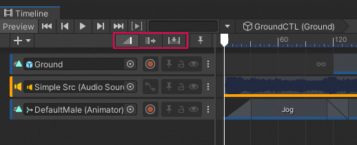
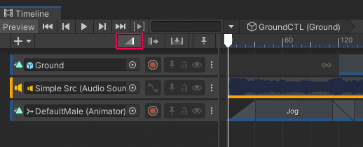
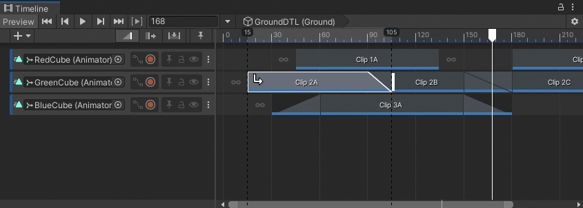
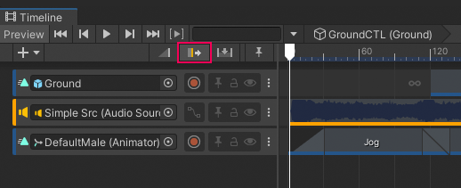
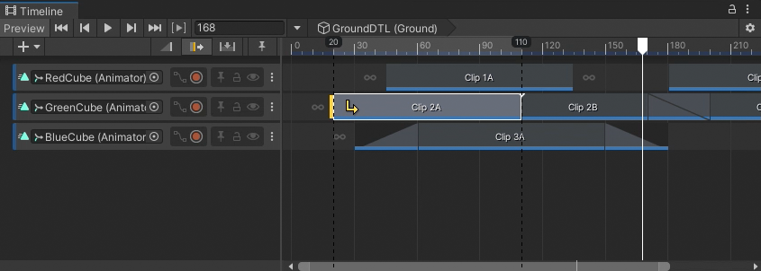
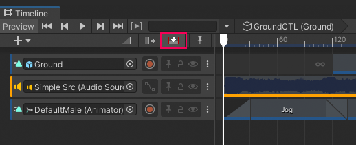

# Content view and Edit modes

Use the Content view to add, position, and manage the clips and markers on each track in the Timeline asset or Timeline instance. The selected Edit mode determines how clips and markers interact with each other when you add, position, trim, resize, or delete them.

**(A)** Edit modes 
**(B)** Content view 

## Clips and the Content view

In the Content view, each clip has a colored accent line that identifies the type of clip:

* Activation clips are green.
* Animation clips are blue.
* Audio clips are orange.
* Control clips are turquoise.
* Playable clips are white.

A clip with a source asset, such as an Animation clip or an Audio clip, displays arrows that indicate when the clip excludes part of its source animation, audio waveform, or other source content.

For example, if an Animation clip uses only part of its full animation, white arrows indicate that keyframes exists before the start or after the end of the clip.

_Small arrows (red) indicate that data exists before the start or after the end of the area defined by the clip_

There are many ways to resize a clip and view its hidden source data:
* Drag the start or end of the clip to [trim its start or end](clip-trim.md).
* Select the clip and modify its clip timing properties in the Inspector window.
* Right-click the clip and choose **Match Content** from the context menu.

When you resize a clip, the selected Edit mode determines how the surrounding clips are affected.

## Clips and Edit modes

Select an Edit mode to choose how clips are added, positioned, and trimmed in the Content view. The Edit mode is also used when you modify clip timing properties in the Inspector window. There are three Edit modes that affect most clip editing features.

_Edit modes are [Mix mode](#mixmode) (default and selected), [Ripple mode](#ripplemode), and [Replace mode](#replacemode)_

You can temporarily switch between Edit modes. This is useful if, for example, you want to temporarily use Ripple mode to offset the content of a track while you position clips. To temporarily switch between Edit modes, hold down the following keyboard keys:

* Hold down 1 to temporarily switch to Mix mode.
* Hold down 2 to temporarily switch to Ripple mode.
* Hold down 3 to temporarily switch to Replace mode.

### Mix mode

Use Mix mode to add, position, and trim clips without moving or replacing adjacent clips. Mix mode creates blends between intersecting clips. Mix mode is the default Edit mode.

_Timeline window with Mix mode as the selected Edit mode._

In Mix mode, when you hover over a clip in the Content view, the cursor changes to indicate the action that you can perform. The action depends on the part of the clip that you hover over:

* When you hover over the start of a clip, the cursor changes to a trim cursor. The trim cursor indicates the area to drag to trim the start of the clip.
* When you hover over the middle of a clip, the cursor changes to a position cursor. The position cursor indicates the area to drag to position the clip.
* When you hover over the end of a selected clip, the cursor changes to a trim cursor. The trim cursor indicates the area to drag to trim the end of the clip.

In Mix mode, if you drag to trim or position a clip and it intersects another clip, the cursor changes to a white arrow that points towards the blend being created. There are three possible cursors depending on whether the blend is created at the beginning of the clip, at the end of the clip, or at both the beginning and end of the clip. The clip and the blend are also outlined in white.

_For example, the white arrow cursor and white outline indicates that dragging Clip `2A` to the right creates a blend, at the end of the clip, between Clip `2A` and Clip `2B`._

### Ripple mode

Use Ripple mode to add, position, and trim a clip while affecting the subsequent clips on the same track. Positioning or trimming clips in Ripple mode preserves the gaps between subsequent clips.

_Timeline window with Ripple mode as the selected Edit mode._

In Ripple mode, when you hover over a clip in the Content view, the cursor changes to indicate the action that you can perform. The actions and areas are similar to Mix mode:

* When you hover over the start of a clip, the cursor changes to a trim cursor. The trim cursor indicates the area to drag to trim the clip relative to its start.
* When you hover over the middle of a clip, the cursor changes to a position cursor. The position cursor indicates the area to drag to position the clip.
* When you hover over the end of a clip, the cursor changes to a trim cursor. The trim cursor indicates the area to drag to trim the clip relative to its end.

In Ripple mode, when you drag to trim or position a clip, the cursor switches to a yellow arrow that points towards the affected clips and gaps. A yellow line indicates the ripple point. When you drag to trim a clip, dragging left and right changes the duration of the selected clip and repositions subsequent clips and gaps after the ripple point.

_For example, the yellow arrow cursor indicates that dragging Clip `2A` affects the clips and gaps to the right, after the ripple point._

### Replace mode

Use Replace mode to add, position, and trim a clip while cutting or replacing intersecting clips.

_Timeline window with Replace mode as the selected Edit mode._

In Replace mode, when you hover over a clip in the Content view, the cursor changes to indicate the action that you can perform. The actions and areas are similar to Mix mode:

* When you hover over the start of a selected clip, the cursor changes to a trim cursor. The trim cursor indicates the area to drag to trim the clip relative to its start.
* When you hover over the middle of a clip, the cursor changes to a position cursor. The position cursor indicates the area to drag to position the clip.
* When you hover over the end of a clip, the cursor changes to a trim cursor. The trim cursor indicates the area to drag to trim the clip relative to its end.

In Replace mode, when you drag to position a clip, the clip becomes transparent so that you can view overlapping clips. If the clip being positioned overlaps other clips, releasing the clip cuts the underlying clip at each overlap.

In Replace mode, when you drag to trim a clip and it intersects another clip, the cursor changes to a red arrow and a red replacement line indicates where clips overlap. Releasing the trim cuts the overlapping clip at the red replacement line.
