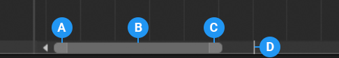

# Pan and zoom the Content view

Use either the keyboard or the zoombar to pan and zoom the Content view. There are many ways to pan, zoom, or frame clips and markers in the Content view:

* To pan, either middle-click and drag, or hold Alt (MacOS: Option) and drag.
* To frame selected clips and markers, [select clips](clip-select.md) then press F.
* To frame all clips and markers, press A. Or, press F with no clips or markers selected.
* To zoom horizontally, move the scroll-wheel. Or, press = to zoom-in and - to zoom-out.
* To zoom vertically, hold Control (MacOS: Command) and move the scroll-wheel.

When you horizontally zoom the Content view, the zoombar indicates the level of zoom. The zoombar is the horizontal bar at the bottom of the Content view that zooms and pans the section of the Timeline instance or Timeline asset displayed in the Content view.

_The Timeline zoombar_

**(A)** Left zoombar handle 
**(B)** The zoombar thumb is the area between the two zoombar handles 
**(C)** Right zoombar handle 
**(D)** The white line indicates the location of the Timeline Playhead. Use this line to view the location of the Timeline Playhead relative to the zoom level and the part of the Timeline instance displayed in the Content view. The Timeline Playhead, and the white line, only appears for Timeline instances. 

There are many ways to pan and zoom with the Timeline zoombar:

* To pan, drag the zoombar thumb left or right.
* To jump to a section of the Timeline instance or Timeline asset, click an empty area of the scrollbar, on either side of the zoombar.
* To zoom-in or zoom-out, drag either zoombar handle. Dragging a zoombar handle also resizes the zoombar thumb.
