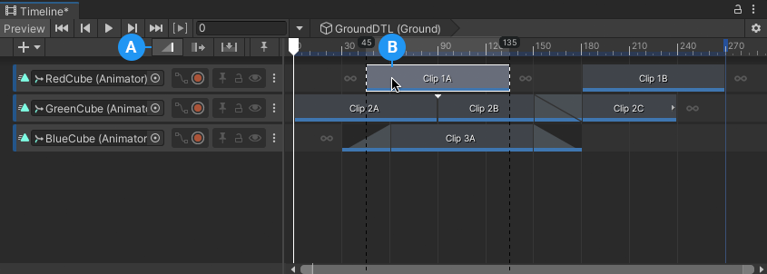
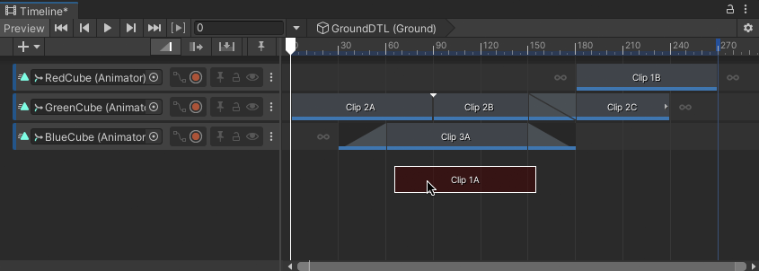
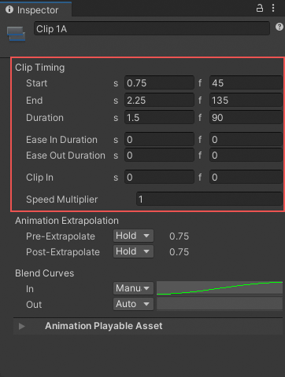
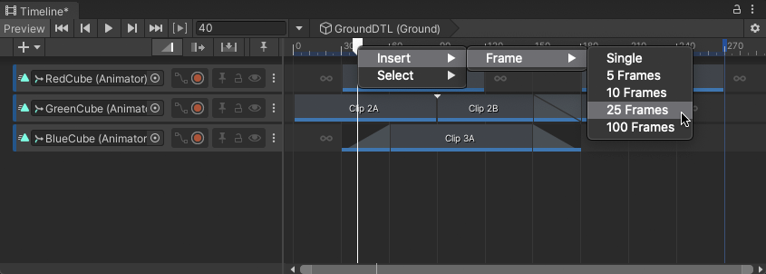
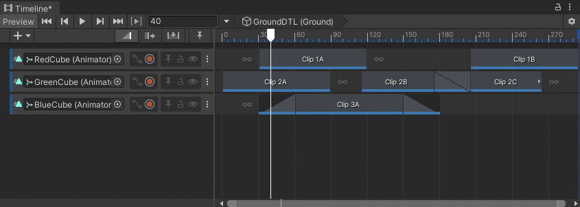

# Position clips

To position a clip, select Mix mode as the Edit mode. Select a clip and hover over it. When the cursor is a standard arrow cursor, click and drag the clip to its new position.

While dragging, black lines indicate the selection of clips being positioned. The Timeline ruler displays the start time and end time of the selected clips being positioned.

_Select Mix mode (A). Select and drag to position a clip (B)._

By default, when you drag to position clips, both Snap to Frame and Edge Snap are enabled in the Content view. You can change these snap settings in the [Timeline Options](tl-options.md) menu.

You can also move a clip to another track of the same type. Drag the clip off of its current track and a white ghost indicates where the clip will be moved. If you drag a clip to an area where the clip cannot be placed, the ghost changes to red indicating that you cannot release the clip in that area. For example, you cannot drag a clip where there is no track.

_The ghost of the selection being moved is drawn in red if you attempt to move a clip to an invalid area_

You can position a selection of clips on the same track, or on different tracks. You are not limited to positioning one clip at a time. The same edge snapping rules and invalid area restrictions apply when positioning a selection of clips on many tracks.

## Position clips with the Inspector window

Use the [Inspector window to accurately position clips](insp-clip.md). To position a clip with the Inspector window, select a clip and use the Clip Timing properties to change its **Start** property.

_Clip Timing properties for an Animation clip_

The impact that changing the Start value has on adjacent clips depends on the selected Edit mode.

## Position clips in different Edit modes

You are not restricted to positioning clips with Mix mode as the selected Edit mode. You can also position clips in Ripple mode and in Replace mode. The difference is the impact each Edit mode has on adjacent clips on the tracks where clips are being moved:

* Position clips in Mix mode to create blends between intersecting clips.
* Position clips in Ripple mode to ripple subsequent clips, respecting the gaps between clips.
* Position clips in Replace mode to cut or replace intersecting clips.

## Position clips with the Timeline Playhead

You can position clips by inserting frames at the position of the Timeline Playhead. To do this, follow these steps:

1. move the Timeline Playhead to where you want to insert frames.

  

  _For example, to insert frames starting at frame 40, move the Timeline Playhead to frame 40_

2. Right-click the Timeline Playhead on the Timeline ruler above the Content view, select **Insert** &gt; **Frame**, and a number of frames.

  

  _To insert 25 frames, right-click the Timeline Playhead and choose **Insert** &gt; **Frame** &gt; **25 Frames**_

  This inserts frames in the Timeline instance at the position of the Timeline Playhead. Inserting frames only repositions the clips that start after the position of the Timeline Playhead.

  

  _In this example, inserting 25 frames at frame 40 affects Clip `1B`, Clip `2B`, and Clip `2C`._
