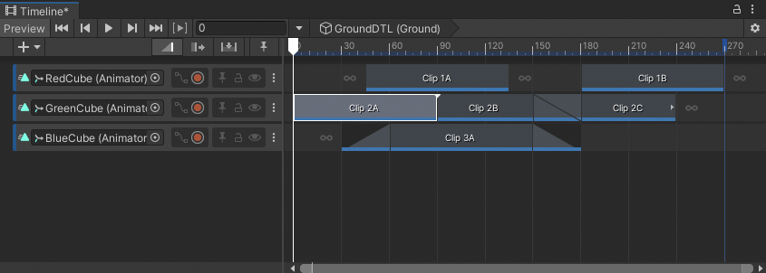
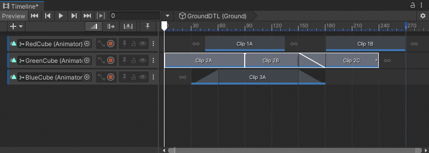
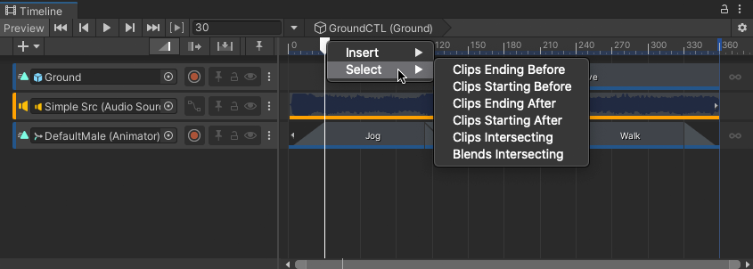

# Select clips

The Timeline window supports many different methods of selecting clips depending on where you click, where you drag, and whether a clip or track is already selected.

The easiest method is to click a clip to select it. The Content view displays the selected clip with a white border, including its blends. Selecting a clip deselects all other tracks or clips.

Selecting a clip also displays its properties in the Inspector window. The clip properties change depending on the type of clip and whether multiple clips are selected. Consult [Setting Clip properties](insp-clip.md) for details.

## Select many clips

Hold Shift and click to select contiguous clips vertically on different tracks or horizontally on the same track. For example, to select three contiguous clips on the same track, select the first clip, then hold Shift and click the third clip. All three clips are selected.

_Click to select the first clip, `2A`_

_Shift-click the third clip, `2C`, to select contiguous clips (`2A`, `2B`, and `2C`) on the same track_

Hold Control (MacOS: Command) and click to select discontiguous clips. Hold Control (MacOS: Command) and click a selected clip to deselect it.

## Select clips with a selection rectangle

Click and drag on an empty area in the Content view to draw a selection rectangle. This selects all clips inside or that intersect the rectangle. Hold Shift and draw a selection rectangle to add clips to the current selection.

## Select clips with the Tab key

You can also press the Tab key to select clips. The behavior of the Tab key changes depending on the current selection:

* If a track is selected, press Tab to select the first clip on the selected track.
* If many discontiguous tracks are selected, press Tab to select the first clip on the last selected track.
* If a clip is selected, press Tab to [select its track](trk-select.md).
* If there are no clips or tracks selected, press Tab to select the first clip on the first track.

## Select clips with arrow keys

Use the arrow keys to change the selected clips. The behavior and results depend on the current selection and which modifier keys you press:

* If nothing is selected in the Timeline window, press the Tab, Up arrow, or Down arrow key to select the first clip on the first track.
* If a clip is selected, press the Left arrow key to select the previous clip. If the selected clip is the first clip on the track, the Left arrow key selects the track.
* If a clip is selected, press the Right arrow key to select the next clip. Press the Up arrow key to select the closest clip on the previous track. Press the Down arrow key to select the closest clip on the next track.
* Hold Shift and press either the Left arrow key or Right arrow key to add or remove clips from the selection of clips. Whether a clip is added to or removed from the selection of clips is relative to the first selected clip. This selection method only selects or unselects clips on the same track.

When using arrow keys to change selected clips, the Content view pans to display the most recently selected clip if it outside the Content view. For example, if the selected clip is framed in the Content view and you press the Right arrow key to select the next clip that is outside the Content view, the Content view pans to display the start of the selected clip.

## Select clips with the Timeline Playhead

You can also select clips with the Timeline Playhead. Right-click the Timeline Playhead and choose a selection option. This selects clips that either start after, start before, end after, end before, or intersect the Timeline Playhead. Clips are selected on all tracks.

_Right-click the Timeline Playhead and choose **Select** for more clip selection options_
