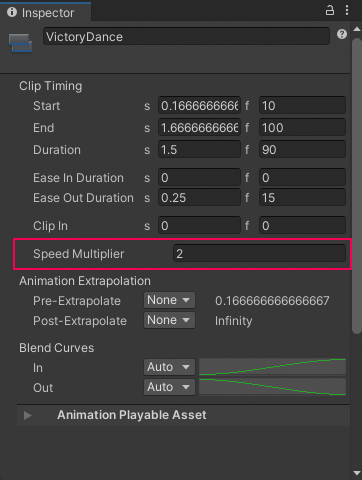
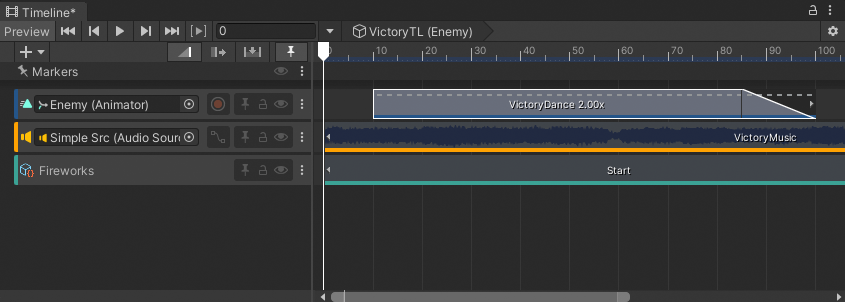

# Change clip play speed

Change the clip play speed to accelerate or decelerate its audio, animation, or particle effect. Changing the clip play speed affects the duration of the clip. You can only change the play speed for Animation clips, Audio clips, and Control clips.

To change the clip play speed, first, select the Edit mode to determine how other clips on the same track are affected:

* If the change in duration results in two clips that overlap each other:
    * Select Mix mode to create a blend.
    * Select Replace mode to cut or remove intersecting clips.
* Select Ripple mode to reposition the clips that start after the clip being sped up or slowed down. Ripple mode also preserves the gaps between clips.

Select the clip and set the **Speed Multiplier** property in the Inspector window. The **Speed Multiplier** property displays the play speed as a multiplier of the original clip speed.

_Speed Multiplier in the Inspector window_

When the **Speed Multiplier** is set to 1, the clip plays at its original speed. To double the play speed, change the **Speed Multiplier** to 2. This changes the duration of the clip. For example, doubling the play speed of a 180 frame Animation clip changes its duration to 90 frames.

_A short-dashed line and multiplication factor of 2.00x indicates a clip playing at double its original speed_

There are other ways to change the play speed of a clip:

* Right-click the clip and choose **Editing** &gt; **Double Speed** to halve the clip duration. The clip plays at twice its current speed. A short-dashed line and a multiplication factor indicates an accelerated clip. Doubling the clip speed sets the **Speed Multiplier** property to double its current value.
* Right-click the clip and choose **Editing** &gt; **Half Speed** to double the clip duration. The clip plays at half its current speed. A long-dashed line and multiplication factor indicates a decelerated clip. Halving the clip speed sets the **Speed Multiplier** property to half its current value.
* Right-click the clip and choose **Editing** &gt; **Reset Speed** to reset the clip to its original speed. This is the original duration of the clip. Resetting the clip speed sets the **Speed Multiplier** property to 1.

**Note:** The clip play speed only recognizes positive values 0.001 and greater. You cannot set the clip play speed to a negative value. This does not, for example, play an Animation clip in reverse.
