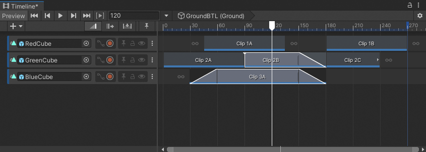
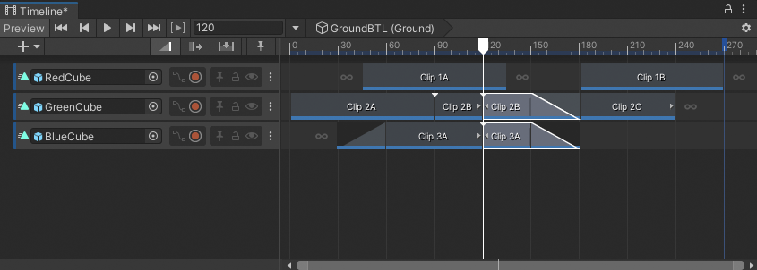

# Split clips

You can split a clip into two identical clips that have different start points, end points, and durations.

To split a clip:
1. Select the clip.
1. Position the playhead where you want to split the clip.
1. Either right-click the clip and choose **Editing** &gt; **Split**, or press S.

Selected clips that intersect the playhead are split into separate clips. You can position, trim, and edit split clips independently.

_Select the clips to be split, position the playhead where you want the split to occur, and press S_

_Selected clips are split where each clip intersects the playhead_

If a split clip is part of a blend, or if the split is performed within a blend, Timeline copies the blend settings to the split clips.

If you split an Animation clip that uses a recorded clip as its source asset, the recorded clip is also copied. This copied recorded clip only appears in your Project window after you save the Scene or Project.
