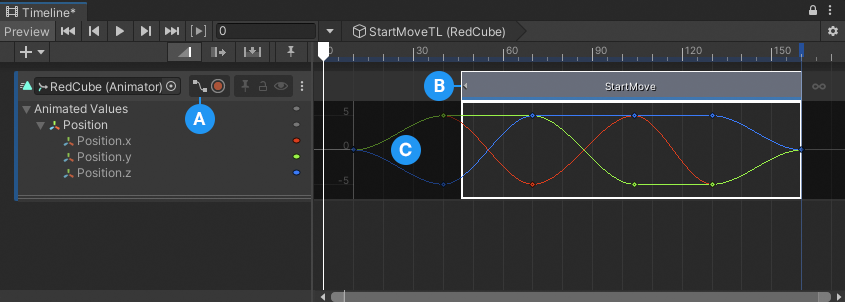
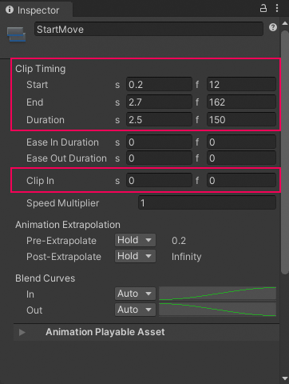
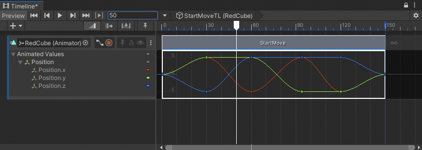
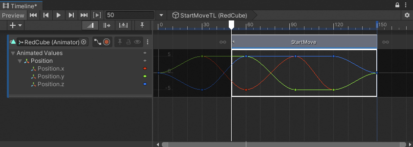
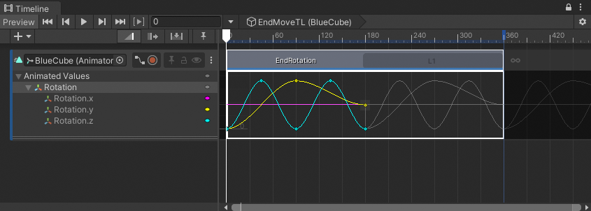
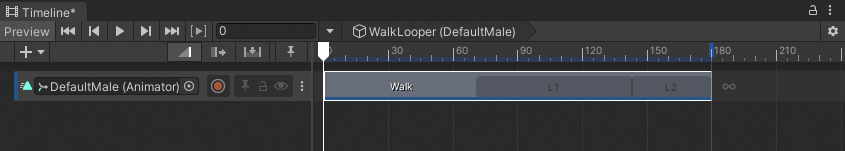
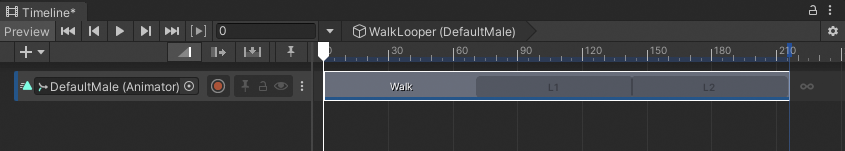
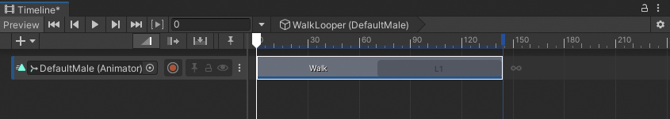

# Trim clips

Trimming a clip cuts off a portion of the clip at its start or end. To trim a clip, select the Mix Edit mode, hover over the start or end of the clip until the trim cursor appears, then drag the trim cursor to modify the start or end of the clip.

If you trim an Animation clip, an Audio clip, or a Control clip, this selects the portion of the source asset that the clip uses.

For example, trim the start of an Animation clip to modify its start and offset. This selects the section of the source asset to use. Trim the end of an Animation clip to modify its duration. If an Animation clip's source asset is keyframe animation, use the Curves view to display the unused section of the source asset.

**(A)** Curves view. 
**(B)** If the area defined by an Animation clip, Audio clip, or Control clip only uses part of its source asset, the clip displays a white arrow to indicate that unused content exists before the start or after the end of the clip. 
**(C)** The trimmed keyframe animation displays outside of the Animation clip. 

Trimming a clip is non-destructive. Trim the clip again to modify its start or end to include the animation, audio waveform, or other source content cut during a previous trim. You can also [reset a clip](clip-reset.md) to undo trims and other edits.

## Trim with the Inspector window

You can select a clip to display its [Clip properties](insp-clip.md) in the Inspector window. Use the **Start**, **End**, **Duration**, and **Clip In** (offset) properties to modify a clip to exact values.

_Position and trim a clip by adjusting its Start, End, Duration, and Clip In properties in the Inspector window_

## Trim with the Timeline Playhead

You can trim a clip based on the location of the Timeline Playhead. To trim using the playhead, do the following:
1. Position the playhead within the clip to be trimmed.
2. Right-click the clip and choose either **Editing** &gt; **Trim Start** or **Editing** &gt; **Trim End**.

**Trim Start** trims the start of the clip to the playhead. **Trim End** trims the end of the clip to the playhead.

_For example, move the Timeline Playhead within the clip_

_Right-click the clip and choose **Editing** &gt; **Trim Start** to trim the start of the clip to the playhead_

If you select clips on multiple tracks, Timeline only trims the selected clips that intersect the playhead.

## Trim to hold or loop clips

If you trim the end of an Animation clip, Audio clip, or Control clip past the end of its source asset, the extra clip area either holds or loops its content.

When the extra clip area loops, the entire source asset loops. Each full loop is labelled sequentially as L1, L2, L3, and so on. If the source asset is recorded keyframe animation, you can also view the looping animation curves in the Curves view.

For example, an Animation clip named `EndRotation` is set to loop. Trimming the end of the `EndRotation` clip past the end of the `Recorded(2)` source asset loops its content.

_The `EndRotation` clip loops once, indicated by L1. Its animation curve loops and is drawn in white._

Whether the extra clip area holds or loops depends on the **Loop** property in the [Animation Clip Properties](insp-clip-anim.md) or the [Audio Clip Properties](insp-clip-audio.md).

For [Control clips](insp-clip-control.md), the properties that determine whether the extra clip area holds or loops depends on whether the clip controls a Sub-Timeline instance, Particle System, Prefab instance, or an ITimeControl Script.

## Special trim options for looping clips

The Timeline window provides special trimming options for clips with loops. These special trim options either remove or complete the last partial loop.

For example, an Animation clip is set to loop and its duration is just over twice longer than its source asset. This results in the Walk clip with one full loop and one partial loop.

_L1 indicates a complete loop. The clip ends in the middle of the second partial loop, L2._

To extend the end of the clip and complete the partial loop, right-click the clip and choose **Editing** &gt; **Complete Last Loop**. To trim the clip at the last complete loop, right-click the clip and choose **Editing** &gt; **Trim Last Loop**.

_The result of **Complete Last Loop**_

_The result of **Trim Last Loop**_
