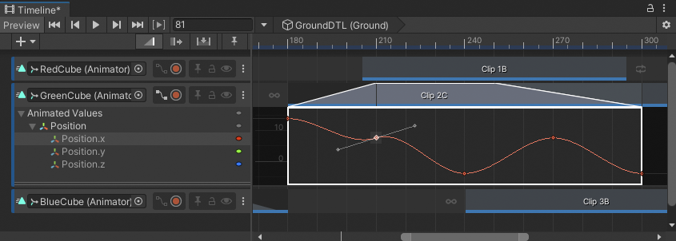
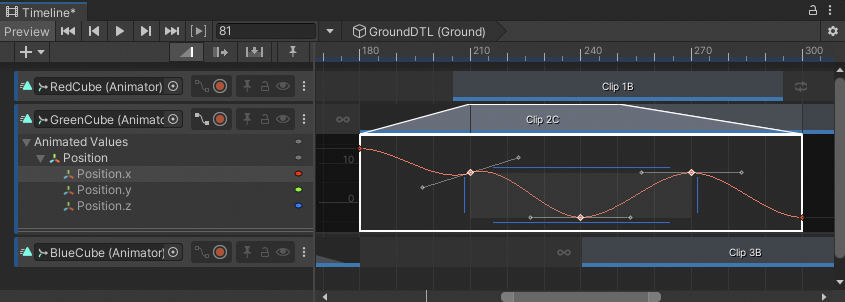

# Manage keyframes

This topic summarizes how to use the Curves view to add, select, step between, edit, and delete keyframes on an animation curve. The functionality described in this topic is similar to [manipulating keyframes in Curves mode](https://docs.unity3d.com/Manual/animeditor-KeyManipulationInCurvesMode.html) in the Animation window.

## Add keyframes

The Curves view provides the following ways to add keyframes:

* Right-click on an animation curve and choose **Add Key**. This method adds a keyframe at the location of the right-click.
* Double-click on an animation curve. This method adds a keyframe at the location of the Double-click.

## Select keyframes

Click to select a single keyframe. Selecting a keyframe deselects all other selected keyframes.

When you select a keyframe, the Curves view displays the keyframe with its tangents. Each keyframe has either one or two tangents that you can use to change the shape of the animation curve. For more information, consult [Tangent modes and types](curves-tangents.md).

To select contiguous keyframes along the same animation curve, click the first keyframe, then hold Shift and click the last keyframe.

_Click to select a single keyframe. A selected keyframe displays its tangents._

_Hold Shift and click a keyframe to select contiguous keyframes_

There are others ways to select and deselect keyframes:

* Hold Control (MacOS: Command) and click to select discontiguous keyframes. Hold Control (MacOS: Command) and click a selected keyframe to deselect it.
* Click and drag on an empty area in the Curves view to draw a selection rectangle. This selects all keyframes within the rectangle.
* Hold Shift while drawing a selection rectangle to add keyframes to the current selection.
* Hold Control (MacOS: Command) and double-click a keyframe to select all keyframes on the same animation curve.
* Click in an empty area in the Curves view to deselect all selected keyframes. This empty area cannot be within a selection of keyframes.

## Move the Timeline Playhead between keyframes

After you select at least one animation curve in the Curves view, use one of the following methods to move the Timeline Playhead between keyframes:
* Hold Shift and Control (MacOS: Command), and press Period (.) to move the Timeline Playhead to the next keyframe.
* Hold Shift and Control (MacOS: Command), and press Comma (,) to move the Timeline Playhead to the previous keyframe.

## Edit keyframes

Edit a keyframe to change its time, value, or both. The Curves view provides the following different ways to edit a keyframe:

* Right-click a keyframe and choose **Edit** from the context menu to enter specific values for time and value.
* Select a keyframe and press Enter to enter specific values for time and value.
* Select and drag a keyframe to change its time and value.
* Drag a keyframe vertically, then press Shift while dragging to snap the keyframe on the vertical axis. This changes the value but not the time of the keyframe.
* Drag a keyframe horizontally, then press Shift while dragging to snap the keyframe on the horizontal axis. This changes the time of the keyframe, but not its value.

In addition to the methods described above, you can also scale, ripple, and edit the time and value of a selection of keyframes using the same methods as found in the Animation window. Consult [Key manipulation in Curves mode](https://docs.unity3d.com/Manual/animeditor-KeyManipulationInCurvesMode.html) for details.

## Delete keyframes

The Curves view provides the following ways to delete a keyframe:

* Right-click a keyframe and choose **Delete Key** from the context menu.
* Select a keyframe and press Delete.
