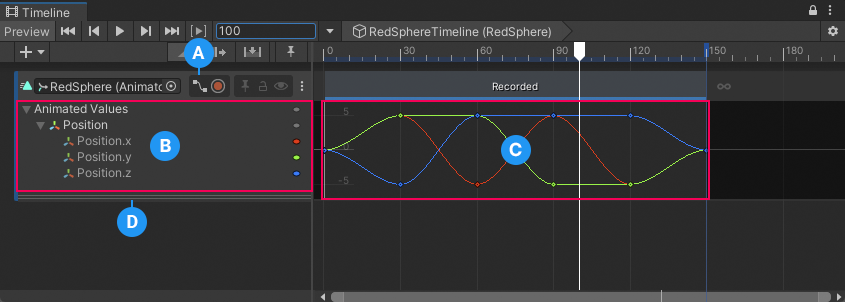
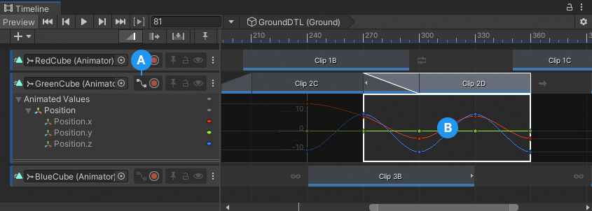
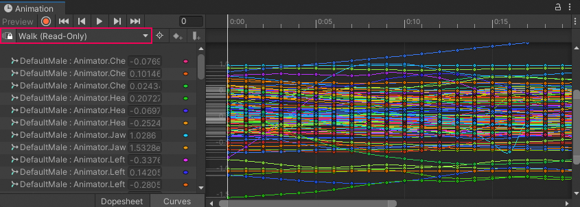
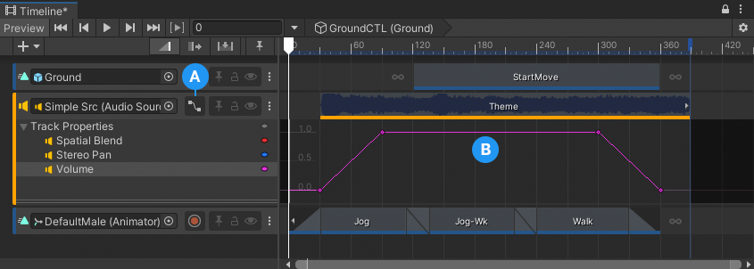

# Curves view

Use the Curves view to view and edit animation curves for audio tracks, infinite clips, and animation clips. The Curves view is similar to [Curves mode](https://docs.unity3d.com/Manual/animeditor-AnimationCurves.html) in the Animation window.

**(A)** Curves View toggle. 
**(B)** List of properties with Animation curves, referred to as the Animation Properties list. 
**(C)** Curves view. 
**(D)** Use the double-line at the bottom of the Animated Properties list to resize the Curves view vertically. 

## Curves view with Animation clips

Use the Curves view to view and perform basic edits to animation curves in Infinite clips and Animation clips. These edits include adding keyframes, modifying keyframes, adjusting tangents, and changing the interpolation between keyframes.

To view animation curves for an Infinite clip or Animation clip, enable the Curves View toggle in the Track Header.

If you enable the Curves View toggle for an Animation track without selecting an Animation clip, the Curves view displays the animation curves for the first Animation clip.

_The Curves View toggle (A) displays or hides the Curves view for the selected Animation clip (B)_

## View and edit in the Animation window

The Curves View toggle does not appear for Animation tracks with imported animation. To view and edit keyframe animation for imported Animation clips, right-click an Animation clip and choose **Edit in Animation Window** from the context menu. You can also double-click the Animation clip.

When the Animation window appears, it is linked to the Timeline window. When in linked mode, the Animation window displays the Linked button and the name of the Animation clip being viewed or edited.

_Animation window linked to the Timeline window, indicated by the Linked button and Animation clip name. The clip in this example is `(Read-Only)` which means that it can be viewed but not edited._

Click the Linked button to stop viewing or editing the Animation clip, and to release the Animation window from linked mode. You can also close the Animation window to release it from linked mode.

## Curves view with Audio tracks

For Audio tracks, the Curves view displays the animation curves for the animatable properties of an Audio track. You can animate the following Audio track properties:
* Spatial Blend
* Stereo Pan
* Volume

Each animatable property is calculated based on its keyframe values, the values for each Audio clip, the values for each Audio source, or a combination of each. Consult [Audio track properties](insp-trk-audio.md) for more information on each animatable property.

_The Curves View toggle (A) displays or hides the animatable properties of an Audio track (B)_

When you animate the properties for an Audio track, it is recommended that you select the Audio track, lock the Timeline window, and lock the Inspector window. With both the Timeline window and Inspector window locked, you can add and edit keyframe values with the Audio Track properties in the Inspector window. Use the Timeline Playhead, Playhead Controls, or keyboard shortcuts to navigate between keyframes.
