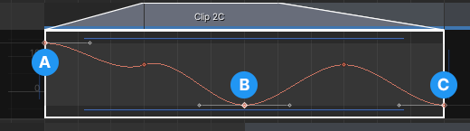
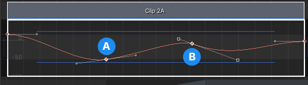

# Tangent modes and types

This topic describes [keyframe tangents](#keytangents), [tangent modes](#tangentmodes), [tangent types](#tangenttypes), and [weighted tangents](#weighted). Many of the features described in this topic are similar to [editing tangents in the Editing Curves topic](https://docs.unity3d.com/Manual/animeditor-AnimationCurves.html) in the Animation window.

## Keyframe tangents

Use keyframe tangents to modify the shape of the animation curve between keyframes. Each keyframe has one or two tangents depending on the location of the keyframe on its animation curve.

**(A)** The first keyframe has a single right tangent that controls the shape of the animation curve after the keyframe. 
**(B)** Most keyframes have two tangents where the left tangent controls the shape of the animation curve before the keyframe, and the right tangent controls the shape after the keyframe. 
**(C)** The last keyframe has a single left tangent that controls the shape of the animation curve before the last keyframe. 

By default, left and right tangents are joined. Rotating a joined tangent handle rotates both tangents which changes the shape of the animation curve both before and after the keyframe.

You can break joined tangents to modify the left and right tangent handles independently. In addition, each keyframe has a [tangent mode](#tangentmodes) and a [tangent type](#tangenttypes) that controls tangents and the shape of the animation curve.

## Tangent modes

The term **tangent mode** refers to the algorithm that automatically adjusts tangent handles when you modify the time or value of a keyframe.

To display the tangent mode for a keyframe, right-click the keyframe. A context menu displays the selected tangent mode with a checkmark. In some cases, a keyframe can have more than one tangent mode. For example, keyframe tangents can be both **Free Smooth** and **Flat**.

|**Tangent mode** |**Description** |
|:---|:---|
|**Clamped Auto**|This is the default tangent mode. In this mode, the Curves view automatically adjusts the rotation of each tangent handle to ensure that the animation curve smoothly passes through the keyframe.  For example, if you drag a keyframe to modify its time or value, the **Clamped Auto** tangent mode automatically adjusts the rotation of each tangent handle.  When in **Clamped Auto** mode, if you rotate a keyframe tangent handle, its tangent mode changes to **Free Smooth**.|
|**Auto**|Do not select this tangent mode. This is a legacy tangent mode that is only included for backward compatibility with projects prior to Unity 5.5. If you have a keyframe set to this tangent mode, you should change it to another tangent mode.|
|**Free Smooth**|Joins broken tangent handles. Selecting this tangent mode may rotate the tangent handles as they are joined.  This tangent mode does not use an algorithm to automatically adjust tangent handles. For example, if you drag a keyframe set to the **Free Smooth** tangent mode, the rotation of the each tangent handles are not adjusted.|
|**Flat**|Use this tangent mode to join tangent handles and flatten them horizontally. This tangent mode is linked to the **Free Smooth** tangent mode.  For example, if you change the tangent mode from **Clamped Auto** to **Flat**, the keyframe is set to both the **Free Smooth** and **Flat** tangent modes.|
|**Broken**|Select this mode to break joined tangent handles. When tangent handles are broken, you can control the left and right tangent handles independently. In some cases, both the **Free Smooth** and **Broken** tangent modes may be selected.|

The tangent mode is automatically selected in the following cases:

* If you [select the tangent type](#tangenttypes) for the **Left Tangent**, **Right Tangent**, or **Both Tangents** of a keyframe, the tangent mode changes to either **Free Smooth** or **Broken**.
* If you rotate the left or right tangent handle of a keyframe, the tangents are broken and the tangent mode changes to **Broken**.

## Tangent types

Select a tangent type to have greater control over the shape and slope of the animation curve before and after a keyframe.

The term **tangent type** refers to the interpolation algorithm that determines the shape of an animation curve between keyframes. The term **interpolation** refers to the estimation of values between two known points.

To set the tangent type of a keyframe tangent, do the following:
1. Right-click a keyframe. A context menu appears.
1. Select a tangent type from the **Left Tangent**, **Right Tangent**, or **Both Tangents** sub-menu.

|**Tangent type** |**Description** |
|:---|:---|
|**Free**|Select this tangent type to freely rotate the left tangent handle (Left Tangent), right tangent handle (Right Tangent), or both tangent handles (Both Tangents).  When you select **Free** this breaks joined tangent handles and sets the tangent mode to **Broken**.|
|**Linear**|Select this tangent type to draw a straight line to the keyframe (Left Tangent), away from the keyframe (Right Tangent), or both to and away from the keyframe (Both Tangents).  When you select this tangent type, the tangent is hidden. Selecting this tangent type also breaks joined tangent handles and sets the tangent mode to **Broken**.|
|**Constant**|Select this tangent type to keep a constant value from the last keyframe to this keyframe (Left Tangent), from this keyframe to the next keyframe (Right Tangent), or both (Both Tangents).  When you select this tangent type, the tangent is hidden. Selecting this tangent type also breaks joined tangent handles and sets the tangent mode to **Broken**.|
|**Weighted**|Select this tangent type to use a weighted tangent to modify the shape and slope of the animation curve before the keyframe (Left Tangent), after the keyframe (Right Tangent), or both before and after the keyframe (Both Tangents). Consult [weighted tangents](#weighted) for more information.|

## Weighted tangents

Use weighted tangents to modify the shape and slope of an animation curve. You can modify the length of a weighted tangent which modifies the slope of its animation curve. This provides greater control over the animation when compared to the default tangent.

By default, tangents are non-weighted: you can only rotate a non-weighted tangent to modify the shape of its animation curve. You cannot modify the slope of the animation curve because the tangent is set to a fixed length.

**(A)** Keyframe with default non-weighted tangents. The length of the tangent cannot be changed. 
**(B)** Keyframe with weighted tangents. Its tangent handles are drawn as outlines. In this example, the left and right tangents are set to different lengths. 

To change a non-weighted tangent to a weighted tangent, do the following:
1. Right-click a keyframe. A context menu appears.
1. Select **Weighted** as the tangent type for the **Left Tangent**, **Right Tangent**, or **Both Tangents** sub-menu.
