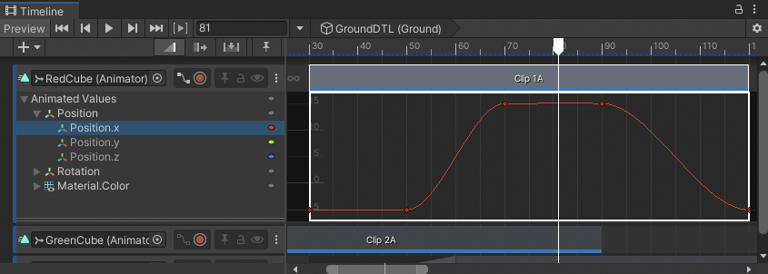

# Use the Curves view

This topic summarizes how to use the Curves view to navigate, display, and hide animation curves. The functionality described in this topic is similar to [Curves mode](https://docs.unity3d.com/Manual/animeditor-AnimationCurves.html) in the Animation window.

## Navigate the Curves view

Use one of the following methods to pan, zoom, resize, or frame the animation curves and keyframes in the Curves view:

* To pan, middle-click and drag, or hold Alt (MacOS: Option) and drag.
* To zoom vertically, move the scroll-wheel, or hold Alt (MacOS: Option), right-click and drag.
* To zoom horizontally, hold Control (MacOS: Command) and zoom vertically.
* To resize the Curves view, drag the double line separating the Curves view from the next track in the Track list.
* To frame only selected animation curves or selected keyframes, press F.
* To frame all animation curves or keyframes, press A.

You can also [use the Zoombar](clip-pan-zoom.md) to pan, zoom, and resize the Content view.

## Display and hide animation curves

For the selected Animation clip, the Curves view includes a hierarchical list of the properties with animation curves. Expand, collapse, select, and deselect the properties in this list to filter which animation curves appear in the Curves view.

For example, to display only the X-axis animation curves for the position of a GameObject, do the following:
1. Click the Triangle beside the **Position** parent property to display its child properties.
2. Select the **Position.x** property.
3. Press F to frame the animation curve for the **Position.x** property.

_Curves view that displays the animation curve of the Position.x property_

There are many ways to expand, collapse, select, and deselect animation curves:

* Click the foldout (triangle) of a parent property to expand and collapse its list of child properties.
* Hold Shift and click to select contiguous properties.
* Hold Control (MacOS: Command) and click to select discontiguous properties.
* Hold Control (MacOS: Command) and click a selected property to deselect it.
