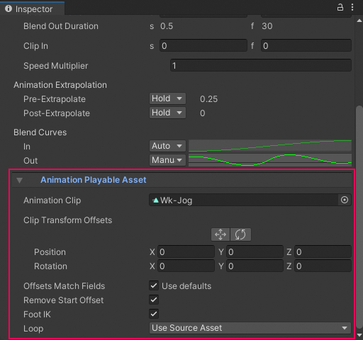

# Animation clip properties

Use the Inspector window to change the properties of an Animation clip. An Animation clip has two sets of properties:
- [Common properties](#animcommon)
- [Animation Playable Asset properties](#animplayable)

## Common properties

The common properties of an Animation clip include its display name, clip timing, extrapolation, and blend curves.

_Inspector window when selecting an Animation clip in the Timeline window_

### Display Name

The name of the Animation clip displayed in the Timeline window.

### Clip Timing properties

Use the **Clip Timing** properties to position, change the duration, change the ease-in and ease-out duration, choose the extrapolation mode, and adjust the play speed of the Animation clip.

Most timing properties are expressed in both seconds (**s**) and frames (**f**). When specifying seconds, a **Clip Timing** property accepts decimal values. When specifying frames, a property only accepts integer values. For example, if you attempt to enter 12.5 in a frames (f) field, the Inspector window sets the value to 12 frames.

Depending on the [selected Edit mode](clip-overview.md), changing the **Start**, **End**, or **Duration** may blend, ripple, or replace Animation clips on the same track.

|**Property** |**Description** |
|:---|:---|
|**Start**|The frame or time (in seconds) when the clip starts. Changing the Start changes the position of the clip on its track in the Timeline asset. Changing the Start also affects the End. Changing the Start sets the End to the new Start value plus the Duration.|
|**End**|The frame or time (in seconds) when the clip ends. Changing the End also affects the Start. Changing the End sets the Start to the new End value minus the Duration.|
|**Duration**|The duration of the clip in frames or seconds. Changing the Duration also affects the End. Changing the Duration sets the End to the Start value plus the new Duration.|
|**Ease In Duration** or **Blend In Duration**|Sets the number of seconds or frames that it takes for the clip to ease in. Consult [Easing-in and Easing-out Clips](clip-ease.md).  If the beginning of the clip overlaps and blends with another clip, the name of this property changes to **Blend In Duration** and it displays the duration of the blend between clips. The **Blend In Duration** can only be edited in the Content view. Consult [Blending clips](clip-blend.md).|
|**Ease Out Duration** or **Blend Out Duration**|Sets the number of seconds or frames that it takes for the clip to ease out. Consult [Easing-in and Easing-out Clips](clip-ease.md).  If the end of the clip overlaps and blends with another clip, the name of this property changes to **Blend Out Duration** and it displays the duration of the blend between clips. The **Blend Out Duration** can only be edited in the Content view.|
|**Clip In**|Sets the offset for when the source asset starts playing. For example, to play the last 10 seconds of a 30 second Animation clip, set Clip In to 20 seconds.|
|**Speed Multiplier**|A multiplier on the playback speed of the clip. This value must be greater than 0. Changing this value changes the duration of the clip. You cannot use this property to reverse playback. Consult [Changing Clip Play Speed](clip-speed.md).|

### Animation Extrapolation

Use the **Animation Extrapolation** properties to set the gap extrapolation before and after an Animation clip. The term **gap extrapolation** refers to how an Animation track approximates or extends animation data in the gaps before, between, and after the Animation clips on a track.

|**Property** |**Description** |
|:---|:---|
|**Pre-Extrapolate**|Controls how animation data is approximated in the gap before an Animation clip. The Pre-Extrapolate property affects the easing-in of an Animation clip.|
|**Post-Extrapolate**|Controls how animation data extends in the gap after an Animation clip. The Post-Extrapolate property affects the easing-out of an Animation clip.|

Consult [Setting the gap extrapolation](clip-gap-extrap.md) for more information on each gap extrapolation mode and how they affect other Animation clips on the same Animation track.

### Blend Curves

Use the **Blend Curves** to customize the transition between the outgoing and incoming Animation clips. Consult [Blending clips](clip-blend.md) for details on how to blend clips and customize blend curves.

When easing-in or easing-out clips, use the **Blend Curves** to customize the curve that eases-in or eases-out an Animation clip. Consult [Easing-in and Easing-out clips](clip-ease.md) for details.

## Animation Playable Asset properties

Use the Inspector window to change the Playable Asset properties of an Animation clip. These properties include properties for selecting the source asset used by the Animation clip, controls for manually applying position and rotation clip offsets, and options for overriding default clip matching.

To view the Playable Asset properties for an Animation clip, expand **Animation Playable Asset**.

_Inspector window with the **Animation Playable Asset** properties expanded_

### Animation Clip

Use the **Animation Clip** to choose the source asset used by the Animation clip on the Animation track. The source asset is either a [recorded Infinite clip](wf-record-anim.md) or an [external motion clip](wf-anim-human.md).

### Clip Transform Offsets

Use the **Clip Transform Offsets** area to manually apply position and rotation offsets to the selected Animation clip. The tools and properties underneath the Clip Transform Offsets provide two methods of manually applying offsets based on the selected source:

|**Property:** |**Description:** |
|:---|:---|
|**Move tool**|Displays a Move Gizmo in the Scene view. Use the Move Gizmo to manually position the clip offset for the selected Animation clip. Using the Move Gizmo changes the Position coordinates.|
|**Rotate tool**|Displays a Rotate Gizmo in the Scene view. Use the Rotate Gizmo to manually rotate the clip offset for the selected Animation clip. Using the Rotate Gizmo changes the Rotation coordinates.|
|**Position**|Manually sets the clip offset in X, Y, and Z coordinates. By default, the Position coordinates are set to zero and are relative to the [track offsets](insp-trk-anim.md).|
|**Rotation**|Manually sets the clip rotation offset around the X, Y, and Z axes. By default, the Rotation axes are set to zero and are relative to the [track offsets](insp-trk-anim.md).|

You can also [automatically match the clip offsets](clip-match.md) based on the end of the previous Animation clip, or the start of the next Animation clip. The transforms that are matched depends on the **Offset Match Fields**.

### Offsets Match Fields

Use **Offsets Match Fields** to choose which transforms to match when [matching clip offsets](clip-match.md). By default, **Use Defaults** is enabled and uses the default matching options set for the [Animation track](insp-trk-anim.md).

Disable **Use Defaults** to override the track matching options and choose which transformations to match when performing a Match Offsets to Previous Clip or Match Offsets to Next Clip for the selected Animation clip. When you disable **Offsets Match Fields**, a series of additional checkboxes appear. Use these additional checkboxes to enable or disable matching per coordinate, for both position and rotation.

### Remove Start Offset

Enable **Remove Start Offset** to make the Animation clip begin at position zero and rotation zero. The rest of the position and rotation keyframes in the Animation clip follow from zero. Enabling **Remove Start Offset** makes it easier to match the Animation clip with the previous Animation clip.

Disable **Remove Start Offset** to keep the starting position and rotation. The Animation clip starts from its original position and rotation.

### Foot IK

Enable **Foot IK** if the Animation clip is animating a humanoid and you want to use inverse kinematics for foot solving. Inverse kinematics attempts to remedy foot sliding by solving and influencing foot placement from the foot to the hip of the humanoid.

Disable Foot IK if the Animation clip is animating a non-humanoid object such as a moving platform or a quadruped character with a non-human bone structure.

### Loop

Use the **Loop** property to set how Timeline handles the extra clip area when an Animation clip is longer than its source asset. For example, if you [trim the end of an Animation clip](clip-trim.md#trimloop) past the end of its source asset, the extra clip area either holds or loops its content.

|**Value:** |**Description:** |
|:---|:---|
|**Use Source Asset**|Sets the Animation clip to loop or hold based on the **Loop Time** property of its source asset.  If the source asset is imported from an FBX file, [the **Loop Time** property is set in the Animation tab](https://docs.unity3d.com/Manual/class-AnimationClip.html#ClipProperties). If the source asset is recorded keyframe animation, the Loop Time property displays when you select [the Recorded clip saved under the Timeline Asset](tl-overview.md) in the Project window.|
|**On**|Loops the extra clip area, ignoring the Loop Time property of the source asset. When the extra clip area loops, the entire source asset loops. Each full loop is labelled sequentially as L1, L2, L3, and so on.|
|**Off**|Sets the extra clip area to hold, ignoring the Loop Time property of the source asset. When the extra clip area holds, the last value of the source asset is held until the end of the extra clip area. The label `Hold` displays in the extra clip area.|
