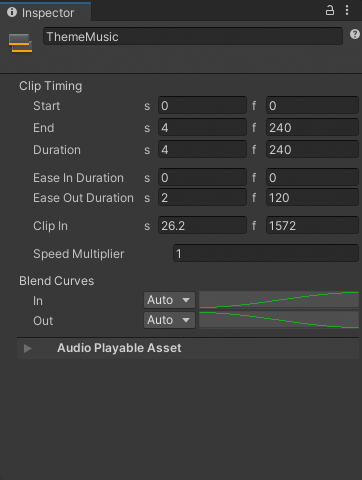
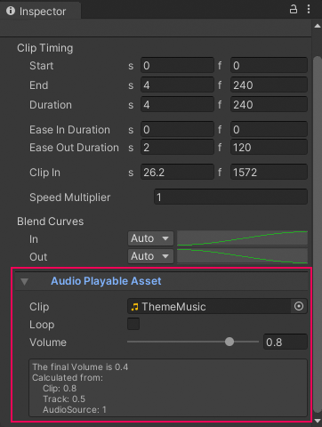

# Audio clip properties

Use the Inspector window to change the properties of an Audio clip. An Audio clip has two sets of properties:
- [Common properties](#audiocommon)
- [Audio Playable Asset properties](#audioplayable)

## Common properties

The common properties of an Audio clip include its display name, clip timing, and blend curves.

_Inspector window when selecting an Audio clip in the Timeline window_

### Display Name

The name of the Audio clip displayed in the Timeline window. This is not the name of the audio file that Unity uses for the waveform. For information on audio file properties, consult [Audio Playable Asset properties](#audioplayable).

### Clip Timing properties

Use the **Clip Timing** properties to position, change the duration, change the ease-in and ease-out duration, and adjust the play speed of the Audio clip.

Most timing properties are expressed in both seconds (**s**) and frames (**f**). When specifying seconds, a **Clip Timing** property accepts decimal values. When specifying frames, a property only accepts integer values. For example, if you attempt to enter 12.5 in a frames (f) field, the Inspector window sets the value to 12 frames.

Depending on [the selected Edit mode](clip-overview.md), changing the **Start**, **End**, or **Duration** may blend, ripple, or replace Audio clips on the same track.

|**Property** |**Description** |
|:---|:---|
|**Start**|The frame or time (in seconds) when the clip starts. Changing the Start property changes the position of the clip on its track in the Timeline asset. Changing the Start also affects the End. Changing the Start sets the End to the new Start value plus the Duration.|
|**End**|The frame or time (in seconds) when the clip ends. Changing the End also affects the Start. Changing the End sets the Start to the new End value minus the Duration.|
|**Duration**|The duration of the clip in frames or seconds. Changing the Duration also affects the End. Changing the Duration sets the End to the Start value plus the new Duration.|
|**Ease In Duration** or **Blend In Duration**|Sets the number of seconds or frames that it takes for the Audio clip to ease in (fade in).  If the beginning of the clip overlaps and blends with another clip, the name of this property changes to **Blend In Duration** and it displays the duration of the crossfade between Audio clips. The **Blend In Duration** can only be edited in the Content view. Consult [Blending clips](clip-blend.md).|
|**Ease Out Duration** or **Blend Out Duration**|Sets the number of seconds or frames that it takes for the Audio clip to ease out (fade out).  If the end of the clip overlaps and blends with another Audio clip, the name of this property changes to **Blend Out Duration** and it displays the duration of the crossfade between Audio clips. The **Blend Out Duration** can only be edited in the Content view.|
|**Clip In**|Sets the offset for when the source waveform starts playing. Use Clip In to skip silence at the beginning of a source waveform. For example, if the source waveform has 2 seconds of silence before the theme music begins, set Clip In to 2 seconds to skip the silence.|
|**Speed Multiplier**|A multiplier that effects the playback speed of the Audio clip. This value must be greater than 0. Changing this value changes the duration of the Audio clip. You cannot use this property to play an Audio clip backwards.|

### Blend Curves

Use the **Blend Curves** to customize the fade-in and fade-out between the outgoing and incoming Audio clips. Consult [Blending clips](clip-blend.md) for details on how to blend clips and customize blend curves.

When easing-in or easing-out Audio clips, use the **Blend Curves** to customize the curve that fades-in or fades-out an Audio clip. Consult [Easing-in and Easing-out clips](clip-ease.md) for details.

## Audio Playable Asset properties

Use the **Audio Playable Asset** properties to select the Audio file used by the Audio clip, set whether the Audio clip loops, and to adjust its volume.

_Inspector window when selecting an Audio clip in the Timeline window_

|**Property** |**Description** |
|:---|:---|
|**Clip**| This is the name of the audio file associated with the Audio clip. |
|**Loop**| Sets how Timeline handles the extra clip area when the Audio clip is longer than its source audio file (specified by **Clip**).  Enable **Loop** to loop from the start of the source audio file. Each full loop is labelled sequentially as L1, L2, L3, and so on.  Disable **Loop** to play the audio file once. The label `Hold` displays in the extra clip area.|
|**Volume**|The volume for the Audio clip. The value is a number between 0 and 1 (default). When changed from its default value, the volume for the Audio clip is calculated based on the [Audio track volume](insp-trk-audio.md), this volume value, and the volume of the [Audio Source] bound to the Audio track.|
