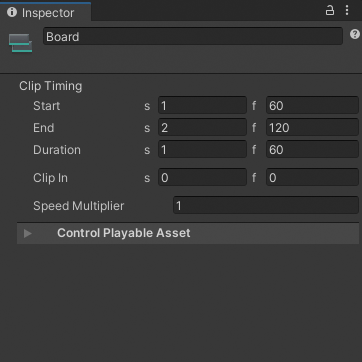
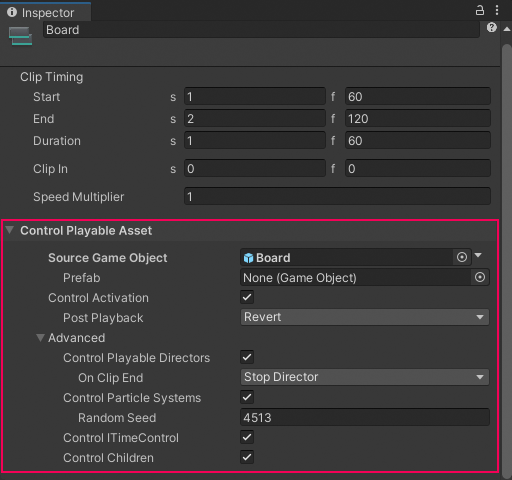

# Control clip properties

Use the Inspector window to change the properties of a Control clip. A Control clip has two sets of properties:
- [Common properties](#ctrlcommon)
- [Control Playable Asset properties](#ctrlplayable)

## About Control clips

A Control clip is a special clip that controls a Sub-Timeline instance, a Particle System, a Prefab instance, or a ITimeControl Script. What a Control clip controls depends on how you create the Control clip:
* If you create a Control clip from a GameObject with a Playable Director component associated with a Timeline asset, then the Control clip controls a Sub-Timeline instance. If the GameObject parents other GameObjects associated with many Timeline assets, then the Control clip controls multiple Timeline instances.
* If you create a Control clip from a GameObject with a Particle System component, then the Control clip controls a Particle System.
* If you create a Control clip from a GameObject linked to a Prefab, then the Control clip controls a Prefab instance.
* If you create a Control clip from a GameObject with a script that implements the ITimeControl interface, then the Control clip controls an ITimeControl Script.

## Common properties

The common properties of a Control clip include its name and Clip Timing properties. Not all common properties apply to all types of Control clips.

_Inspector window when selecting a Control clip in the Timeline window_

## Display Name

The name of the Control clip displayed in the Timeline window.

## Clip Timing properties

Use the **Clip Timing** properties to position and change the duration of the Control clip.

Most timing properties are expressed in both seconds (**s**) and frames (**f**). When specifying seconds, a **Clip Timing** property accepts decimal values. When specifying frames, a property only accepts integer values. For example, if you attempt to enter 12.5 in a frames (f) field, the Inspector window sets the value to 12 frames.

Depending on the [selected Edit mode](clip-overview.md), changing the **Start**, **End**, or **Duration** of a Control clip may insert or replace clips on the same track. You cannot create a blend between Control clips.

|**Property:** |**Description:** |
|:---|:---|
|**Start**|The frame or time (in seconds) when the Control clip starts. Changing the Start changes the position of the Control clip on its track in the Timeline asset. Changing the Start also affects the End. Changing the Start sets the End to the new Start value plus the Duration.|
|**End**|The frame or time (in seconds) when the Control clip ends. Changing the End also affects the Start. Changing the End sets the Start to the new End value minus the Duration.|
|**Duration**|The duration of the clip in frames or seconds. Changing the Duration also affects the End. Changing the Duration sets the End to the Start value plus the new Duration.|
|**Clip In**|Sets the offset of when the Control clip starts playing. The Clip In property only affects Particle Systems and Sub-Timeline instances.|
|**Speed Multiplier**|A speed multiplier that affects the playback speed of the Control clip. This value must be greater than 0. The Speed Multiplier property only affects Particle Systems and Sub-Timeline instances.|

## Control Playable Asset properties

Use the Inspector window to change the playable asset properties of a Control clip. To view the playable asset properties for a Control clip, select a Control clip in the Timeline window and expand **Control Playable Asset** in the Inspector window.

_Inspector window with the **Control Playable Asset** properties for the selected Control clip_

### Source Game Object

Use **Source Game Object** to select the GameObject with the Particle System, Sub-Timeline instance, or ITimeControl Script for the selected Control clip. Changing the **Source Game Object** changes what the Control clip controls.

### Prefab

Use **Prefab** to select a Prefab to instantiate when the Timeline instance plays in Play mode. When a Prefab is selected, the label of the **Source Game Object** property changes to **Parent Object**.

When in Play mode, the Prefab is instantiated as a child of the **Parent Object**. Although the Prefab is instantiated at the start of the Timeline instance, the Prefab is only activated during the Control clip. When the Control clip ends, the Prefab instance is deactivated.

### Control Activation

Enable **Control Activation** to activate the **Source Game Object** while the Control clip plays. Disable this property to activate the **Source Game Object** during the entire Timeline instance.

The **Control Activation** property only affects Control clips that control a Sub-Timeline instance or a Particle System.

### Post Playback

When **Control Activation** is enabled, use the **Post Playback** property to set the activation state for the Sub-Timeline instance when the main Timeline stops playing. The **Post Playback** property only affects Sub-Timeline instances.

|**Post-Playback State** |**Description** |
|:---|:---|
|**Active**|Activates the Source Game Object after the Sub-Timeline instance finishes playing.|
|**Inactive**|Deactivates the Source Game Object after the Sub-Timeline instance finishes playing.|
|**Revert**|Reverts the Source Game Object to its activation state before the Sub-Timeline instance began playing.|

### Advanced properties

Use the Advanced properties to select additional functionality based on whether the Control clip controls a Playable Director, Particle System, or ITimeControl Script. The Advanced properties do not apply to all Control clips.

|**Property** |**Description** |
|:---|:---|
|**Control Playable Directors**|Enable this property if the Source Game Object is attached to a Playable Director and you want the Control clip to control the Sub-Timeline instance associated with this Playable Director.|
|**On Clip End**| Use this property in conjunction with **Control Playable Directors** to set the state of the controlled Playable Director at the end of a clip.   **Stop Director** stops the Playable Director and destroys the Playable Director graph at the end of a clip, releasing allocated resources.  **Pause Director** pauses the Playable Director and reuses the Playable Director graph, preserving allocated resources. Select **Pause Director** to improve performance when a Control track has multiple clips using the same Sub-Timeline instance.
|**Control Particle Systems**|Enable this property when the Control clip includes a Particle System. Set the value of the Random Seed property to create a unique, repeatable effect.|
|**Control ITimeControl**|Enable this property to control ITimeControl scripts on the Source GameObject. To use this feature, the Source GameObject must have a script that implements the ITimeControl interface.|
|**Control Children**|Enable this property if the Source Game Object has a child GameObject with either a Playable Director, Particle System, or ITimeControl Script, and you want the Control clip to control this child component.  For example, if the Source Game Object is a GameObject that parents another GameObject with a Particle System, enable this property to make the Control clip control the Particle system on the child GameObject.|
