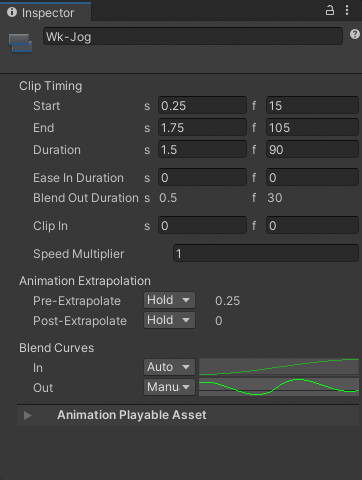
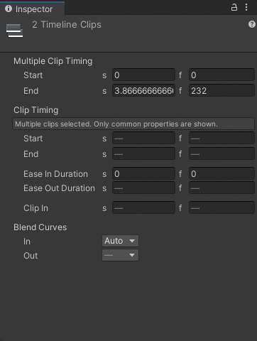
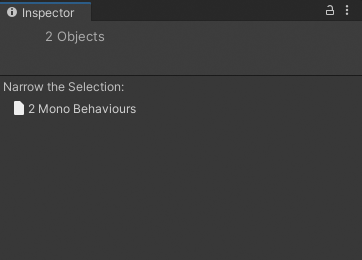

# Timeline properties in the Inspector window

This section describes the properties that display in the Inspector window when you select Timeline assets, tracks, clips, markers, or other Timeline-related items. The displayed properties also depend on whether you select a single item or multiple items. Not all selected items have properties.

## Single selection

If you select a single Timeline asset, track, clip, or marker, the Inspector window displays the properties for the selected item. For example, if you select an Animation clip in the Timeline window, the Inspector window displays the properties for the selected Animation clip.

_Inspector window when selecting an Animation clip in the Timeline window_

The following topics provide more information on the properties that display when you select a Timeline asset, track, clip, or marker:
* [Timeline Asset Properties](insp-tl-asset.md)
* [Track Properties](insp-trk.md)
* [Clip Properties](insp-clip.md)
* [Marker and Signal properties](insp-overview.md)

## Multiple selection

If you select multiple Timeline assets, tracks, clips, or markers, the Inspector window lists the properties that apply to the selection as a group followed by properties common to all selected items.

_Inspector window when selecting multiple clips, from multiple tracks, in the Timeline window_

For example, if you select an Audio clip on one track and an Animation clip on another track, the Inspector window includes **Multiple Clip Timing** properties and **Clip Timing** properties:
* Use the **Multiple Clip Timing** properties to change the **Start** or **End** of the selection as a group. For example, if you change the **Start** to frame 30, the selection of clips start at frame 30. This moves the start of the first clip to frame 30 and the remaining selected clips are placed relative to the first clip, respecting gaps between selected clips.
* Use the **Clip Timing** properties to change the common properties for each selected clip. If the selected clips have different values for the same property, the value is represented with a dash ("-"). If you change the dash to a value, it sets the value for all selected clips. For example, if you change the **Ease In Duration** from a dash to 10 frames, the ease-in of each selected clip changes to 10 frames.

If your selection does not have common properties, the Inspector window prompts you to narrow the selection. For example, if you select an Animation track and an Audio clip in the Timeline window, you are prompted to narrow the selection:

_The message in the Inspector window when the selection does not have common properties_
