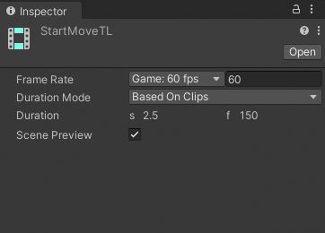

# Timeline asset properties

Use the Inspector window to set the frame rate, the duration mode, and a fixed length for the selected Timeline asset. Select a Timeline asset from the Project window to view its properties.

_Inspector window when you select a Timeline asset in the Project window_

|**Property**||**Description**|
|:---|:---|:---|
|**Frame Rate**||Sets the reference frame rate for the Timeline asset and its Timeline instances. Change the frame rate to align clips at precise frames. Note that the Frame Rate is only visual and has no effect on play speed, keyframes, tracks, or clips.  To set the Frame Rate, either select a standard frame rate from the drop-down menu or enter a non-standard frame rate in the adjacent field. Timeline supports frame rates from 1e-6 to 1000.  For Timeline instances associated with the Timeline asset, you can set the Frame Rate in the [Timeline Options](tl-options.md).|
|**Duration Mode**||Choose whether the duration of the Timeline asset extends to the end of the last clip or ends at a specific time or frame.|
||Based On Clips|Sets the length of the Timeline asset based on the end of the last clip.|
||Fixed Length|Sets the length of the Timeline asset to a specific number of seconds or frames.|
|**Duration**||Displays the length of the Timeline asset in seconds and frames when the Duration Mode is set to Based on Clips.  Sets the length of the Timeline asset to a specific number of seconds or frames when the Duration Mode is set to Fixed Length.|
|**Scene Preview**||Enable to preview the affect of the Timeline instance on the Scene. It is recommended to always enable Scene Preview.  Disable Scene Preview to apply the changes from the Timeline instance to the Scene. Since disabling Scene Preview can be destructive, a warning appears in the Inspector window and a warning icon appears on the [Timeline Preview toggle](tl-preview.md).|
