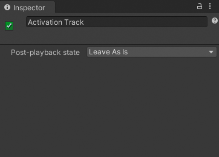

# Activation track properties

Use the Inspector window to change the name of an Activation track and set the state of its bound GameObject when the Timeline asset finishes playing.

_Inspector window when selecting an Activation track in the Timeline window_

|**Property**||**Description**|
|:---|:---|:---|
|**Display Name**||The name of the Activation track displayed in the Timeline window and Playable Director component. The Display Name applies to the Timeline asset and all of its Timeline instances. It is set to `Activation Track` by default.|
|**Post-playback state**||Sets the activation state for the bound GameObject when the Timeline asset stops playing. The Post-playback state applies to the Timeline asset and all of its Timeline instances.|
||Active|Activates the bound GameObject when the Timeline asset finishes playing.|
||Inactive|Deactivates the bound GameObject when the Timeline asset finishes playing.|
||Revert|Reverts the bound GameObject to its activation state before the Timeline asset began playing.  For example, if the Timeline asset finishes playing with the GameObject set to inactive, and the GameObject was active before the Timeline asset began playing, then the GameObject reverts to active.|
||Leave As Is|Sets the activation state of the bound GameObject to the state the Timeline asset is at when it finishes playing.  For example, if the Timeline asset finishes playing with the GameObject set to inactive, the GameObject remains inactive.|
