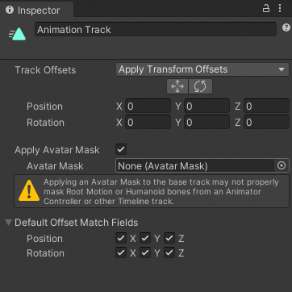
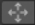
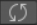

# Animation track properties

Use the Inspector window to change the name of an Animation track, set how track offsets are applied, use an avatar mask, and set which transforms are modified by default when you [match clip offsets](clip-match.md).

_Inspector window when selecting an Animation track in the Timeline window_

|**Property** ||**Description** |
|:---|:---|:---|
|**Display Name**||The name of the Animation track displayed in the Timeline window and in the Playable Director component. The Display Name applies to the Timeline asset and all of its Timeline instances. The Display Name is set to `Animation Track` by default.|
|**Track Offsets**||Applies a position and rotation offset to the start of each Animation clip on the selected Animation track. The position and rotation offset starts from a specific position and rotation or from the position and rotation relative to a state machine or another Timeline instance.|
||Apply Transform Offsets|Starts the animation in each Animation clip from a specific position and rotation offset. Use the Move and Rotate tools, and the Position and Rotation fields, to set the starting position and rotation.|
||Apply Scene Offsets|Starts the animated GameObject from its current position and rotation in the Scene. Use this mode to build a Timeline instance that transitions to and from a state machine or to and from another Timeline instance.|
||Auto (deprecated)|If you load a Scene or Project that was built before 2018.3, Track Offsets is automatically set to Auto. This is a special offset for backwards compatibility.  If you select Auto, a warning states that this mode should not be selected because it will be deprecated. You should choose one of the other Track Offsets. The Auto offset also disables animation recording.|
| **Move tool** ||Enable the Move tool displays the Move Gizmo in the Scene view. Use the Move Gizmo to visually position the transform offset. Positioning the Move Gizmo changes the Position properties.  The Move tool only appears when Track Offsets is set to Apply Transform Offsets.|
| **Rotate tool** ||Enable the Rotate tool displays the Rotate Gizmo in the Scene view. Use the Rotate Gizmo to visually rotate the track offset. Rotating the Rotate Gizmo changes the Rotation properties.  The Rotate tool only appears when Track Offsets is set to Apply Transform Offsets.|
|**Position**||Sets the track position offset in X, Y, and Z coordinates. The Position fields only appears when Track Offsets is set to Apply Transform Offsets.|
|**Rotation**||Sets the track rotation offset in X, Y, and Z coordinates. The Rotation fields appear when Track Offsets is set to Apply Transform Offsets.|
|**Apply Avatar Mask**||Enables Avatar masking. When enabled, Timeline applies the animation of all Animation clips on the track based on the selected Avatar Mask.|
||Avatar Mask|Selects the Avatar Mask applied to all Animation clips on the Animation track. An Avatar Mask defines which humanoid body parts are animated by Animation clips on the selected Animation track. The body parts that are masked are animated by other Animation tracks in the Timeline asset.  For example, you can use an Avatar Mask to combine the lower-body animation on an Animation track with the upper body animation on an [Override Animation track](wf-anim-override.md).|
|**Default Offset Match Fields**||Expand to display a series of checkboxes that choose which transforms are matched when [matching clip offsets](clip-match.md) between Animation clips.  The Default Offset Match Fields set the default matching options for all Animation clips on the same track. Use the [Animation Playable Asset properties](insp-clip-anim.md) to override these defaults for each Animation clip.|
