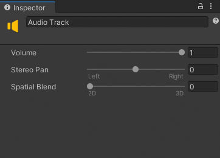

# Audio track properties

Use the Inspector window to change the name of an Audio track, and set its Volume, Stereo Pan, and Spatial Blend. You can also [animation the Audio track properties](curves-overview.md#curvesviewaudiotrack) in the Curves view.

_Inspector window when selecting an Animation track in the Timeline window_

|**Property** |**Description** |
|:---|:---|
|**Display Name**|The name of the Audio track displayed in the Timeline window and in the Playable Director component. The Display Name applies to the Timeline asset and all of its Timeline instances. The Display Name is set to `Audio Track` by default.|
|**Volume**|The volume for the Audio track. The value is a number between 0 and 1 (default). When changed from its default value, the volume for each Audio clip on the Audio track is calculated based on this volume value, the [Audio clip volume](insp-clip-audio.md), and the volume of the [Audio Source](https://docs.unity3d.com/Manual/class-AudioSource.html) bound to the Audio track.|
|**Stereo Pan**|The pan value for the Audio track. This property is only valid for Mono or Stereo Audio clips. The pan value is a number between -1 and 1, where fully panned left is -1 and fully panned right is 1. By default, panning is set to 0 which is centered. For Mono Audio clips, the default value is either panned fully left or fully right.  When changed from its default, the final pan is calculated based on this pan value and the pan of the [Audio Source](https://docs.unity3d.com/Manual/class-AudioSource.html) bound to the Audio track.|
|**Spatial Blend**|Sets how much the 3D engine has an effect on the Audio track. The Spatial Blend value is a number between 0 and 1, where 0 means that the Audio track is fully 2D: the audio uses its original audio channel mapping and is not affected by the 3D engine. When set to fully 3D, all audio channels are mixed down to a mono channel and attenuated based on distance and direction.  By default, Spatial Blend is set to 0 (fully 2D). When changed from its default, the Spatial Blend for the Audio track and its clips are calculated based on this property and the Spatial Blend of the [Audio Source](https://docs.unity3d.com/Manual/class-AudioSource.html) bound to the Audio track.|
