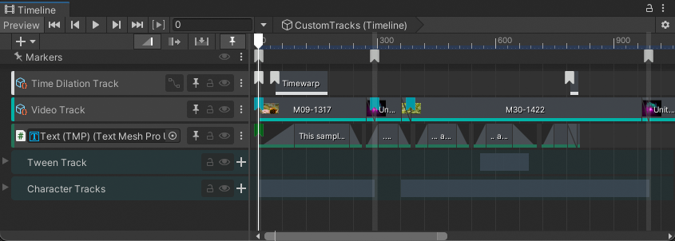
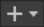

# Customization Samples

The Customization Samples sample includes track groups, tracks, clips, markers, signals, and actions that demonstrate how to extend and customize Unity's Timeline.

To import the Customization Samples scene and open its Timeline instance, do the following:

1. [Import the Customization Samples sample](samp-overview.md) into your project.
1. In the Project window, go to `Assets/Samples/Timeline/<version>/Customization Samples/Demo/Scenes`, where `<version>` is your installed Timeline package version.
1. Double-click the scene named `Timeline_CustomTracks`.
1. To open the Timeline instance, in the Hierarchy window, select the `Timeline` GameObject. The Timeline instance named `CustomTracks` displays in the Timeline window.
1. If the Timeline window is not open, go to **Window** &gt; **Sequencing** &gt; **Timeline**.

_`CustomTracks` Timeline instance associated with the `Timeline` GameObject_

This sample uses the `CustomTracks` Timeline instance to demonstrate different custom markers, tracks, scripts, and menu items. These customizations play as a single sequence with captions from the custom Text track and annotations from custom annotation markers.

The main customizations in this Timeline instance are as follows:

* [Annotation marker](#annosamp): This custom marker annotates the custom tracks, text, video, and animation clips. These markers are placed on the Markers track, on custom tracks, and on animation tracks.
* [Time dilation track](#timesamp): This custom track creates a time dilation effect that slows down animation for emphasis.
* [Video track](#videosamp): This custom track plays video clips.
* [Text track](#textsamp): This custom track uses the TextMeshPro component describe the other custom tracks with captions.
* [Tween track](#tweensamp): This custom track  provides a track that can be used for simple transform movements.

## Annotation marker

This custom marker annotates the custom tracks, text, video, and animation clips. These markers are placed on the Markers track, on custom tracks, and on animation tracks.

The custom Annotation marker uses scripts to override the default Timeline marker behavior and USS (Unity style sheets) to default marker appearance. There are also custom scripts for adding menu items that add annotation markers and copy text from the clipboard.

## Time Dilation Track

The Time Dilation Track provides track and clip scripts that adjust Unity's `Time.timeScale` global. The most common usage for modifying this global is to create a time warp effect where the animation slows down for emphasize. This is referred to as a **bullet time** effect.

This sample demonstrates how to:

* Create a custom TrackMixer `PlayableBehaviour` that performs custom blending of clip values.
* Set and restore Unity global values in a `PlayableBehaviour`.
* Support blending and extrapolation on custom clips.
* Animate custom clip data using the Curves view with a `PlayableBehaviour` template.

### Usage

Select the **Add** (**+**) menu  and choose **Timeline.Samples** &gt; **Time Dilation Track** to add a new Time Dilation Track.

Add clips to the track, and use the Inspector window to set timescale values for the clip. You can also use the Curves view in the Timeline window to animate the timescale. Blend clips to create transitions.

## Video Track sample

The Video Track sample provides a track that plays video clips. This sample demonstrates how to:

* Use blending, speed, and clip-in with custom clips.
* Use many `ClipEditor`s to customize clip drawing.
* Use a mixer `PlayableBehaviour` to perform look-ahead operations.
* Manage the `UnityEngine.Object` lifetime (`VideoPlayer`) with a `PlayableBehaviour`.
* Use ExposedReferences to reference scene components from a `PlayableAsset`.

### Usage

Drag an imported video from the Project window into a Timeline instance to create a video track and video clip.

The video clip provides several playback options including selecting which camera renders the video and which audio source plays the audio. If a camera is not specified, the video clip uses the main camera. If an audio source is not specified, the audio plays directly.

The video playback options are set per clip in the Inspector window. To view these options, select the video clip and expand **Video Playable Asset**.

### Known Issues

* The video track supports ease-in and ease-out, but blending between videos is not supported and may give unexpected results.
* Editing a Timeline instance with video clips may cause the blended result to flicker or change unexpectedly.
* Looping a Timeline instance with video clips could de-synchronize the video.

## Text Track

The Text track requires the TextMeshPro package. The Text track provides track and clip scripts that display subtitles or other similar types of messages.

This sample demonstrates how to:

* Register custom properties in a custom track.
* Perform custom clip blending with a mixer (`PlayableBehaviour`).
* Animate custom clip properties in the Curves view through a `PlayableBehaviour` template.
* Use a `ClipEditor` to react to changes in a clip.

## Transform Tween track sample

The Transform Tween Track provides a track for simple transform movements between two points. This track demonstrates how to:

* Create a custom clip, custom track, and mixer.
* Use the PlayableGraph API to transform a GameObject.
* Customize a clip with a `ClipEditor`.

### Usage

Use the Transform Tween track for simple transform movements. All translation happens in a straight line but you can control the speed with an animation curve. The Tween track binds to the scene `Transform` you want to move.

|**Property**|**Description**|
|:---|:---|
| **Start Location** | A GameObject in the scene that the playable uses as a starting reference. This reference is the starting position, rotation, or both. If the Start Location is set to null, the Transform uses its own position, rotation, or both when the playable starts. |
| **End Location** | A GameObject in the scene that the playable uses as an ending reference. This reference is the ending position, rotation, or both. If the End Location is set to null, the Transform uses its own position, rotation, or both when the playable finishes. |
| **Tween Position** | Whether the position of the Transform changes. |
| **Tween Rotation** | Whether the rotation of the Transform changes. |
