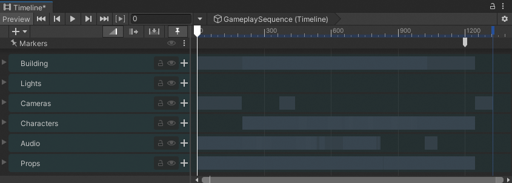
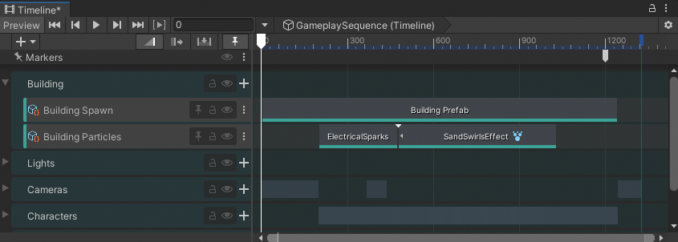
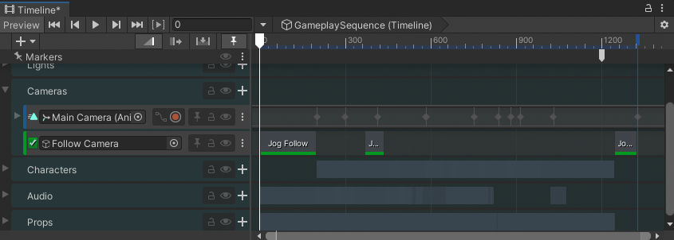
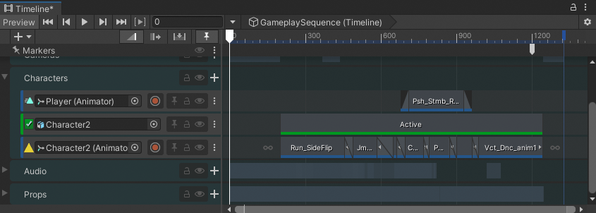
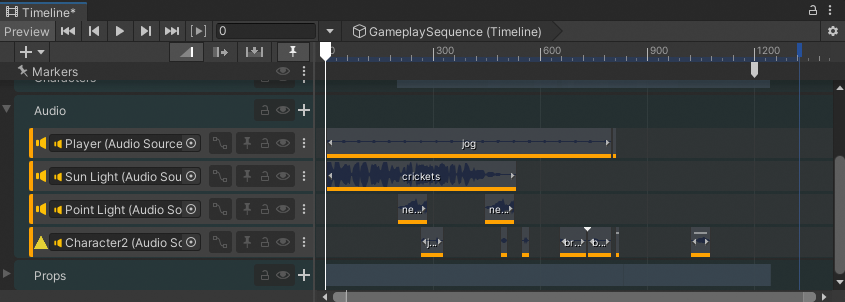
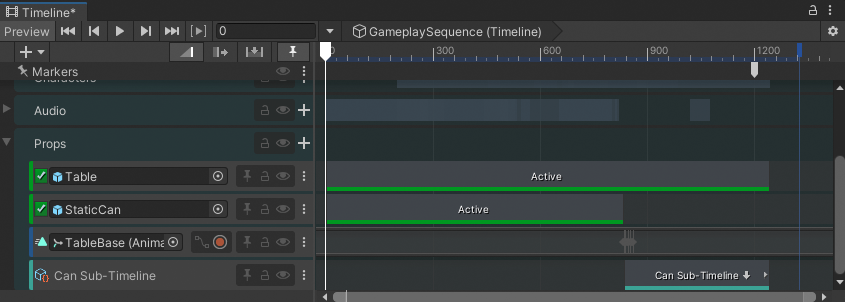

# Gameplay Sequence Demo

The Gameplay Sequence Demo sample demonstrates how to use Unity's Timeline to create a complex cut-scene.

To import the Gameplay Sequence Demo scene and open its Timeline instance, do the following:

1. [Import the Gameplay Sequence Demo sample](samp-overview.md) into your project.
1. In the Project window, go to `Assets/Samples/Timeline/<version>/Gameplay Sequence Demo/Scenes`, where `<version>` is your installed Timeline package version.
1. Double-click the scene named `GameplaySequence`.
1. To open the Timeline instance, in the Hierarchy window, select the `Timeline` GameObject. The Timeline instance named `GameplaySequence` displays in the Timeline window.
1. If the Timeline window is not open, go to **Window** &gt; **Sequencing** &gt; **Timeline**.

_`GameplaySequence` Timeline instance associated with the `Timeline` GameObject_

The `GameplaySequence` Timeline instance uses the [Markers track](#gs_markers) and multiple Activation, Animation, Audio, and Control tracks organized into the following Track groups:

* [Building Track group](#gs_building): Contains tracks for spawning the buildings and controlling particle effects related to the spawned buildings.
* [Lights Track group](#gs_lights): Contains tracks that animate two of the lights in the cut-scene: `Sun Light` and the `Point Light`.
* [Cameras Track group](#gs_cameras): Contains tracks that creates camera movement and camera switch between two camera GameObjects: `Main Camera` and `Follow Camera`.
* [Characters Track group](#gs_chars): Contains tracks that animate the activate the main `Player` character and the secondary `Character2` character.
* [Audio Track group](#gs_audio): Contains multiple audio tracks
that play sounds associated with characters, environment, and other effects.
* [Props Track group](#gs_props): Contains multiple tracks that animate and activate the `Table` and `Can` GameObjects. The Props Track group uses the `Can` Sub-Timeline instance to animate the `Can` GameObject bouncing and falling off the table.

## Markers track

In the `GameplaySequence` Timeline instance, the Markers track includes a single runtime Signal Emitter at frame 1200. This Signal Emitter emits a signal to play an audio clip at the end of the cut-scene.

The Signal Receiver is attached to the `Timeline` GameObject. It receives the signal and plays an audio clip of the `Player` character jogging. This Signal Receiver only receives the signal at runtime and will not play the audio clip while previewing the `GameplaySequence` Timeline instance in the Timeline window.

The purpose of playing this audio clip is to provide an audio transition from the cut-scene to gameplay when the cut-scene has ended.

## Building Track group

_The Building Track group expanded_

The Building Track group contains the following tracks:

|**Track**|**Description**|
|:---|:---|
|`Building Spawn` Control track|This track contains a Control clip that spawns the building prefab.|
|`Building Particles` Control track|This track uses two Control clips to add background effects. The `ElectricalSparks` clip  provides electrical sparks inside the building. The `SandSwirlsEffect` clip provides the swirling sand effect outside the building.|

## Lights Track group

_The Lights Track group expanded_

The Lights Track group contains the following tracks:

|**Track**|**Description**|
|:---|:---|
|`Sun Light` Animation track|This track animates the passage of time from night, to sunrise, and then to day. This effect is achieved by animating the rotation of the light GameObject bound to the `Sun Light` track.|
|`Point light` Animation track|This track animates a flickering light within the `Building` model. The flickering light effect is achieved by animating the Intensity property of the light GameObject bound to the `Point Light` track.|

The animation for each light track is created with keyframe animation on infinite clips. To view the keyframe animation, for either track, do one of the following:

* Enable the Curves View toggle in the Track Header. The keyframe animation displays in the [Curves View](curves-overview.md).
* Double-click the infinite clip. The keyframe animation [displays in the Animation window](curves-overview.md#animwindow).

## Cameras Track group

_The Cameras Track group expanded_

The `Cameras` Track group contains the following tracks:

|**Track**|**Description**|
|:---|:---|
|`Main Camera` Animation track|This track animates the camera movement of the `Main Camera` camera GameObject. The camera movement is created with keyframe animation on an infinite clip. To view this keyframe animation, either enable the Curves View toggle in the Track Header or double-click the infinite clip to open the Animation window.|
|`Player Shots` Animation Override track | This track is a child of the `Main Camera` Animation track. The clips on this track override the position and rotation of the `Main Camera` camera which provides a camera shot of the main `Player` character.|
|`Character2 Shots` Animation Override track | This track is a child of the `Main Camera` Animation track. The clips on this track override the position and rotation of the `Main Camera` camera.|
|`Follow Camera` Activation track | This track activates the `Follow Camera` GameObject. When active, the view from the Follow Camera camera overrides the Main Camera track and its Animation Override tracks.  To create this follow camera and camera shot, in the scene, the `Follow Camera` is parented by the `Player` Character so that the `Follow Camera` camera moves with the `Player` Character. A local position and rotation offset is added to the `Follow Camera` GameObject so that the camera shot is from over the left shoulder of the `Player` Character.|

## Characters Track group

_The Characters Track group expanded_

The `Characters` Track group contains the following tracks:

|**Track**|**Description**|
|:---|:---|
|`Player` Animation track|This track animates the `Player` character. This is the main character in the cut-scene.  The Animation clip on this track takes control of the `Player` character, collides `Player` with the `Character2` character, bumps `Player` into a table which causes a can to fall and bounce on the floor, then returns control of the `Player` character to the `jog` Animator state.  If you attempt to preview this animation in the Timeline window, the `Player` character is shown in a T-Stance pose before and after the Animation clip because the `jog` Animator state is only available during runtime.  To preview the `Player` character with the looping jog animation, click [Play in the Game View](https://docs.unity3d.com/Manual/GameView.html).|
|`Character2` Activation track|This track activates the `Character2` character. The `Character2` character is the secondary character in the cut-scene.|
|`Character2` Animation track |This track contains many Animation clips that blend together to create the parkour animation sequence for the `Character2` character. This track also includes animation clips for the collision between characters and `Character2` gesturing towards the main `Player` character.|

## Audio Track group

_The Audio Track group expanded_

The Audio Track group contains the following tracks:

|**Track**|**Description**|
|:---|:---|
|`Player` Audio track| This track plays the `jog` Audio clip which contains the jogging and breathing sounds associated with the main Gameplay character. This Audio track also plays the `bump` Audio clip when the two characters collide.|
|`Sun Light` Audio track|This track plays the `crickets` Audio clip during the night portion of the Gameplay sequence. The `Sun Light` Audio track also has pan and volume track animation. To view this track animation, enable the Curves View toggle for the `Sun Light` Audio Track Header.|
|`Point Light` Audio track|This track plays the `neon_light` Audio clips as `Character2` moves, jumps, and runs through the Building model. The `neon-light` Audio clip is for the flickering `Point light` effect.|
|`Character2` Audio track|This track contains the jump and breath audio clips as the `Character2` character parkours through the Building model. The `Character2` Audio track also plays a `bump` Audio clip when the two characters collide.|

## Props Track group

_The Props Track group expanded_

The Props Track group contains the following tracks:

|**Track**|**Description**|
|:---|:---|
|`Table` Activation track|This track activates the `Table` GameObject.|
|`StaticCan` Activation track|This track activates a static copy of the `Can` GameObject. The `StaticCan` GameObject is hidden when the table is bumped and the `Can` Sub-Timeline animation begins. |
|`TableBase` Animation track|This track contains an Infinite clip that animates the table bump. The table bump also animates the `StaticCan` GameObject because the `StaticCan` is parented by the `TableBase`. This movement causes the can to fall off the table.|
|`Can Sub-Timeline` Control track|This track includes a Control clip that contains the `Can` Sub-Timeline instance. The `Can` Sub-Timeline contains an Animation track for the can rolling off the table and bouncing on the ground, an Audio track for the sound effects of the bouncing can, and a Control track for the liquid particles splashing out of the can as it bounces. To view the `Can` Sub-Timeline and its additional three tracks, double-click the Control clip.|
