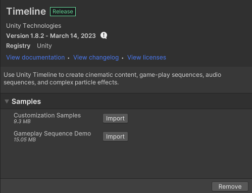

# Timeline Samples

The Timeline package includes sample projects that demonstrate how to use and customize tracks, clips, markers, and menu items.

_Timeline package for version 1.8.2 listing the available Timeline sample projects. Sample projects were first added to the Timeline package in version 1.5._

To import a sample project:

1. Expand the Timeline entry in the Package Manager window.
1. Select the currently installed Timeline package.
1. Either expand **Samples** or select the **Samples** tab to display the list of available Timeline sample projects.
1. Click **Import** beside the sample you want to import. If you have already imported the sample, click **Reimport** to reimport the sample into your project. When you reimport a sample, any changes that you have made to the sample, its assets, scenes, and files are overwritten with the original sample.

The Package Manager window imports or reimports sample files to the `Assets/Samples/Timeline/<version>` in the Project window, where `<version>` is the installed Timeline package version.

Depending on the sample, the location of its assets, scenes, and files may differ. Consult the dedicated topic on each Timeline sample for more information. The Timeline package includes the following Timeline samples:

|**Sample**|**Description**|
|:---|:---|
|[Customization Samples](samp-custom-samples.md) |This sample project includes a Timeline instance with different custom tracks that demonstrate time dilation, video, text, tweening, and character animation. This sample also includes a custom marker that annotates clips and tracks, and track groups.  Use the examples in this sample project as a basis for your own Timeline track customizations.|
|[Gameplay Sequence Demo](samp-gameplay-demo.md)  |This sample project includes a Timeline instance with multiple Track groups, tracks, animated characters, effects, and camera switches that demonstrate how to use Unity's Timeline to create a cut-scene.  This cut-scene features a jogging character (`Player`) who collides with another character (`Character2`). The `Character2` character then bumps into a table which causes a can to fall and bounce on the floor. The `Character2` character gestures towards the `Player` character who continues jogging as the cut-scene ends.|
