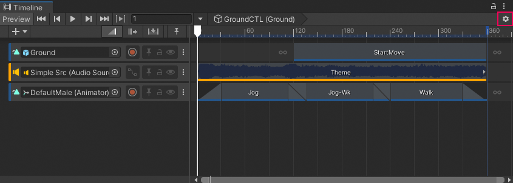
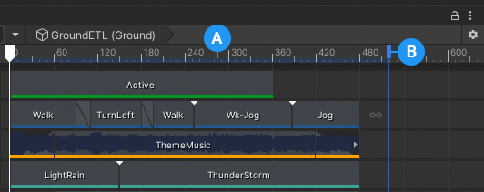

# Timeline Options

Use the Timeline Options to choose Timeline asset settings such as the unit of measurement, the duration mode, whether to display markers, and the Timeline frame rate. You can also access the Timeline Preferences.

_Click the gear icon in the Timeline window to view the Timeline Options menu_

The items in the Timeline Options menu apply to the selected Timeline asset and affect its Timeline instances. Consult the [Timeline assets and instances topic](tl-overview.md) for more information on the relationship between Timeline assets and Timeline instances.

## Preferences page

Select to open the Preferences window and access the Timeline Preferences. The Timeline Preferences are settings that apply to the Timeline window regardless of the selected Timeline asset or Timeline instance. Consult [Timeline Preferences](tl-preferences.md) for more information.

## Frames, Timecode, or Seconds

Select either **Frames**, **Timecode** or **Seconds** to set the selected Timeline asset to display time in that format. Timecode displays the time in seconds with sub-second values displayed in frames.

## Duration Mode

Use the **Duration Mode** to set whether the duration of the Timeline asset extends to the end of the last clip (**Based On Clips**), or ends at a specific time or frame (**Fixed Length**).

_Timeline asset Duration Mode set to Fixed Length_

**(A)** Length of Timeline asset. 
**(B)** Blue marker that indicates the end of the Timeline asset. 

When the **Duration Mode** is set to **Fixed Length**, use one of the following methods to change the length of the Timeline asset:

* Select the Timeline asset in the Project window and use the Inspector window to set the Duration in seconds or frames.
* In the Timeline window, drag the blue marker on the timeline. The blue marker indicates the end of the Timeline asset. A blue line indicates the duration of the Timeline asset.

## Show markers

Use the **Show markers** option to expand or collapse the Timeline marker track. This option toggles the [Timeline Markers toggle in the Track list](trk-list-overview.md).

Use the Timeline marker track, and other dedicated marker tracks, to add and manage [markers and signals](trk-list-overview.md).

## Frame Rate

Select one of the standard frame rates under **Frame Rate** to set the unit of measurement for the Timeline ruler. Change the Frame Rate to align clips at precise frames but changing the Frame Rate is only visual and has no effect on play speed, keyframes, tracks, or clips.

Timeline supports custom frame rates from 1e-6 to 1000. To set a custom frame rate, you must use the **Frame Rate** property in the [Timeline asset settings](insp-tl-asset.md). When the Timeline asset is set to a custom frame rate, Custom is automatically selected for the Timeline instance. The Custom menu item displays the custom frame rate in parentheses.
