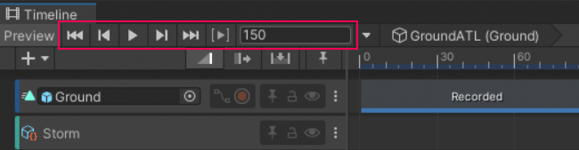
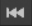
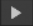
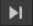
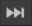
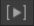
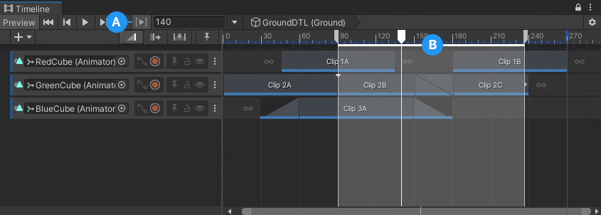
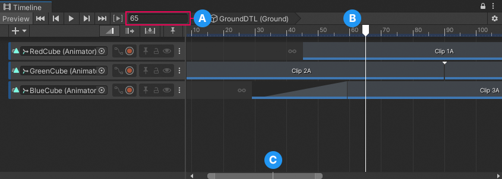

# Timeline Playback Controls

To play the Timeline instance and to control the location of the Timeline Playhead, use the Timeline Playback Controls and the Playhead Location field.

_Timeline Playback Controls and the Playhead Location field_

##  Timeline Start

To move the Timeline Playhead to the start of the Timeline instance, click the Timeline Start button, or hold Shift and press Comma (,).

##  Previous Frame

To move the Timeline Playhead to the previous frame, click the Previous Frame button, or press Comma (,).

##  Timeline Play

To preview the Timeline instance in Timeline Playback mode, click the Timeline Play button, or press the Spacebar. Timeline Playback mode does the following:

* Begins playback at the current location of the Timeline Playhead and continues to the end of the Timeline instance. If the Play Range toggle is enabled, playback is restricted to a specified time range.
* The Timeline Playhead moves along the Timeline instance. The Playhead Location field displays the position of the Timeline Playhead in either frames, timecode, or seconds, depending on the [Timeline settings](tl-options.md).
* To pause playback, click the Timeline Play button again, or press the Spacebar.
* When playback reaches the end of the Timeline instance, the Wrap Mode determines whether playback should hold, loop, or do nothing. The Wrap Mode property is in the [Playable Director component](playable-director.md).

Timeline Playback mode provides a preview of the Timeline instance while in the Timeline window. Timeline Playback mode is only a simulation of [Play mode in the Game View](https://docs.unity3d.com/Manual/GameView.html).

The Timeline Playback mode does not support audio playback. To preview a Timeline instance with audio, enable the Play on Awake option in the [Playable Director component](playable-director.md) and preview gameplay in Play mode.

##  Next Frame

To move the Timeline Playhead to the next frame, click the Next Frame button, or press Period (.).

##  Timeline End

To move the Timeline Playhead to the end of the Timeline instance, click the Timeline End button, or hold Shift and press Period (.).

##  Play Range

Enable the **Play Range** toggle to continuously loop playback within a specific range. You can only set a play range when previewing a Timeline instance within the Timeline window. Unity ignores the play range in [Play mode](https://docs.unity3d.com/Manual/GameView.html).

_Play Range enabled with loop points and highlighted area defining range_

**(A)** Play Range enabled 
**(B)** The Timeline ruler highlights the play range and indicates its start and end with loop points. To modify the play range, drag either border of the play range. 

## Timeline Playhead and Playhead Location field

The Timeline Playhead indicates the exact point in time being previewed in the Timeline window. The Playhead Location field expresses the location of the Timeline Playhead in frames, timecode, or seconds.

_Use the Playhead Location field to move the Timeline Playhead_

**(A)** Playhead Location field 
**(B)** Timeline Playhead 
**(C)** Timeline Playhead on the Zoombar 

Use the [Zoombar to navigate, scroll, and zoom](clip-pan-zoom.md) the Content view. A white line indicates the location of the Timeline Playhead in relation to the entire Timeline instance.

To jump the Timeline Playhead to a specific time, click the Timeline ruler. You can also enter the time value in the Playhead Location field and press Enter. This value is converted to frames, timecode, or seconds based on the [Timeline Options](tl-options.md).

For example, if the Timeline ruler is expressed as seconds with a frame rate of 30 frames per second, entering 180 in the Playhead Location field converts the value to seconds and moves the Timeline Playhead to 6:00. Use the [Timeline Options](tl-options.md) to set the time format and choose the frame rate.
