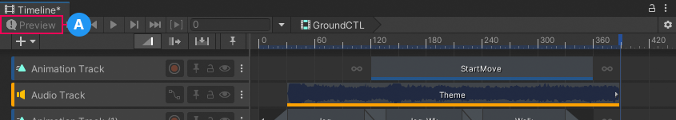

# Timeline Preview toggle

The Timeline **Preview** toggle enables or disables previewing the impact that the selected Timeline instance has on your Scene. The Timeline **Preview** is toggled on by default.

When **Preview** is toggled off, the following occurs:
* Timeline preview is disabled when using the Timeline Playback Controls. To preview your Scene, you must use Play Mode.
* Recording is disabled for all recordable tracks.
* Play range is disabled in the Timeline Playback Controls and Timeline window.
* The `Stop()` method is not called on the `PlayableDirector` when you switch between different `TimelineAsset` objects in the TimelineWindow class.

When the **Scene Preview** option is disabled in the [Timeline asset Properties](insp-tl-asset.md), the Preview toggle is unavailable and displays a warning icon.

_Preview is unavailable (A) because Scene Preview is disabled_

When you disable the Scene Preview option, if your Timeline instance transforms or modifies GameObjects, these changes are saved to the Scene which could result in unintended changes to scene data. You should only disable the Scene Preview option if you have manually coded a scene data management system that saves, restores, and protects scene data.

Enable the Scene Preview option to preview the affect of the Timeline instance on the Scene. When Scene Preview is enabled, the Timeline window also automatically manages and protects the scene and its scene data. It is recommended to always enable the Scene Preview option.
