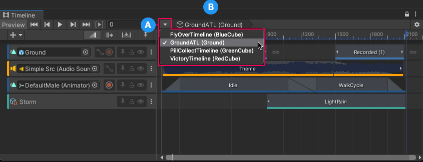
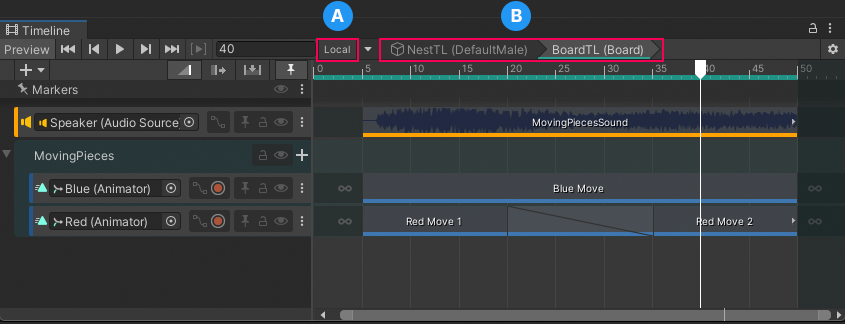
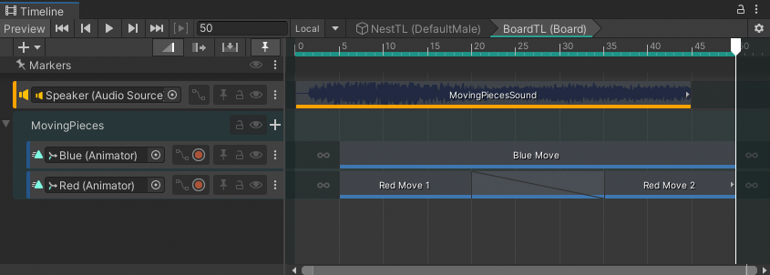
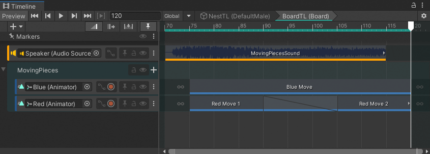

# Timeline Selector

Use the Timeline Selector to select which Timeline instance to view, modify, or preview in the Timeline window. To select a Timeline instance, click the Timeline Selector and choose from the list of Timeline instances in the current Scene.

**(A)** Timeline Selector and menu of Timeline instances. The menu indicates the selected Timeline instance with a checkmark. 
**(B)** Timeline title. 

Each menu item and the Timeline title displays the name of the Timeline asset and its associated GameObject in the current Scene. For example, the Timeline asset named `GroundATL` is associated with the `Ground` GameObject. In this case, the Timeline title displays `GroundATL (Ground)`.

## Sub-Timeline instances

When you are editing a Sub-Timeline instance, the Timeline title displays a breadcrumb list of Timeline and Sub-Timeline instances. The **Local** or **Global** button indicates whether the Timeline ruler displays local time or global time.

**(A)** Local or Global button. 
**(B)** Sub-Timeline instance. 

## Switching between Local and Global time

Use the **Local** or **Global** button to change the Timeline ruler from global time to local time and back. This option only appears when you are editing a Sub-Timeline instance.

_Local displays the Timeline ruler relative to the Sub-Timeline_

Click **Local** to switch the Timeline ruler to Global time. Global time is relative to the Sub-Timeline's Control clip in the main Timeline instance. For example, if the Control clip is placed at frame 70 on the main Timeline, then the Timeline ruler starts at frame 70 when editing the Sub-Timeline.

_Global displays the Timeline ruler relative to the main Timeline_

Click **Global** to switch the Timeline ruler to Local time. Local time is relative to the Sub-Timeline. This means that the Timeline ruler starts at zero when editing the Sub-Timeline.
