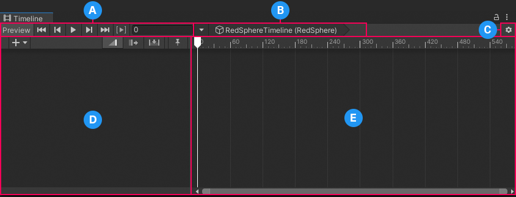
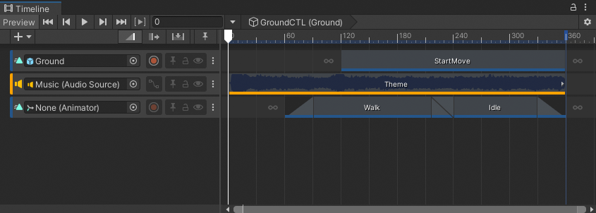
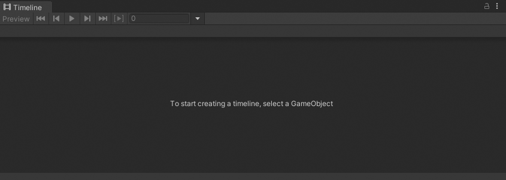
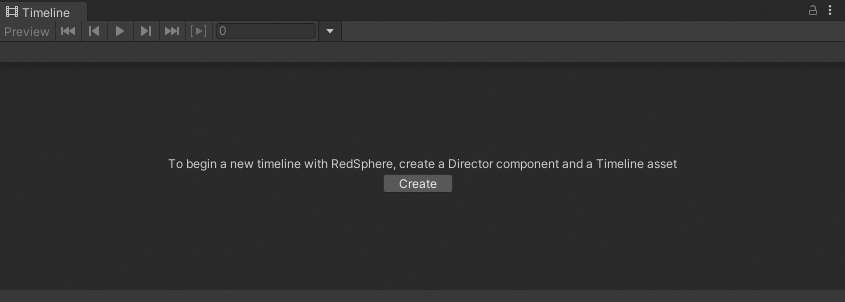
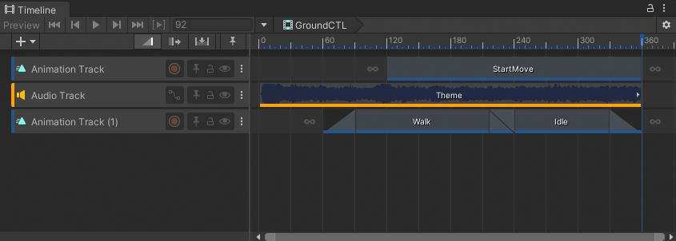
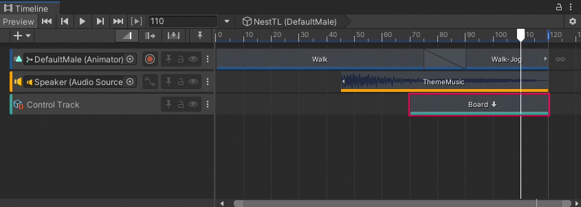
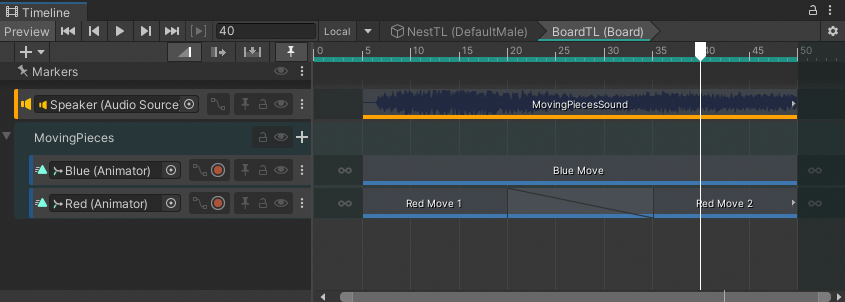

# Timeline window

Use the **Timeline window** to visually arrange tracks, clips, and markers to create cut-scenes, cinematics, and gameplay sequences.

The Timeline window provides dedicated areas for controlling playback, selecting a Timeline instance, setting Timeline options, managing tracks, adding markers, and managing clips.

**(A)** The [Timeline Preview](tl-preview.md) and [Timeline Playback Controls](tl-play-ctrls.md). 
**(B)** [Timeline Selector and instance](tl-selector-instance.md). 
**(C)** [Timeline options](tl-options.md). 
**(D)** The [Track List](trk-list-overview.md) includes the Add (+) menu, the Edit modes, the Timeline Markers toggle, and a [Track Header](trk-header.md) for each track. 
**(E)** The [Content view](clip-overview.md) includes the Timeline Playhead, Timeline Ruler, and the Zoombar. 

## Accessing the Timeline window

To access the Timeline window, go to **Window** &gt; **Sequencing** &gt; **Timeline**. What the Timeline window displays depends on what you select in the Project window, the Hierarchy window, or the Scene view.

For example, if you select a GameObject that is associated with a Timeline asset, the Timeline window displays the tracks and clips from the Timeline asset and the GameObject bindings from the Timeline instance.

_Selecting a GameObject associated with a Timeline asset displays its tracks and clips, and the bindings from the Timeline instance_

If you haven’t selected a GameObject, the Timeline window informs you that the first step for creating a Timeline asset and a Timeline instance is to select a GameObject.

_With no GameObject selected, the Timeline window provides instructions_

If a GameObject is selected and it is not associated with a Timeline asset, the Timeline window provides the option to create a new Timeline asset. This option also adds a Playable Director component to the selected GameObject and creates a Timeline instance.

_Click Create to create a Timeline asset, a Timeline instance, and add a Playable Director component to the selected GameObject_

To use the Timeline window to view a previously created Timeline asset, select the Timeline asset in the Project window and open the Timeline window.

The Timeline window displays the tracks and clips associated with the Timeline asset, but without the track bindings to GameObjects in the Scene. In addition, the Timeline Playback Controls are disabled and there is no Timeline Playhead.

_Timeline asset selected in the Project window displays its tracks and clips, but with no track bindings. The Timeline Playback Controls are disabled._

The Timeline window saves the track bindings to GameObjects in the Scene with the Timeline instance, not the Timeline asset. Consult the [Timeline assets and instances topic](tl-overview.md) for details on the relationship between the Project, Scene, Timeline assets, and Timeline instances.

## Create Sub-Timelines

[To create a Sub-Timeline](wf-subtimeline.md), drag a GameObject associated with a Timeline instance into another Timeline instance. The Timeline instance you are dragging into becomes the parent or main Timeline instance. The Timeline instance associated with the GameObject becomes a Sub-Timeline instance.

_Drag a GameObject linked to a Timeline instance (BoardTL) into another Timeline instance (NestTL) to create a Sub-Timeline instance as a Control clip on a Control track_

## Edit Sub-Timelines

To edit a Sub-Timeline instance, double-click the Control clip that contains the Sub-Timeline instance.

The Timeline window switches to the Sub-Timeline instance, indicated by the Timeline title which is the name and GameObject of the parent Timeline instance, followed by the name and GameObject of the Sub-Timeline instance.

_The Timeline title indicates that you are editing a Sub-Timeline instance_

When viewing a Sub-Timeline, use the **Local** or **Global** button to change the Timeline ruler from local time to global time. The Local or Global button is documented in [the Timeline Selector topic](tl-selector-instance.md) since it is related to selecting the Timeline instance.
