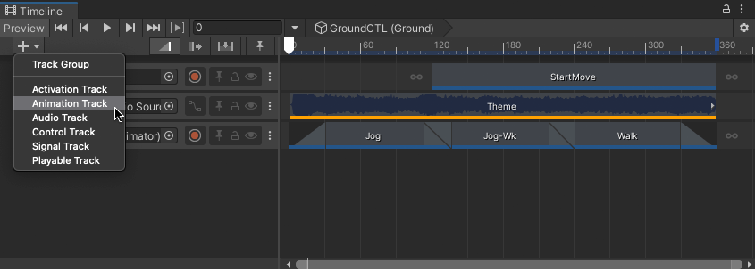

# Add tracks

The Timeline window supports many different methods of adding tracks to the Track list. Depending on the method you choose, the Timeline window may also add track bindings to the Track header, clips to tracks, and components to GameObjects.

The simplest method to add a track is to click the **Add** (**+**) menu and choose the track to add. You can also right-click an empty area of the Track list to add a track.

_Add (+) menu_

Timeline supports adding the following tracks:

* **Activation**: Use this track to control when its bound GameObject is active. When you select an Activation track, its [track properties](insp-trk-act.md) appear in the Inspector window.
* **Animation**: Use this track to animate GameObjects and humanoids. When you select an Animation track, its [track properties](insp-trk-anim.md) appear in the Inspector window.
* **Audio**: Use this track to play Audio clips. When you select an Audio track, its [track properties](insp-trk-audio.md) appear in the Inspector window. You can also [animate Audio track properties](curves-overview.md#curvesviewaudiotrack) with the Curves view.
* **Control**: Use this track to schedule a Sub-Timeline or to control a particle system, a prefab, or a script that uses ITimeControl. The Control track itself has no track properties. Instead, a Control track depends on its Control clips. It is recommended to add a Control track by dragging a GameObject into the Content view. Consult [About Control clips](insp-clip-control.md#aboutctrlclips) for more on Control clips and Control tracks.
* **Playable**: Use this track to add Playable clips. Each Playable clip is bound to a script that uses the [Playables API](https://docs.unity3d.com/Manual/Playables.html) to create custom animation tools, effects, or gameplay mechanisms. Note that the script must inherit from `PlayableAsset` to be detected automatically and create a Playable Track. Consult the [Tween Track sample](samp-custom-samples.md#tweensamp) for an example of how to create a custom Playable track.
* **Signal**: Use this track to schedule Signal Emitters that send signals to its bound GameObject. The bound GameObject must have a Signal Receiver component with a reaction to successfully receive signals and perform a reaction. The Signal track itself has no track properties.

## Dragging into the Track list

Drag a GameObject into an empty area in the Track list and choose the type of track to add from the context menu. Depending on the type of track selected, the Timeline window performs different actions:

* Select **Animation Track** and the Timeline window binds the GameObject to the Animation track. If the GameObject doesn't already have an Animator component, the Timeline window creates an Animator component for the GameObject.
* Select **Activation Track** and the Timeline window binds the GameObject to the Activation track. There are some limitations when creating an Activation track when dragging a GameObject. For example, the main GameObject with the Playable Director component should not be bound to an Activation track. Because this is the same GameObject that links the Timeline asset to the Scene, activating and disabling the GameObject affects the length of Timeline instance.
* Select **Audio Track** and the Timeline window adds an Audio Source component to the GameObject and binds this Audio Source component to the Audio track.
* Select **Signal Track** and the Timeline window binds the GameObject to the Signal track. If the GameObject doesn't already have a Signal Receiver component, the Timeline window adds a Signal Receiver component to the GameObject.
