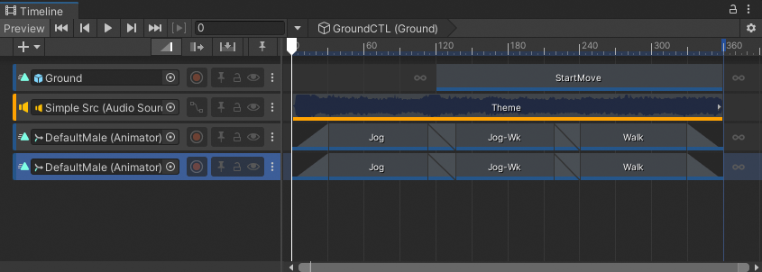

# Duplicate tracks

Duplicating a track copies its binding, clips, blends, and Inspector properties.

_Result of duplicating the last track bound to `DefaultMale`_

There are many ways to duplicate tracks:

* Select a track. Right-click an empty area in the Track list and choose **Duplicate** from the context menu.
* Select a track. Hold Control (MacOS: Command) and press D.
* Select a track. Hold Control (MacOS: Command) and press C, for copy, then press V, for paste.
* Right-click a track and either select **Duplicate** from the context menu or hold Control (MacOS: Command) and press D.
