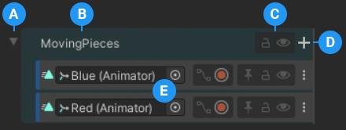
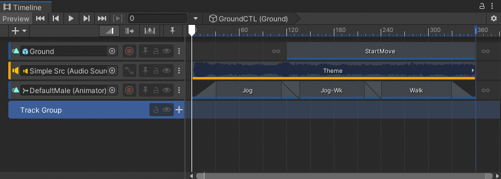
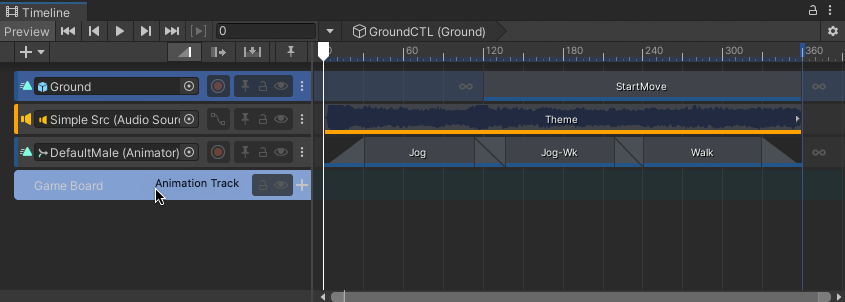
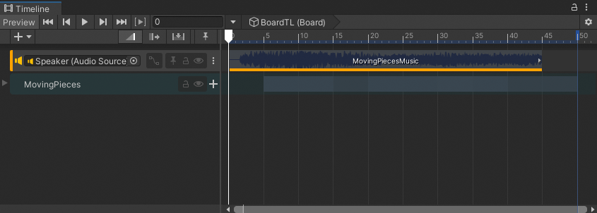
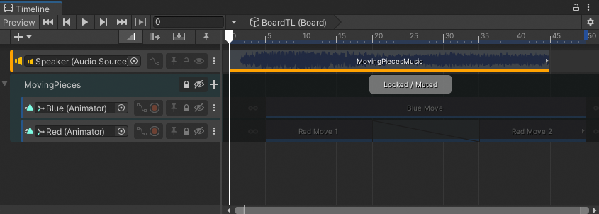
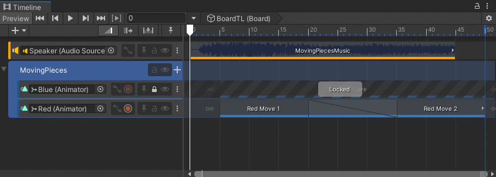
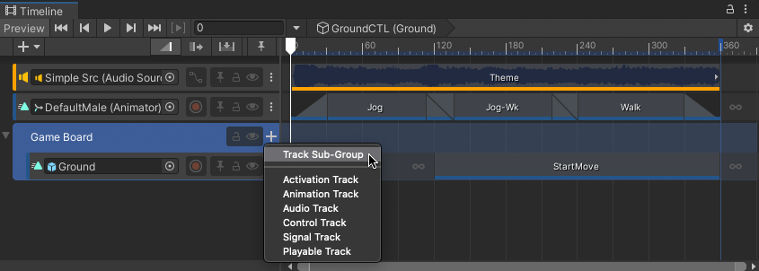

# Group tracks

Use Track groups to organize tracks into groups when you are working with many tracks. For example, a Timeline instance has two Animation tracks that animate pieces to set up a game board. You can group these two tracks into a Track group named `MovingPieces`.

_A Track group with two Animation tracks_

**(A)** Use the foldout (triangle) to [collapse or expand the Track group](#collexpgroup). 
**(B)** Track group name. 
**(C)** Use the Lock and Mute toggles to [lock or mute the tracks in the Track group](#grouplockmute). 
**(D)** Use the Add (+) button to [add tracks or sub-groups](#addsubgroup) directly to the Track group. 
**(E)** Track headers for the tracks within a Track group are indented. 

To add a Track group, select the **Add** (**+**) menu and choose **Track Group**. You can also right-click an empty area of the Track list and choose **Track Group** from the context menu. When you add a Track group, it is added to the bottom of the Track list.

_Timeline instance with a Track group added to the bottom of the Track list_

To rename a Track group, click its name. Type the new name for the Track group and press Return. You can also rename a Track group in the Inspector window.

To move tracks into a Track group, select one or more tracks and drag over the Track group. When you drag a selection of tracks, the name of the last selected track displays beside the cursor.

To drop the tracks before a specific track in a Track group, drag until a white insert line indicates the destination. This is the same as [reordering tracks](trk-reorder.md) outside a Track group.

_If you release when the Track group is highlighted, the tracks are moved to the top of the Track group._

## Collapsing and expanding Track groups

To collapse the tracks in a Track group, click the foldout (triangle) beside the name of the Track group. The tracks are collapsed from view in the Timeline window, but are not muted. To expand the tracks in a Track group, click the foldout (triangle) again.

_When a track group is collapsed, a ghost track visually represents the tracks in the Track group._

You can also press the Left arrow key to collapse the tracks in a Track group while the Track group is selected. Press the Right Arrow key to expand the tracks in a Track group. If you press the Right Arrow key with a Track group already selected, the selection switches to the first selectable clip on the first track in the Track group.

## Locking and muting Track groups

Lock a Track group to prevent editing its sub-groups, tracks, and clips.  Mute a Track group to hide the effect its sub-groups, tracks, and clips have on your scene.

_A Track group can be both locked and muted._

A locked Track group has the message `Locked` with its Lock toggle enabled. A muted Track group has the message `Muted` with its Mute toggle enabled.

There are many ways to lock and unlock a Track group:
* Enable the Lock toggle in the Track group.
* Select a Track group and press L. You can select and lock or unlock multiple Track groups and tracks at a time.
* Right-click a selected Track group and choose **Lock** or **Unlock** from the context menu.

There are many ways to mute a Track group:
* Enable the Mute button in the Track header.
* Select a track and press M. You can select and mute or unmute multiple Track groups and tracks at a time.
* Right-click a selected Track group and choose **Mute** or **Unmute** from the context menu.

Tracks in a Track group maintain their individual locked and muted states when you lock a Track group. This means that if you lock or mute a track and then lock or mute its Track group, when you unlock or unmute the Track group, the track remains locked or muted.

For example, the MovingPieces Track group has its first track locked and its second track unlocked. If you lock the Track group, both the first and second track are locked. If you unlock the Track group, the first track remains locked and the second track is unlocked because the first track was locked before the Track group was locked.

_MovingPieces Track group is unlocked but its first track remains locked because it was locked before the Track group was locked._

## Adding Track sub-groups

A Track group can have any number of Track sub-groups. There are many ways to add a Track sub-group:

* Select a Track group, click the **Add** (**+**) menu in the Track list, and choose **Track Sub-Group**.
* Click the **Add** (**+**) button beside the Track group name, and choose **Track Sub-Group**. You can also use this menu to add tracks directly to a Track group or a Track sub-group.

_Click the Add (+) button to add tracks and sub-groups directly to the Track group. Tracks and sub-groups are added to the bottom of the Track group._
