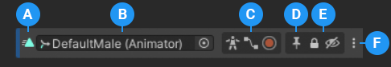

# Track header

When a Timeline asset is selected, use the Track Header to rename a track, display the Curves view for an Audio track, or lock and mute a track.

When a GameObject with a Timeline instance is selected, use the Track Header to set the track binding or rename a track, enable an Avatar mask, display the Curves view, record keyframe animation, display Track markers, or lock and mute a track.

_Track Header for an Animation track when a GameObject with a Timeline instance is selected_

**(A)** The [colored accent and icon](#accenticon) provides track information and indicates track errors or warnings. 
**(B)** The [Track name or its binding](#tracknameorbinding) 
**(C)** Use the Avatar Mask, Curves View, and Record toggle to [enable masking between Animation tracks](wf-anim-override.md), [display and edit animation curves](curves-overview.md) for Animation clips or Audio tracks, and to [record basic animation](wf-record-anim.md). 
**(D)** Enable the Track Markers toggle to expand the size of markers on the track and to make the markers selectable. Disable the Track Markers toggle to collapse markers and make them unselectable. 
**(E)** Use the Lock and Mute toggles to [lock and mute tracks](trk-lock-mute.md). 
**(F)** More (⋮) menu 

## Colored accent and icon

Each Track header has a colored accent that identifies the track type and its clips:

* Activation tracks are green. Use Activation tracks to add Activation clips which set when the bound GameObject is active. The GameObject is bound to the Activation track.
* Animation tracks are blue. Use Animation tracks to add Animation clips that animate the bound GameObject. Use an Animation track and its Animation clips to [record basic animation](wf-record-anim.md) or [animate a humanoid](wf-anim-human.md).
* Audio tracks are orange. Use Audio tracks to add Audio clips for playing background music or sound effects. Each Audio clip is bound to an audio waveform. The audio source, that plays each waveform, is bound to the Audio track.
* Control tracks are turquoise. Use Control tracks to add Control clips which are special clips that control a Sub-Timeline instance, Particle System, Prefab instance, or ITimeControl Script. [How the Control clip is created](insp-clip-control.md) determines what it controls.
* Playable tracks are white. Use Playable tracks to add Playable clips. Each Playable clip is bound to a script that uses the [Playables API](https://docs.unity3d.com/Manual/Playables.html) to create custom animation tools, effects or gameplay mechanisms.

Each Track header is also identified by an icon. If a track has a binding error, its bound GameObject is disabled, or another track related error occurs, then this icon switches to an error or warning icon. Hovering over this icon displays an error or warning message.

For example, if an Animation track is bound to a disabled GameObject, the icon switches to an alert icon.

_An alert icon indicates that the RedCube bound GameObject is disabled. Hover over the icon to view an explanation of the warning._

## Track name or binding

When a Timeline instance is selected, depending on the type of track, the Track header displays either the track name or the track binding.

To rename a track that has a track name, click the track name, type the new name and press Return. You can also rename tracks in the Inspector window when setting [track properties](insp-trk.md).

To select or change a track binding, click the picker (circle) to choose from the list of GameObjects in your Scene. This list only includes GameObjects that have an Animator component.

To view the GameObject that is bound to a track, click the track binding and the linked GameObject is indicated in the Hierarchy view.

Track bindings are saved to the Playable Director component associated with the GameObject that is linked to the Timeline asset. For more information on the relationship between Timeline assets and Timeline instances, consult the [Timeline assets and instances topic](tl-overview.md).
