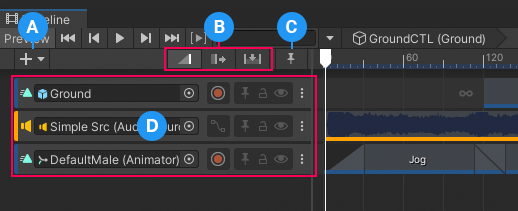

# Track list

Use the Track list to add, select, duplicate, delete, lock, mute, and reorder the tracks of a Timeline asset or Timeline instance.

**(A)** Use the Add (+) button to [add tracks](trk-add.md) and [Track Groups](trk-groups.md). 
**(B)** Select an [Edit mode](clip-overview.md) to choose how clips and markers interact with each other when you add, position, trim, or resize them in the [Content view](clip-overview.md). 
**(C)** Use the Timeline Markers toggle to expand and collapse the [Timeline marker track](trk-list-overview.md). Use the Timeline marker track, and other dedicated marker tracks, to add and manage [markers and signals](trk-list-overview.md). 
**(D)** The Track list displays a [Track header](trk-header.md) for each track in the Timeline instance or Timeline Asset. The options available for each Track Header depends on the type of track.

The remainder of this section includes topics on how to add, select, duplicate, reorder, group, delete, lock, and mute tracks.
