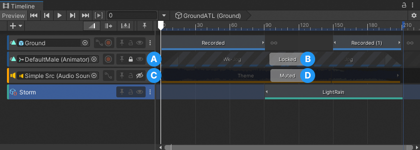

# Lock and mute tracks

Lock a track to prevent editing the track or its contents. Mute a track to hide the effect its signals and clips have on your scene. A track can be both locked and muted.

For example, you can lock an Animation track when you have finished creating a cut-scene and you want to avoid inadvertently modifying its Animation clips. You can mute an Audio track if you want to stop its audio from playing while you edit other tracks and clips in your Timeline instance.

_A muted track and a locked track_

**(A)** An enabled Lock toggle identifies a locked track. 
**(B)** A locked track has the message `Locked`. You cannot select, edit, or delete a locked track or its contents. 
**(C)** An enabled Mute toggle identifies a muted track. 
**(D)** A muted track has the message `Muted`. You can select, edit, and delete a muted track and its contents. 

There are many ways to lock or unlock a track:
* Enable the Lock toggle in the Track header.
* Select a track and press L. You can select and lock or unlock multiple tracks at a time.
* Right-click a selected track and choose **Lock** or **Unlock** from the context menu.

There are many ways to mute or unmute a track:
* Enable the Mute toggle in the Track header.
* Select a track and press M. You can select and mute or unmute multiple tracks at a time.
* Right-click a selected track and choose **Mute** or **Unmute** from the context menu.
