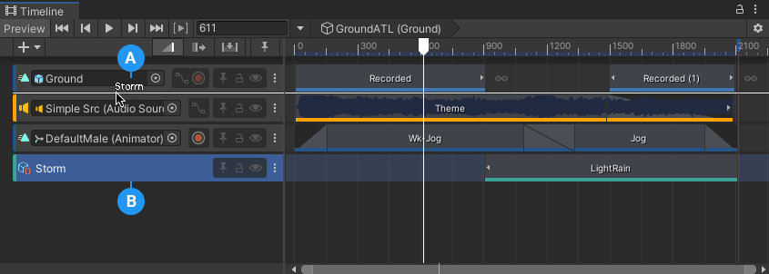
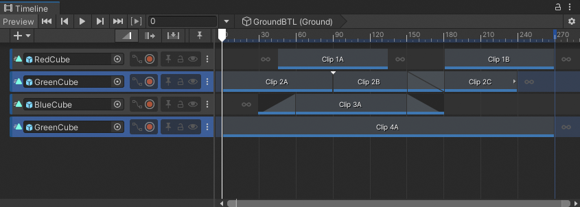

# Reorder tracks and animation priority

To reorder tracks, select one or more tracks and drag until a white insert line appears between tracks in the Track list. The white insert line indicates the destination of the tracks you are dragging. The name of the last selected track displays beside the cursor.

_The white insert line (A) indicates the destination of the track named `Storm` (B)_

## Animation Priority

In the Timeline window, the animation priority is from the first track to the last track, where the last track has priority. When you reorder tracks, it is important to understand the animation priority.

For example, a Timeline instance has four Animation tracks, where the second and fourth Animation tracks animate the same GameObject. The fourth track overrides the animation on the preceding tracks.

_The second track and fourth track animate the same GameObject (GreenCube). The fourth track has priority and overrides the second track._

The example above uses Animation tracks but animation priority applies to any track that uses the same GameObject and Animator as another track.

For example, a Control track has a Control clip with a Sub-Timeline. This Sub-Timeline includes an Animation track that animates the same GameObject as an Animation track on the main Timeline. According to the animation priority, whichever track is last in the main Timeline takes priority.

## Reordering Animation Override tracks

The first to last animation priority is why an Animation Override track is added after the Animation track being overridden: because the Animation Override track overrides the animation on the preceding track.

An Animation Override track is bound to the same GameObject as its parent Animation track. If you reorder an Animation Override track without selecting its parent Animation track, the binding of the Animation Override track is set to none and the track becomes an Animation track.
