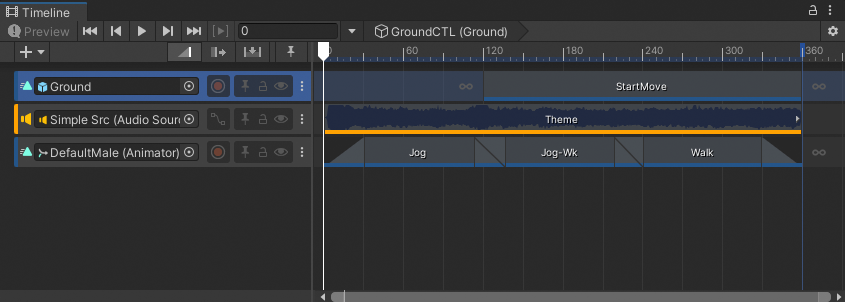
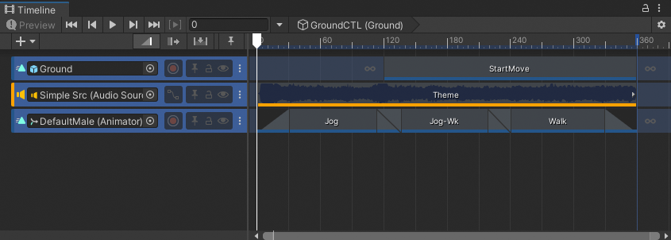

# Select tracks

To select a single track, click its Track header in the Track list. You can also click an empty area in the Content view. When you select a track, Timeline highlights its Track header and Content view. Selecting a track deselects all other tracks or clips.

Selecting a track also shows [its properties in the Inspector window](insp-overview.md). The track properties change depending on the type of track and how many tracks you select.

To select contiguous tracks, select the first track and then hold Shift and click the last track in the series. For example, to select three contiguous tracks, click the first track, then hold Shift and click the third track. All three tracks are selected.

_Click to select the first track_

_Hold Shift and click to select contiguous tracks_

Hold Control (MacOS: Command) and click to select discontiguous tracks. Hold Control (MacOS: Command) and click to deselect a selected track.

There are many other ways to select tracks:
* Hold Shift and press the Up arrow key or Down arrow key to add and remove tracks from the selection.
* To deselect all tracks or clips, click on an empty area in either the Track list or Content view.
* When a clip is selected on a track, press Tab to select the track.
* Use the arrow keys to change the selected track. The Up and Down arrow keys select the previous or next track. The Right arrow key selects the first clip on the track.
* If a Track group is selected, the Left arrow and Right arrow keys collapse and expand the Track group.
