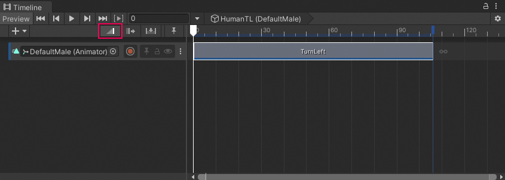
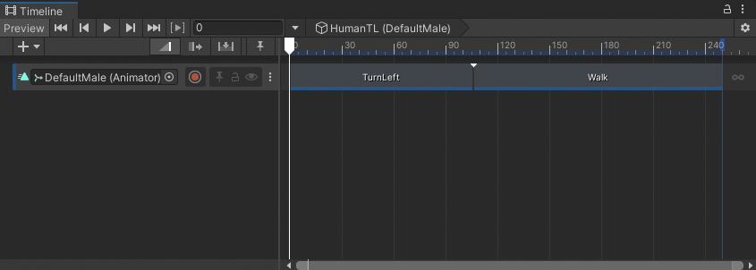
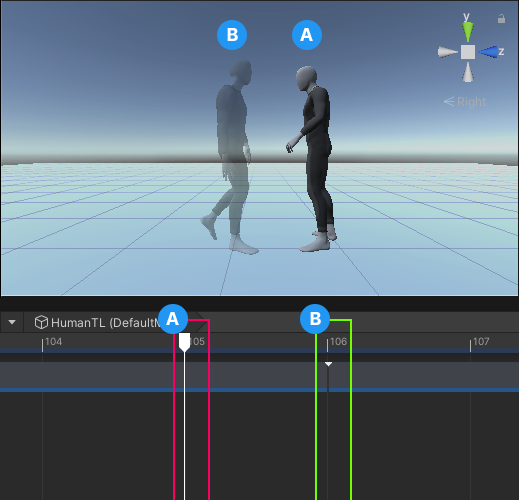
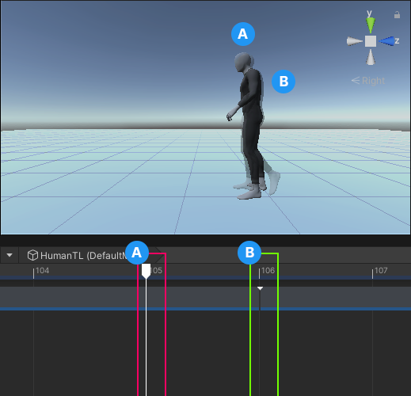
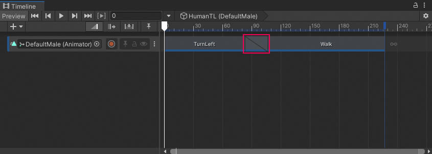
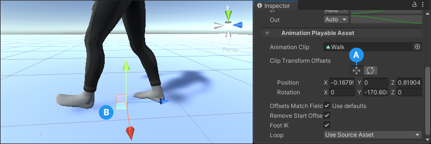

# Animate a humanoid

This workflow demonstrates how to use a Timeline instance to animate a humanoid model so that it turns left and begins to walk.

Although this workflow uses a humanoid, you can use this animation method for any GameObject.

This workflow uses the humanoid model named `DefaultMale` and animation source assets from the [Gameplay Sequence sample](samp-gameplay-demo.md) for its examples. Consult [Timeline Samples](samp-overview.md) for information on the samples available from the Timeline package and how to import these samples into your projects.

This workflow starts with a Timeline instance that has an empty Animation track bound to the `DefaultMale` humanoid model.

_The `DefaultMale` humanoid model linked to a Timeline instance (`HumanTL`) with an empty Animation track bound to the same model_

While animating the humanoid model, this workflow demonstrates how to do the following:
1. [Add and position Animation clips](#addclips).
1. [Match clip offsets](#matchclips).
1. [Create blends between clips](#blendclips).
1. [Manually adjust clip offsets to reduce foot sliding](#reduceslide).

## Add and position Animation clips

1. From your Project, drag an animation source asset into the Animation track to add a new Animation clip.

   Dragging a source asset adds an Animation clip on the same track. The duration of the Animation clip matches the source asset.

1. To position, resize, or trim the Animation clip in the Content view, select **Mix mode** as the Edit mode.

   There are [three Edit modes](clip-overview.md) that affect the editing behavior of the Timeline window. When the Timeline window is in **Mix mode**, you can drag to position, trim, and blend clips.

   You can also select an Animation clip to modify its [Animation clip properties](insp-clip-anim.md), including its Start, End, and Duration, in the Inspector window.

   

   _The Mix mode (red) is the selected Edit mode. The `TurnLeft` clip is positioned to start at frame 0._

1. Add a second Animation clip. This workflow adds a walk clip (`Walk`), positions the clip so it starts immediately after the first clip, and it resizes the second clip to include one loop.

   

   _Animation track with the `TurnLeft` and `Walk` Animation clips_

1. Play the Timeline instance. In this example, the `DefaultMale` animation jumps between each Animation clip because its position and rotation at the end of each clip does not match the position and rotation at the start of the next Animation clip.

   

   _The `DefaultMale` jumps between the `TurnLeft` Animation clip, which ends at frame 105 (A), and the `Walk` Animation clip, ghost model which starts at frame 106 (B)_

## Match clip offsets

To fix animation jumping between clips, match the offset of each Animation clip. The Timeline window provides [different methods for matching offsets](clip-match.md). This workflow demonstrates how to match an Animation clip with the previous clip.

In this workflow, to match the TurnLeft clip with the previous clip, follow these steps:

1. Select the TurnLeft clip.

1. Right-click the selected clip and choose **Match Offsets to Previous Clip** from the context menu.

   The position and rotation of the humanoid at the start of the second Animation clip (`Walk`) matches the position and rotation of the humanoid at the end of the first Animation clip.

   

   _The ghosted `DefaultMale` at the start of the `Walk` Animation clip, which starts at frame 106 (B), matches the position and rotation of the `DefaultMale` at the end of the `TurnLeft` Animation clip, which ends at frame 105 (A)_

1. Play the Timeline instance again.
   Although the position and rotation of the humanoid matches, there is still a jump between the two Animation clips because the humanoid is in different poses:
   * At the end of the `TurnLeft` Animation clip, the feet are on the ground and the arms are slightly raised.
   * At the start of the `Walk` Animation clip, the left leg is off the ground and the arms are in a relaxed position.

   To remove the jump and to transition between these two poses, you can [create a blend](#blendclips).

## Create blends between clips

Create a blend to seamlessly mix between two different animations or poses. The Timeline window includes many different ways to [create a blend](clip-blend.md) between Animation clips.

To create a blend, move an Animation clip until it overlaps another Animation clip.

You might need to adjust the size of the Animation clips, the Blend Area, the Clip In value, and the shape of each Blend Curve to create a smoother transition between the two poses.

For example, in the transition between the `TurnLeft` clip and the `Walk` clip, the `Walk` clip was repositioned to start at frame 83. The rest of the clip properties are unchanged from their default values.

_Overlap two clips to create a smooth transition between two Animation clips_

As the `TurnLeft` clip transitions to the `Walk` clip, the blend removes the obvious jump between poses. The transition between most body parts appears natural, however in this case, the blend between the different positions of the foot results in an unnatural slide.

## Reduce foot sliding

To reduce foot sliding, manually adjust the offset of an Animation clip so that the position of the foot changes less drastically.

To manually adjust the offset, follow these steps:

1. Select the Animation clip in the Timeline window and, in the Inspector window, expand **Animation Playable Asset**.

   

   _The **Animation Playable Asset** properties include the **Clip Transform Offsets**_

   In this example, the X Position. Z Position, and Y Rotation of the **Clip Transform Offsets** for the Walk Animation clip is not zero because a **Match Offsets to Previous Clip** was performed earlier in this workflow. Match to a previous clip sets these values to match the root of the humanoid at the end of the previous Animation clip.

1. With the Animation clip selected, use one of the following methods:
   * In the Inspector window, under **Clip Transform Offsets**, change the value of the appropriate **Position** property.
   * In the Inspector window, under **Clip Transform Offsets**, enable the Move tool. The Move Gizmo appears in the Scene view at the root of the Animation clip. In the Scene view, drag the Move Gizmo.

   

   _Enable the Move tool (A) to view the Move Gizmo (B)_
