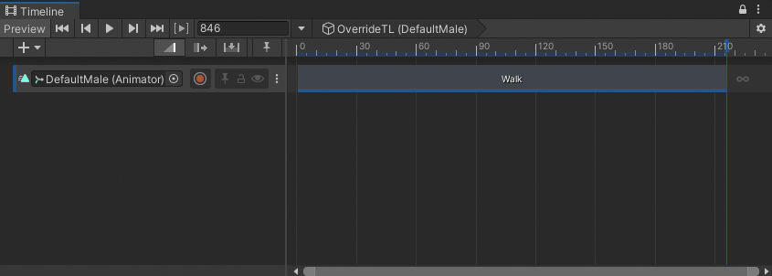
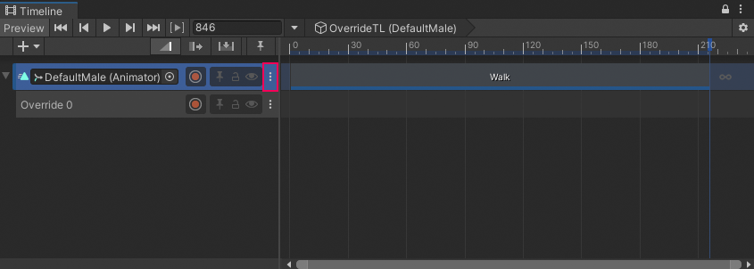
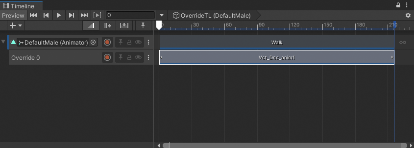
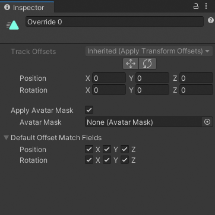
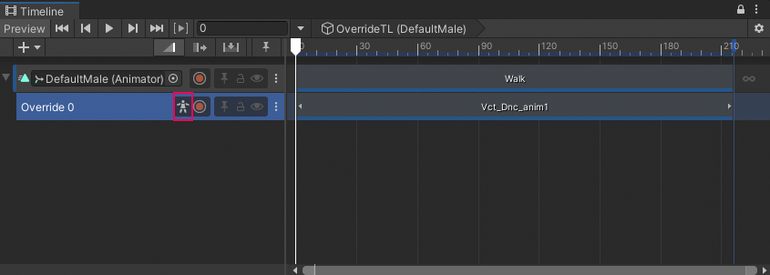

# Override upper-body animation

This workflow demonstrates how to use an Animation Override track and an Avatar Mask to replace the upper-body animation of an Animation track. For example, you can use this technique to animate a humanoid to walk while celebrating a victory.

This workflow uses the humanoid model named `DefaultMale` and animation source assets from the [Gameplay Sequence sample](samp-gameplay-demo.md) for its examples. Consult [Timeline Samples](samp-overview.md) for information on the samples available from the Timeline package and how to import these samples into your projects.

This workflow starts with a Timeline instance that has an Animation track bound to the `DefaultMale` humanoid model. The Animation track has a single Animation clip that starts at frame 0 and loops twice for a duration of 216 frames.

_The `DefaultMale` humanoid model linked to a Timeline instance (`OverrideTL`) with an Animation track bound to the same model (`DefaultMale`) with a Walk Animation clip that loops twice._

In this workflow, to add an Animation Override track and override the upper-body animation, follow these steps:

1. In the Track Header for the Animation track, click the **More** (**⋮**) menu and choose **Add Override Track**. An Animation Override track, named `Override 0`, is linked to the selected Animation track.

Notice that the Animation Override track is not bound to a GameObject. Because the Animation Override track is linked to the Animation track above, the Override track is bound to the same GameObject: the `DefaultMale` humanoid.

_Animation track with an Animation Override track. The More (⋮) menu icon is indicated in red._

2. From your Project, drag an animation source asset with upper-body animation into the Override track. This workflow uses the `Vct_Dnc_anim1` animation source asset from the [Gameplay Sequence sample](samp-gameplay-demo.md).

3. Position and resize the clip to choose the upper-body animation to combine with the Walk clip. The Animation clip on the Override track should also match the size of Walk clip.

_The Animation Override track contains a trimmed part of the full `Vct_Dnc_anim1` animation source asset (frames 630 to 846). This clip was also positioned and resized to match the Animation clip (`Walk`) on the parent Animation track._

4. Play the Timeline instance. The victory dance clip, `Vct_Dnc_anim1`, completely overrides the `Walk` clip. To combine the lower-body animation from one Animation clip with the upper-body animation from the Animation Override clip, you must specify an Avatar Mask for the Animation Override track.

5. To specify an Avatar Mask, select the Override track to view its [track properties in the Inspector window](insp-trk-anim.md).

_The track properties for an Animation Override track are the same as an Animation track_

6. In the Inspector window, specify an Avatar Mask that masks the lower body animation for the Avatar Mask property. If you do not have an Avatar Mask that masks the lower body, consult [Avatar Mask window](https://docs.unity3d.com/Manual/class-AvatarMask.html) for information on how to create one.

Once you have specified a lower body Avatar Mask, select the mask and enable the **Apply Avatar Mask** checkbox. An Avatar Mask toggle appears beside the Override track name.

_In the track header, the enabled Avatar Mask indicates that the Animation Override track uses an Avatar Mask._

7. Play the Timeline instance. In this example, the `DefaultMale` humanoid uses upper-body animation from the `Vct_Dnc_anim1` clip and the lower body animation from the Walk clip.

To temporarily disable the Avatar Mask, toggle the Avatar Mask toggle off. This is the same as disabling the **Apply Avatar Mask** checkbox in the Inspector window.
