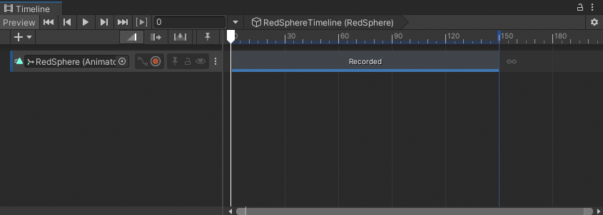

# Convert an Infinite clip

When you record animation to an Animation track in the Timeline window, it creates an Infinite clip. An Infinite clip cannot be positioned, trimmed, or split because it does not have a defined duration. An Infinite clip appears as a dope sheet.

To position, trim, split, or perform other clip manipulations on an Infinite clip, you must first convert it to an Animation clip. Once you convert an Infinite clip to an Animation clip, you cannot convert it back to an Infinite clip.

To convert an Infinite clip to an Animation clip, in the Track Header of the track with the Infinite clip, click the **More** (**⋮**) menu and choose **Convert to Clip Track**.

_Each Track Header has a Track menu_

You can also right-click the track and choose **Convert to Clip Track** from the context menu. The **More** (**⋮**) menu and context menu are similar.

_An infinite clip after it has been converted to an Animation clip_
