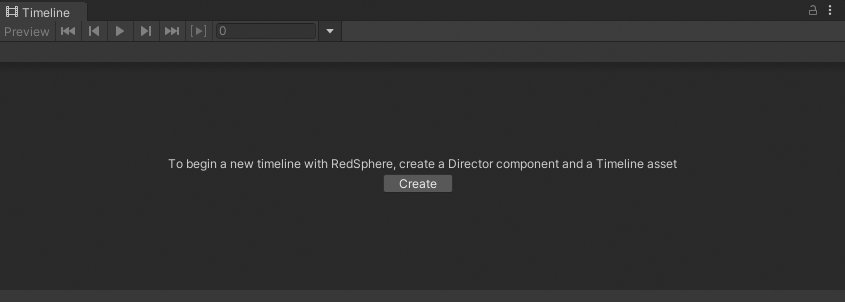
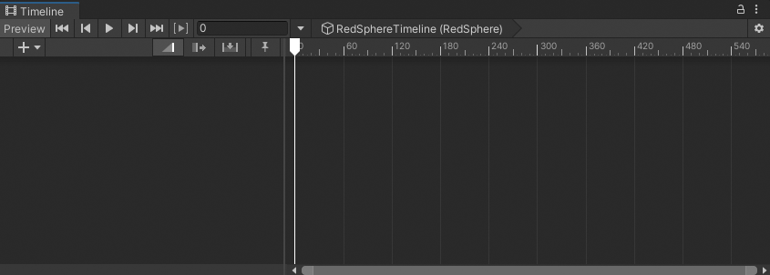

# Create a Timeline asset and Timeline instance

To use a Timeline asset in your Scene, you must associate the Timeline asset with a GameObject using a [Playable Director](playable-director.md) component.

Associating a Timeline asset with a Playable Director component creates a Timeline instance and allows you to specify which objects in the Scene are animated by the Timeline asset.

_Timeline window with Create_

The Timeline window automatically creates a Timeline instance while creating a new Timeline asset. The Timeline window also adds the necessary components. To create a new Timeline asset and Timeline instance, follow these steps:

1. In your Scene, select the GameObject that you want to use as the focus of your cinematic or other gameplay-based sequence.
2. Open the Timeline window (menu: **Window** &gt; **Sequencing** &gt; **Timeline**). If the GameObject does not have a Playable Director component attached to a Timeline asset, a message in the Timeline window prompts you to click  **Create**.
3. Click **Create**. A dialog box prompts you for the name and location of the Timeline asset you are creating. You can also specify tags to identify the Timeline asset.
4. Click **Save**.

The Timeline window saves a new Timeline asset to the Assets directory of your Project. If you did not change the name and location of the Timeline asset you are creating, the Timeline window creates a name based on the selected GameObject with the `Timeline` suffix. For example, selecting the GameObject called `RedSphere` names the Asset `RedSphereTimeline`.

_Timeline asset named `RedSphereTimeline` created for the `RedSphere` GameObject and opened in the Timeline window_

Timeline also adds a Playable Director component to the selected GameObject, and sets the **Playable** property to the Timeline asset. The link between the GameObject and the Timeline asset is a Timeline instance.

_Playable Director component added to the GameObject named `RedSphere`_
