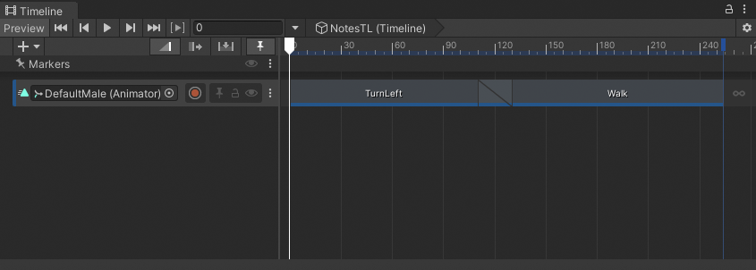
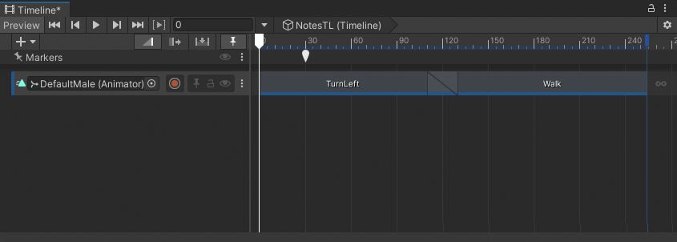
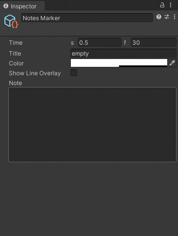
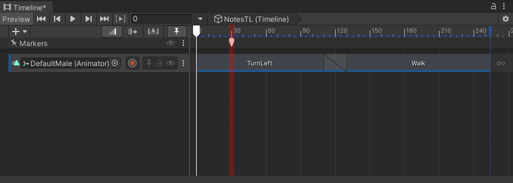
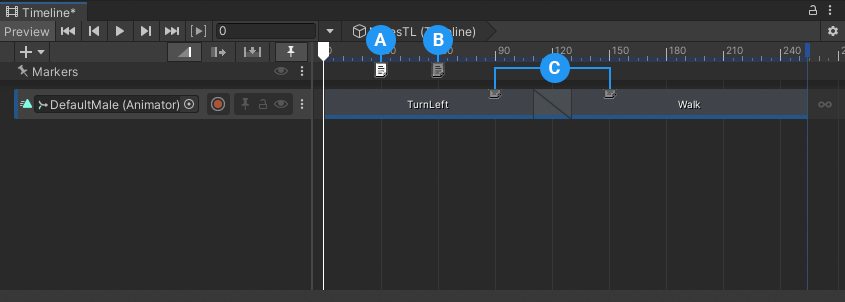
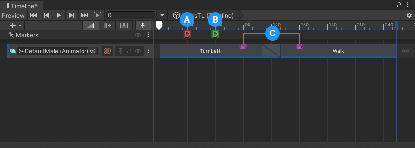

# Create a custom marker

This workflow demonstrates how to create a custom marker that you can use to add notes to your Timeline instance. This workflow also demonstrates how to change the default appearance of a custom marker with scripting and a Unity Style Sheet (USS).

If you are unfamiliar with markers and signals, it is recommended that you follow [the markers and signals workflow](wf-signals.md) before this workflow.

The custom marker created in this workflow is a simplified version of the custom Annotation marker found in the [Customization Samples sample](samp-custom-samples.md#annosamp). Consult [Timeline Samples](samp-overview.md) for information on the available Timeline samples and how to import them into your projects.

To demonstrate how to create a custom marker, this workflow is divided into the following main tasks:
1. [Set up the Timeline instance](#setup-instance).
1. [Add folders for scripts and files](#add-files).
1. [Create a Notes marker with custom properties](#note-marker).
1. [Add a line overlay](#line-overlay).
1. [Customize the marker's appearance with USS](#marker-uss).
1. [Add a marker overlay](#marker-overlay).
1. [Override the default tooltip](#tooltip).
1. [Check your scripts](#fullsrc).
1. [Add more features](#more).


<a name="setup-instance"></a>
## Set up the Timeline instance

The examples in this workflow use the Timeline instance named `NotesTL` which has a single Animation track bound to the `DefaultMale` model. The content of this Animation track is the result of following the [Animate a humanoid](wf-anim-human.md) workflow.


_The NotesTL Timeline instance before creating a custom marker_

It is not necessary to create the same Timeline instance shown in this workflow. You can use any Timeline instance to follow this workflow.

<a name="add-files"></a>
## Add folders for scripts and files

In a Unity project, you store scripts, images, and other supporting files in the `Assets` folder. You can keep the `Assets` folder organized by adding additional folders and sub-folders. To ensure that some scripts, images, and assets are recognized by the Unity Editor, some folders must have specific names, be placed in a specific folder structure, or both.

To organize the `Assets` folder and create a recognized folder structure, follow these steps:

1. In the Project view, right-click the `Assets` folder and choose **Create** &gt; **Folder** from the context menu.
1. Name this new folder `Notes`.
   This folder will store the scripts, assets, and images for overriding the default marker behavior and appearance.
1. In the `Notes` folder, add a new folder and name it `Editor`.
   This folder will store a custom script that overrides the default marker behavior and creates a custom editor. This folder must be named `Editor`.
1. In the `Editor` folder, add a new folder and name it `Stylesheets`.
1. In the `Stylesheets` folder, add two new folders. Name one folder `Extensions` and the other `Resources`.
   The `Extensions` folder will store a Unity Style Sheet. This file must be in the path `Editor/Stylesheets/Extensions` to be recognized.
   The `Resources` folder will store the image resource files used by the Unity Style Sheet. Resource images must be in the path `Editor/Stylesheets/Resources` to be recognized.

   

   _Project window with the `Notes` folder and its paths expanded._

<a name="note-marker"></a>
## Create a Notes marker with custom properties

To create a custom Notes marker with custom properties, you must write a script with a class that inherits from the `Marker` class. To do this, follow these steps:

1. In the Project window, right-click the `Notes` folder and choose **Create** &gt; **C# Script** from the context menu. This adds a `NewBehaviourScript` file to the `Notes` folder.
1. Rename the file `NotesMarker.cs`.
   For Unity to recognize this script, the file name must match the class name.
1. Select the `NotesMarker` file in the `Notes` folder and choose **Open** in the Inspector window.
   The `NotesMarker` script opens for editing in your [External Script Editor](https://docs.unity3d.com/Manual/Preferences.html#external-tools).
1. In your script editor, replace the contents of the `NotesMarker` file with the following:

   ```cs
   using System.ComponentModel;
   using UnityEngine;
   using UnityEngine.Timeline;

   public class NotesMarker : Marker
   {
      public string title = "empty";
      public Color color = new Color(1.0f, 1.0f, 1.0f, 0.5f);
      public bool showLineOverlay = false;
      [TextArea(10, 15)] public string note;
   }
   ```

1. Save the script and switch to the Unity Editor.
   When you save a script and switch to the Unity Editor, it recompiles the script and checks for errors or warnings. If found, errors and warnings are written to the Console window. To view the Console window, select **Window** &gt; **General** &gt; **Console**.

1. When the script is corrected and recompiled, you can add the Notes marker to your Timeline instance.

   For example, to add the custom Notes marker to the expanded Timeline Marker track, right-click on the Marker track and select **Add Notes Marker** from the context menu.

   
   _Notes marker added to the Marker track. The Notes marker has the same appearance as the default marker._

   The added marker is selected and its custom properties display in the Inspector window. Modifying the custom properties does not affect the selected marker.

   
    _Except for the Time property, the Notes marker properties are not connected to the selected marker_

   For example, if you enable **Show Line Overlay**, a line overlay is not drawn. If you change the **Color** property, the color of the selected Notes marker does not change. More scripting is necessary before modifying a custom property in the Inspector window affects the selected Notes marker.

<a name="line-overlay"></a>
## Add a line overlay

For the custom properties in the Inspector window to affect the selected Notes marker, you must write a script with a class that inherits from the `MarkerEditor` class.

The `MarkerEditor` class is similar to a [custom Inspector](https://docs.unity3d.com/ScriptReference/CustomEditor.html). You override methods in the `MarkerEditor` class to perform actions such as drawing a colored line overlay.

To do this, follow these steps:

1. In the Project window, right-click the `Editor` folder and choose **Create** &gt; **C# Script** from the context menu.
1. Name the script `NotesMarkerEditor.cs`.
1. Select the `NotesMarkerEditor` file in the `Editor` folder and choose **Open** in the Inspector window to open this file for editing.
1. In the script editor, replace the contents of the `NotesMarkerEditor.cs` file with the following code snippet:

    ```cs
    using System;
    using UnityEditor;
    using UnityEditor.Timeline;
    using UnityEngine;
    using UnityEngine.Timeline;

    // Editor used by the Timeline window to customize the appearance of a NotesMarker

    [CustomTimelineEditor(typeof(NotesMarker))]
    public class NotesMarkerEditor : MarkerEditor
    {
        // Set a constant for the transparency of overlays
        const float k_OverlayAlpha = 0.5f;

        // Override this method to draw a vertical line over the Timeline window's contents.
        public override void DrawOverlay(IMarker marker, MarkerUIStates uiState, MarkerOverlayRegion region)
        {
            // Check if marker is not NotesMarker. Set notes as local variable.
            if (marker is not NotesMarker notes)
            {
                return; // If not, return without drawing an overlay
            }

            // If NotesMarker, check if Show Line Overlay property is true
            if (notes.showLineOverlay)
            {
                DrawLineOverlay(notes.color, region); // if Show Line Overlay is true, call function to draw vertical line
            }
        }

        static void DrawLineOverlay(Color color, MarkerOverlayRegion region)
        {
            // Calculate a rectangle that uses the full timeline region's height and marker width
            Rect overlayLineRect = new Rect(region.markerRegion.x,
                region.timelineRegion.y,
                region.markerRegion.width,
                region.timelineRegion.height);

            // Set the color with an extra alpha value adjustment, then draw the rectangle
            Color overlayLineColor = new Color(color.r, color.g, color.b, color.a * k_OverlayAlpha);
            EditorGUI.DrawRect(overlayLineRect, overlayLineColor);
        }
    }
    ```

   In the `NotesMarkerEditor` script, the [CustomTimelineEditor attribute](xref:UnityEditor.Timeline.CustomTimelineEditorAttribute) associates `NotesMarker` with the `NotesMarkerEditor`.

   The `NotesMarkerEditor` script overrides the [DrawOverlay](xref:UnityEditor.Timeline.MarkerEditor#UnityEditor_Timeline_MarkerEditor_DrawOverlay_UnityEngine_Timeline_IMarker_UnityEditor_Timeline_MarkerUIStates_UnityEditor_Timeline_MarkerOverlayRegion_) method. This overridden method checks the type of marker. If the marker is not a `NotesMarker`, the method returns without drawing an overlay.

   If the marker is a `NotesMarker` and the `notes.showLineOverlay` property is true, the `DrawOverlay` method calls the `DrawLineOverlay` method. The `DrawLineOverlay` method draws a colored line overlay based on the `notes.color` property and  [MarkerOverlayRegion](xref:UnityEditor.Timeline.MarkerOverlayRegion). This region includes two sub-regions that you can use to calculate the rectangle for the line overlay:
 * `markerRegion`: The region of the marker. You can use this rectangle to draw directly on the marker itself.
 * `timelineRegion`: The region of [the Content view in the Timeline window](tl-window.md). The height of the Timeline window is derived from `region.timelineRegion.y`.

1. Save the script, switch to the Unity Editor, and correct any errors or warnings.
   Errors and warnings are written to the Console window. To view the Console window, select **Window** &gt; **General** &gt; **Console**.

1. In the Timeline window, select the Notes marker on frame 30.
1. In the Inspector window, enable **Show Line Overlay** and modify the **Color** property to change the color overlay from white to red.


_Notes marker at frame 30 is drawn with a red line overlay._

<a name="marker-uss"></a>
## Customize the marker's appearance with USS

When you create a custom marker, it uses the same images as the default Signal Emitter marker. This makes it difficult to visually distinguish a custom marker from a default marker.

In this workflow, the Notes marker uses the same images as the default Signal Emitter marker. To change the appearance of the Notes marker, you can use a Unity Stylesheet (USS).

Before creating the USS file, you should have an image for each state of the Notes marker. This workflow uses three states: collapsed, expanded, and selected. The following table provides an image for each Notes marker state:

| **Image/State** | **Description** |
| :-------------------- | :----------------------- |
| </br>collapsed | The `notes_collapsed.png` image displays when the Notes marker is collapsed. |
| </br>expanded | The `notes_expanded.png` image displays when the Notes marker is expanded but not selected. |
| </br>selected | The `notes_selected.png` image displays when the Notes marker is expanded and selected. |

To modify the Notes marker to use these images, follow these steps:

1. Copy the three images from the table above to the `Assets/Notes/Editor/Stylesheets/Resources` folder.
  These images must be located in the `Resources` folder to be recognized by the USS file.

1. In the Project window, right-click the `Extensions` folder in the `Assets/Notes/Editor/Stylesheets` path and choose **Create** &gt; **UI Toolkit** &gt; **Style Sheet** from the context menu.
  A `NewUSSFile.uss` is created in the `Extensions` folder.
1. Rename the `NewUSSFile` file as `common`.
  This USS file must be named `common.uss` and must be saved in the `Editor/Stylesheets/Extensions` path for it to be recognized by Unity.
1. Select the `common` USS file in the `Extensions` folder and choose **Open** in the Inspector window.
  The `common.uss` file opens for editing in your [External Script Editor](https://docs.unity3d.com/Manual/Preferences.html#external-tools).
1. In the script editor, replace the contents of the `common.uss` file with the following:

    ```css
    /* Custom USS stylesheet. */

    /* NotesMarker uses this style and image when marker is collapsed.*/
    .NotesStyle
    {
        width:16px;
        height:16px;
        background-image: resource("notes_collapsed");
    }

    /* NotesMarker uses this style and image when the marker is selected.*/
    .NotesStyle:hover:focus:checked
    {
        background-image: resource("notes_selected");
    }

    /* NotesMarker uses this style and image when the marker is not selected.*/
    .NotesStyle:checked
    {
        background-image: resource("notes_expanded");
    }
    ```
   USS styles support [pseudo-states](https://docs.unity3d.com/Manual/UIE-USS-Selectors.html), which are similar to [pseudo-classes in CSS](https://developer.mozilla.org/en-US/docs/Web/CSS/Pseudo-classes). Timeline markers use pseudo-states to set its image depending on whether the marker is collapsed, expanded, or selected:
 * Collapsed: no pseudo-state
 * Expanded: `checked` pseudo-state
 * Selected: combination `hover:focus:checked` pseudo-states

   The `common.uss` file defines USS styles for both the light and dark [Editor Theme](https://docs.unity3d.com/Manual/Preferences.html#external-tools).

   If you want to define specific styles for the Unity light and dark themes, in the same folder as the `common.uss` file, add the `light.uss` and `dark.uss` style sheets. The styles defined in these USS files will override styles in the `common.uss` file.

1. To associate the Notes marker with the custom `NotesStyle` style, add the `CustomStyle` attribute to the `NotesMaker` script. Add the attribute to the script before the class definition:

    ```cs
    ...
    [CustomStyle("NotesStyle")]
    public class NotesMarker : Marker
    {
    ...
    }
    ```

1. Save the `NotesMarker` script, switch to the Unity Editor, and correct any errors or warnings.
   Errors and warnings are written to the Console window. To view the Console window, select **Window** &gt; **General** &gt; **Console**.

1. When the script is corrected and recompiled, the appearance of each Notes marker changes depending on whether the marker is selected, not selected, or collapsed:

   
   **(A)** The Notes marker at frame 30 is selected.
   **(B)** The Notes marker at frame 60 is not selected.
   **(C)** The Notes markers at frames 90 and 150, on the Animation track, are collapsed.

<a name="marker-overlay"></a>
## Add a marker overlay

At this point in the workflow, the Notes marker uses custom images and uses the Color property when the Show Line Overlay property is enabled. The Color property is not used when the Show Line Overlay is disabled.

To use the Color property to add color to the Notes marker in all states, expand the conditional statement for the Show Line Overlay property to include a draw marker overlay method. This method draws an overlay for the size of the Notes marker.

To do this, follow these steps:

1. Select the `NotesMarkerEditor` script in the `Assets/Notes/Editor` folder and choose **Open** in the Inspector window.
   This script opens for editing in your [External Script Editor](https://docs.unity3d.com/Manual/Preferences.html#external-tools).

1. In the `NotesMarkerEditor` script, expand the `if` statement to include an `else` statement which calls a new function named `DrawMarkerOverlay`:

    ```cs
    // If NotesMarker, check if Show Line Overlay is true
    if (notes.showLineOverlay)
    {
        DrawLineOverlay(notes.color, region); // if Show Line Overlay is true, draw vertical line
    }
    else // If NotesMarker and Show Line Overlay is false, draw marker overlay
    {
        DrawMarkerOverlay(notes.color, region, uiState);
    }
    ```
    If the marker is a `NotesMarker` and the `notes.showLineOverlay` property is false, the `DrawOverlay` method calls the `DrawMarkerOverlay` function. The `DrawMarkerOverlay` function is similar to `DrawLineOverlay` except an additional parameter is included to check the UI state of the Notes marker.

1. In the `NotesMarkerEditor` script, after the `DrawLineOverlay` function, add the new `DrawMarkerOverlay` function:

    ```cs
    static void DrawMarkerOverlay(Color color, MarkerOverlayRegion region, MarkerUIStates state)
    {
        // By default, set the height to the markerRegion's height
        float markerHeight = region.markerRegion.height;

        // If marker is collapsed, set the height to 2/3 the markerRegion's height
        if (state.HasFlag(MarkerUIStates.Collapsed))
        {
            markerHeight = region.markerRegion.height / 1.5f;
        }

        // Calculate a rectangle that uses the marker region and variable markerHeight
        Rect overlayMarkerRect = new Rect(region.markerRegion.x,
            region.markerRegion.y,
            region.markerRegion.width,
            markerHeight);

        Color overlayMarkerColor = new Color(color.r, color.g, color.b, color.a * k_OverlayAlpha);
        EditorGUI.DrawRect(overlayMarkerRect, overlayMarkerColor);
    }
    ```

    The `DrawMarkerOverlay` function draws a colored rectangle based on the `notes.color` property and the  [MarkerOverlayRegion](xref:UnityEditor.Timeline.MarkerOverlayRegion). The function uses the `markerRegion` region and the UI state to calculate the size of the overlay.

    For example, if the Notes marker is collapsed (`state.HasFlag(MarkerUIStates.Collapsed)`) then the rectangle is set to two-thirds the height of the marker region. This matches the height of the `notes_collapsed.png` file. When the Notes marker is not collapsed, the marker overlay uses the full height of the Notes marker.

1. Save the `NotesMarkerEditor` script, switch to the Unity Editor, and correct any errors or warnings.
   Errors and warnings are written to the Console window. To view the Console window, select **Window** &gt; **General** &gt; **Console**.

1. After the script is corrected and recompiled, each Notes marker is drawn using its Color property. For example, if

   
   **(A)** The Notes marker at frame 30 is red.
   **(B)** The Notes marker at frame 60 is green.
   **(C)** The Notes markers at frames 90 and 150, on the Animation track, are collapsed and blue.

<a name="tooltip"></a>
## Override the default tooltip

A tooltip is a brief two or three sentence description that displays when you hover the cursor over an interface element such as a property name, a button, or an option.

If you hover the cursor over the default Timeline marker, the tooltip displays the name of its Signal asset. Because the custom Notes marker does not emit a signal, when you hover over the Notes marker, nothing displays.

You can override the `MarkerDrawOptions` function in the `NotesMarkerEditor` script to use the tooltip to display the title of the Notes marker. To do this, follow these steps:

1. In the Project window, select the `NotesMarkerEditor` script in the `Assets/Notes/Editor` folder and choose **Open** in the Inspector window.
   The script opens for editing in your [External Script Editor](https://docs.unity3d.com/Manual/Preferences.html#external-tools).

1. Override the `GetMarkerOptions` method by inserting the following code snippet after the `const float k_OverlayAlpha = 0.5f` assignment:
    ```cs
    // Use MarkerDrawOptions to override the marker's tooltip if the marker is of type NotesMarker.
    public override MarkerDrawOptions GetMarkerOptions(IMarker marker)
    {
        // Check if marker is not NotesMarker and assign it to notes
        if (marker is not NotesMarker notes)
        {
            return base.GetMarkerOptions(marker); // If not, return with no tooltip override
        }

        return new MarkerDrawOptions { tooltip = notes.title }; // If NotesMarker, replace tooltip with contents of notes.title
    }
    ```
    The [GetMarkerOptions](xref:UnityEditor.Timeline.MarkerEditor#UnityEditor_Timeline_MarkerEditor_GetMarkerOptions_UnityEngine_Timeline_IMarker_) method provides information about the marker through the MarkerEditor class.

1. Save the `NotesMarkerEditor` script, switch to the Unity Editor, and correct any errors or warnings.
   Errors and warnings are written to the Console window. To view the Console window, select **Window** &gt; **General** &gt; **Console**.

1. After the script is corrected and recompiled, when you hover over a Notes marker, the title of the Notes marker displays as a tooltip.
   By default, each Notes marker tooltip displays "empty". You can change the default title in the `NotesMarker` script. The tooltip also displays for collapsed Notes markers.

<a name="fullsrc"></a>
## Check your scripts

This topic provides the complete scripts that you created and modified during this workflow. Use these listings to ensure that you have entered and edited the following scripts correctly:

* [NotesMarker script](#allnotesmarker).
* [NotesMarkerEditor script](#allnotesmarkereditor).

Use these listings to ensure that your

<a name="allnotesmarker"></a>
### `NotesMarker` script

The complete `NotesMarker.`cs script:
```cs
using System.ComponentModel;
using UnityEngine;
using UnityEngine.Timeline;

[CustomStyle("NotesStyle")]
public class NotesMarker : Marker
{
  public string title = "empty";
  public Color color = new Color(1.0f, 1.0f, 1.0f, 0.5f);
  public bool showLineOverlay = false;
  [TextArea(10, 15)] public string note;
}
```


<a name="allnotesmarkereditor"></a>
### `NotesMarkerEditor` script

The complete `NotesMarkerEditor.cs` file:
```cs
using System;
using UnityEditor;
using UnityEditor.Timeline;
using UnityEngine;
using UnityEngine.Timeline;

// Editor used by the Timeline window to customize the appearance of a NotesMarker

[CustomTimelineEditor(typeof(NotesMarker))]
public class NotesMarkerEditor : MarkerEditor
{
    // Set a constant for the transparency of overlays
    const float k_OverlayAlpha = 0.5f;

    // Use MarkerDrawOptions to override the marker's tooltip if the marker is of type NotesMarker.
    public override MarkerDrawOptions GetMarkerOptions(IMarker marker)
    {
        // Check if marker is not NotesMarker and assign it to notes
        if (marker is not NotesMarker notes)
        {
            return base.GetMarkerOptions(marker); // If not, return with no tooltip override
        }

        return new MarkerDrawOptions { tooltip = notes.title }; // If NotesMarker, replace tooltip with contents of notes.title
    }

    // Override this method to draw a vertical line over the Timeline window's contents.
    public override void DrawOverlay(IMarker marker, MarkerUIStates uiState, MarkerOverlayRegion region)
    {
        // Check if marker is not NotesMarker. Set notes as local variable.
        if (marker is not NotesMarker notes)
        {
            return; // If not, return without drawing an overlay
        }

        // If NotesMarker, check if Show Line Overlay property is true
        if (notes.showLineOverlay)
        {
            DrawLineOverlay(notes.color, region); // if Show Line Overlay is true, call function to draw vertical line
        }
        else // If NotesMarker and Show Line Overlay is false, draw marker overlay
        {
            DrawMarkerOverlay(notes.color, region, uiState);
        }
    }

    static void DrawLineOverlay(Color color, MarkerOverlayRegion region)
    {
        // Calculate a rectangle that uses the full timeline region's height and marker width
        Rect overlayLineRect = new Rect(region.markerRegion.x,
            region.timelineRegion.y,
            region.markerRegion.width,
            region.timelineRegion.height);

        // Set the color with an extra alpha value adjustment, then draw the rectangle
        Color overlayLineColor = new Color(color.r, color.g, color.b, color.a * k_OverlayAlpha);
        EditorGUI.DrawRect(overlayLineRect, overlayLineColor);
    }
    static void DrawMarkerOverlay(Color color, MarkerOverlayRegion region, MarkerUIStates state)
    {
        // By default, set the height to the markerRegion's height
        float markerHeight = region.markerRegion.height;

        // If marker is collapsed, set the height to 2/3 the markerRegion's height
        if (state.HasFlag(MarkerUIStates.Collapsed))
        {
            markerHeight = region.markerRegion.height / 1.5f;
        }

        // Calculate a rectangle that uses the marker region and variable markerHeight
        Rect overlayMarkerRect = new Rect(region.markerRegion.x,
            region.markerRegion.y,
            region.markerRegion.width,
            markerHeight);

        Color overlayMarkerColor = new Color(color.r, color.g, color.b, color.a * k_OverlayAlpha);
        EditorGUI.DrawRect(overlayMarkerRect, overlayMarkerColor);
    }
}
```

<a name="more"></a>
## Add more features

The Notes marker is complete but you can continue adding features. Here are some suggestions:

- In the [add a marker overlay](#marker-overlay) step, you draw a colored overlay for the Notes marker. This changes the background color of the Notes marker but does not draw the image using color. To do this, you could load each marker image as a 2D texture and draw these images with the marker's color. Consult the [custom Annotation marker sample](samp-custom-samples.md#annosamp) for more on how to load 2D textures and draw them with a specific color.
- In the [customize the marker's appearance with USS](#marker-uss) step, you use the `common.uss` file to define USS styles for both the light and dark [Editor Theme](https://docs.unity3d.com/Manual/Preferences.html#external-tools). To define specific styles for the light and dark themes, you can create USS files named `light.uss` and  `dark.uss`. These files, if present at the same path as `common.uss`, overrides styles with the same name and pseudo-states.
