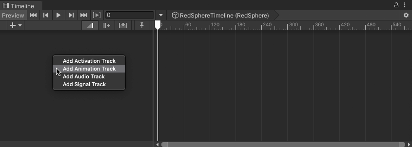
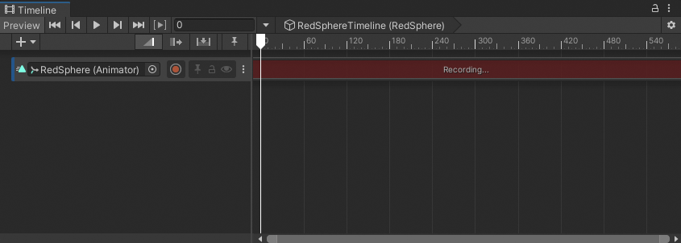
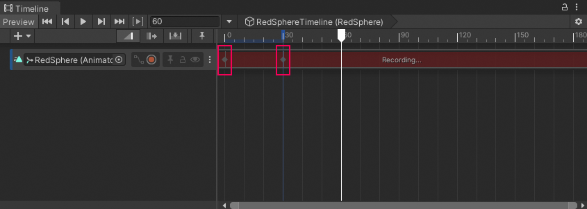
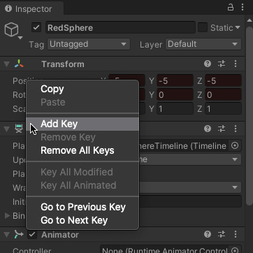
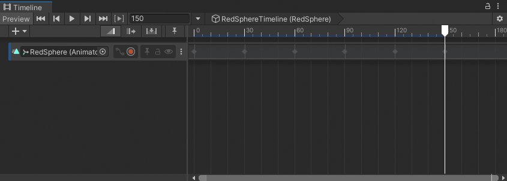
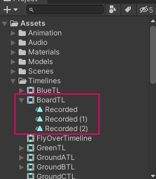

# Record basic animation

This workflow demonstrates how to record animation directly to a Timeline instance.

Before you can record animation, you must [add an empty Animation track](trk-add.md) for the GameObject that you want to animate. You must also ensure that the GameObject you want to animate has an [Animator](https://docs.unity3d.com/Manual/class-Animator.html) component.

1. To create an Animation track for a GameObject and add an Animator component to the GameObject, drag the GameObject into an empty area in the Track list and choose **Add Animation Track** from the context menu.

  

  _Drag a GameObject into the Track list and choose Add Animation Track_

  The Timeline window creates an empty Animation track bound to the GameObject. The Timeline window adds the Animator component to the GameObject.

2. In the Track header for the Animation track, click the Record button to enable Record mode.

  

  _Click the Record button on an empty track to enable Record mode_

  When a track is in Record mode, the clip area of the track is drawn in red and the Record button blinks on and off.

  When you record directly to an empty Animation track, you create an **Infinite clip**. An Infinite clip is a clip that contains basic keyframe animation recorded through the Timeline window.

  

  _Timeline window in Record mode_

  When in Record mode, any modification to an animatable property of the GameObject adds a keyframe at the location of the Timeline Playhead.

3. To start creating an animation, move the Timeline Playhead to the location of the first keyframe, and do one of the following:

  * In the Inspector window, change the value of the animatable property of the GameObject. This adds a keyframe for the property with its changed value. The keyframe appears in the Infinite clip.
  * In the Scene view, either move, rotate, or scale the GameObject. This automatically adds a keyframe for the properties you change. A diamond appears in the Infinite clip.

  

  _The red background indicates that Timeline is in record mode_

  

  _Added keyframes resemble diamonds in the Infinite clip. This Infinite clip has two keyframes._

4. Move the playhead to a different location and change the animatable properties of the GameObject. At each location, the Timeline window adds a diamond to the Infinite clip for any changed properties and adds a keyframe to its associated animation curves.

5. While in Record mode, you can right-click the name of an animatable property to perform other keying operations such as adding a keyframe without changing its value, updating the value of a keyframe, jumping to the next or previous keyframe, and removing a keyframe. For example, to add a keyframe for the position of a GameObject without changing its value, right-click **Position** and choose **Add Key** from the context menu.

  

  _Right-click the name of an animatable property to perform keying operations on the Animation curves for the property_

6. When you finish your animation, click the blinking Record button to disable Record mode.

  An Infinite clip appears as a dope sheet in the Timeline window. You cannot edit the keyframes in this view. Use [the Curves view to edit keyframes](curves-overview.md). You can also double-click the Infinite clip and edit the keyframes with the Animation window.

  

  _An Infinite clip appears as a dope sheet_

7. Save the Scene or Project to save the Timeline asset and the Infinite clip. The Timeline window saves the keyframe animation from the Infinite clip as a source asset. The source asset is named `Recorded` and saved as a child of the Timeline asset in the Project.

  For every additional recorded Infinite clip, the Timeline window numbers each clip sequentially, starting at `(1)`. For example, a Timeline asset named `BoardTL` has three recorded Infinite clips: `Recorded`, `Recorded (1)`, and `Recorded (2)`. If you delete a Timeline asset, its recorded clips are also removed.

  

  _Recorded clips are saved under the Timeline asset in the Project_

  An Infinite clip cannot be positioned, trimmed, or split in the [Content view](clip-overview.md) because it does not have a defined size: it spans the entirety of an Animation track. To perform clip actions on an Infinite clip you must [convert it to a Clip track](wf-convert-infinite.md).
