# Use markers and signals for footsteps

This workflow demonstrates how to use Timeline markers, Signal assets, and Signal Receiver components to play audio sources for footsteps.

This workflow uses the humanoid model named `DefaultMale` and animation source assets from the [Gameplay Sequence sample](samp-gameplay-demo.md) for its walk and walk to jog cycles. Consult [Timeline Samples](samp-overview.md) for information on the samples available from the Timeline package and how to import these samples into your projects.

To demonstrate how to use markers and signals, this workflow is divided into the following main tasks:
1. [Set up the Timeline instance](#setupinstance).
1. [Add files, assets, and components](#addfiles).
1. [Decide where to add markers](#addwhere).
1. [Add a marker and signal for the first left footstep](#add1stleft).
1. [Add a marker and signal for the first right footstep](#add1stright).
1. [Add markers and signals for remaining footsteps](#addrem).
1. [Preview and adjust each marker](#playadjust).

## Set up the Timeline instance

To follow along with this workflow, create a Timeline instance with a single track that animates a character with a walk cycle or any animation where the character's feet occasionally contact the floor. You can also use the result of the [Animate a humanoid](wf-anim-human.md) workflow.

The Timeline instance in this workflow, named `SignalsTL`, has a single Animation track bound to the `DefaultMale` model. The Animation track starts with a walk cycle and blends into a walk to jog cycle. The Timeline instance is associated with an empty GameObject named `Timeline`.

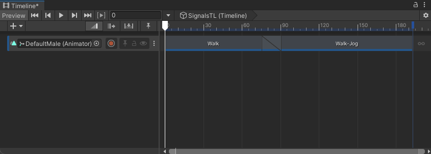

_This workflow uses a Timeline instance (SignalsTL) with the `DefaultMale` model walking then jogging_

## Add files, assets, and components

Before adding markers and signals, depending on what you want your Timeline instance to interact with, you may need to add additional files, assets, and components to your project.

For example, this workflow plays one of two different audio sources depending on which foot of the `DefaultMale` character contacts the floor. Before adding markers and signals to play footsteps, you must do the following:

1. [Add audio files](#addaudio) to your project.
2. [Add an audio source to the `LeftFoot`](#leftsrc) to play the left footstep audio file.
3. [Add an audio source to the `RightFoot`](#rightsrc) to play the right footstep audio file.

### Add Audio files to your project

This workflow uses the audio files named `footsteps1.wav` and `footsteps2.wav`. These are freeware footstep sounds downloaded from a royalty free website.

Before you can use audio files in your project, you must add them to the `Assets` folder. You can do this using one of the following methods:
* Use your operating system to copy or move the audio files to the `Assets` folder within your Project folder.
* Drag the file from your operating system onto the `Assets` folder in the Project window.
* In the Project window, select the `Assets` folder then right-click and choose **Import New Asset** from the context menu. Use the Import dialog that displays to select which files to move to the `Assets` folder.

To keep your assets organized, it is recommended that you create additional folders within your `Assets` folder for each type of asset, file, or resource. For example, you could create a folder named `Audio` to store your audio files. Unity recognizes assets and files in child folders within the `Assets` folder.

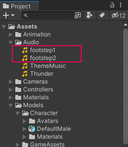

_The audio files `footsteps1.wav` and `footsteps2.wav` are copied or moved to the `Audio` folder within the `Assets` folder_

### Add an Audio Source for the left footstep

After you add audio files to your project, add an Audio Source component to play the audio file for the `LeftFoot`.

1. In the Scene Hierarchy, navigate and choose `LeftFoot` in the `DefaultMale` character hierarchy.

  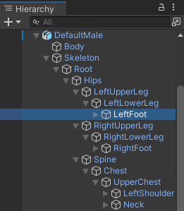

  _`LeftFoot` selected in the `DefaultMale` hierarchy_

2. With `LeftFoot` selected, in the Inspector window, click Add Component.
3. From the list of components, select **Audio** &gt; **Audio Source**.
4. In the AudioClip field, select the picker (circle) and choose the audio file to play when the `LeftFoot` touches the floor.
5. In the Audio Source component for `LeftFoot`, disable **Play On Awake** so that the Audio Source does not automatically play when switching to [Play mode in the Game view](https://docs.unity3d.com/Manual/GameView.html).

  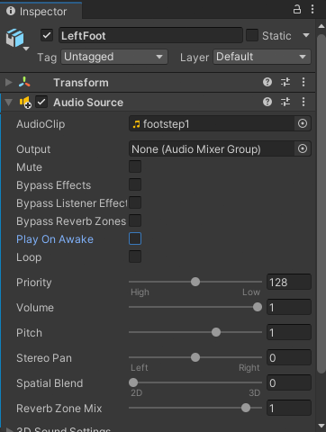

  _Audio Source for `LeftFoot` with the audio file selected and Play On Awake disabled_

### Add an Audio Source for the right footstep

After the `LeftFoot` has an Audio Source component, follow the same steps but for the `RightFoot`.

1. In the Scene Hierarchy, navigate and choose `RightFoot` in the `DefaultMale` character hierarchy.

  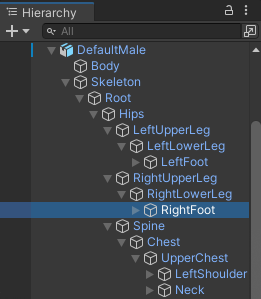

  _`RightFoot` selected in the `DefaultMale` hierarchy_

2. With `RightFoot` selected, in the Inspector window, click Add Component.
3. From the list of components, select **Audio** &gt; **Audio Source**.
4. In the AudioClip field, select the picker (circle) and choose the audio file to play when the `RightFoot` touches the floor.
5. In the Audio Source component for `RightFoot`, disable **Play On Awake** so that the Audio Source does not automatically play when switching to [Play mode in the Game view](https://docs.unity3d.com/Manual/GameView.html).

  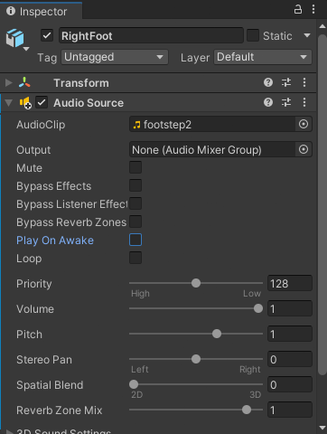

  _Audio Source for `RightFoot` with the audio file selected and Play On Awake disabled_

## Decide where to add markers

After audio files are imported and Audio Source components are created, the next step is to add Timeline markers that play these audio sources at specific points in time.

In the Timeline window, you can add Timeline markers to any track associated with a GameObject. The most appropriate track to add Timeline markers depends on what you want these markers to interact with.

In this workflow, you want these Timeline markers to play the audio sources that have been added to the `LeftFoot` and `RightFoot` GameObjects. These GameObjects are in the `DefaultMale` hierarchy. For this reason, you should add Timeline markers to the Animation track bound to the `DefaultMale` hierarchy.

## Add a marker and signal for the first left footstep

In this step, you add a marker, set its properties, and create a Signal Asset for the first left footstep on the `DefaultMale` Animation track. You will also add a Signal Receiver component to the `DefaultMale` GameObject.

1. Move the Timeline Playhead to where the `DefaultMale` character's left foot first touches the floor. The Playhead Location field displays the time in frames. In this workflow, the left foot first touches the floor at frame 27.

1. On the Track Header for the `DefaultMale` Animation track, click the More menu (⋮) and choose **Add Signal Emitter**. This adds a Timeline marker to the Animation track, at the location of the Timeline Playhead.

  When you add a Timeline marker, you choose the Signal Emitter type for the Timeline marker being added. By default, the Signal Emitter type is the only available type of emitter.

  When you add a Timeline marker, it is automatically selected and its properties display in the Inspector window. If the Inspector window does not display the Timeline marker properties, click the Timeline marker to select it.

  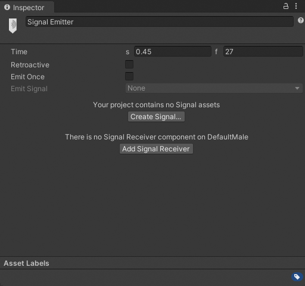

  _Inspector window with the Create Signal and Add Signal Receiver buttons_

  In the Timeline window, notice that this Timeline marker is drawn with a warning icon. This indicates that the Timeline marker is not yet linked to a Signal Asset.

  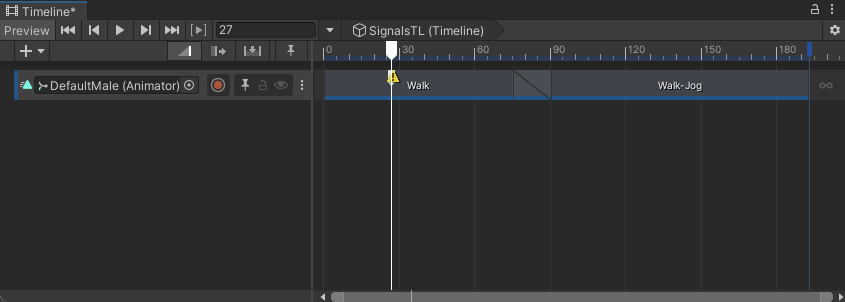

  _Timeline marker added to the `DefaultMale` Animation track with a warning icon_

1. To remove the warning icon, you can either create a new Signal Asset or associate the marker with an existing Signal Asset. In this workflow, since you have yet to create a Signal Asset for the left foot, do one of the following:
  * If your project contains no Signal assets, the Inspector window prompts you to click the **Create Signal** button.
  * If your project contains at least one Signal Asset, choose **Create Signal** from the **Emit Signal** dropdown menu.

  A dialog box prompts you for the name and location of the Signal asset you are creating. You can also specify tags to identify the Signal asset.

1. Name the Signal Asset, choose a location, and click **Save**.

  A Signal Asset defines the relationship between the Timeline Marker and the Signal Receiver. You can reuse a Signal Asset multiple times for many different Timeline Markers.

  This workflow names the Signal Asset `LeftFootSignal.Signal` to differentiate it from the Signal Asset for the right foot and to distinguish it from the `LeftFoot` GameObject.

  This workflow also saves Signal Assets to the folder named `Signals`, within the `Assets` folder. The `Signals` folder is optional. It is used to organize the assets in the Assets folder.

1. Click **Add Signal Receiver** to create and define a Signal Receiver component.

  The Signal Receiver component is added to the GameObject bound to the track with the selected Timeline marker. In this workflow, the Signal Receiver component is added to the `DefaultMale` GameObject.

  With the Timeline marker selected, the Inspector window displays the same properties as the Signal Receiver component except for the **Receiver Component on** property.

  The table in the Signal Receiver properties include a Signal column and a Reaction column. The Signal column lists the signals that the Signal Receiver receives. The Reaction column defines the actions that are performed when a signal is received.

  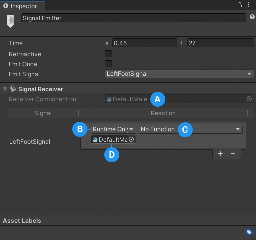
  _blah_

  **(A)** The GameObject with this Signal Receiver component 
  **(B)** Reaction type 
  **(C)** Destination function 
  **(D)** Reaction destination 

1. In the Reaction column, select **Editor and Runtime** as the Reaction type. This ensures that the Signal Receiver reacts to the emitted signal during Timeline preview, Editor Play mode, and during Runtime.

1. Below the reaction type, select the GameObject that receives the signal. Since this Signal Receiver is meant to play the footstep Audio Source associated with the `LeftFoot`, select `LeftFoot` as the Reaction destination instead of `DefaultMale`.

1. To define the reaction, click **No Function** and select **Audio Source** &gt; **Play()** to play the footstep sound from the Audio Source component.

  Defining the reaction chooses which method is called and from which component. The available methods depends on the components added to the GameObject that receives the signal.

  In this workflow, the `Play()` method does not accept parameters. If you select a method that accepts parameters, the parameters would be listed beneath the select component and function.

1. Lastly, make sure **Retroactive** and **Emit Once** are disabled. These properties are disabled by default.

## Add a marker and signal for first right footstep

In this step, you add a marker, set its properties, and define a Signal Asset for the first right footstep. These steps are simplified because they are similar to adding a [marker and signal for the first left footstep](#add1stleft).

1. Move the Timeline Playhead to where the `DefaultMale` character's right foot first touches the floor. In this workflow, the right foot first touches the floor at frame 64.

1. On the Track Header for the `DefaultMale` Animation track, click the More menu (⋮) and choose **Add Signal Emitter**. This adds a Timeline marker to the Animation track, at the location of the Timeline Playhead.

  When you add a Timeline marker, it is automatically selected and its properties display in the Inspector window. If the Inspector window does not display the Timeline marker properties, click the Timeline marker to select it.

1. In the Inspector window, make sure **Retroactive** and **Emit Once** are disabled. These properties are disabled by default.

1. In the Inspector window, to remove the warning icon from the Timeline marker and create a new Signal Asset, choose **Create Signal** from the **Emit Signal** dropdown menu.

  A dialog box prompts you for the name and location of the Signal asset you are creating. You can also specify tags to identify the Signal asset.

1. Name the Signal Asset `RightFootSignal.Signal` to differentiate it from the Signal Asset for the left foot and to distinguish it from the `RightFoot` GameObject. Choose a location and click **Save**.

  This workflow saves Signal Assets to the folder named `Signals`, within the `Assets` folder. The `Signals` folder is optional. It is used to organize the assets in the Assets folder.

  When the `RightFootSignal.Signal` is saved, a new row is added to the table in Signal Receiver properties. You don't have to add a new Signal Receiver component because this component was added to the `DefaultMale` GameObject when you created the first signal for the left foot.

1. In the Reaction column for the `RightFootSignal` row, select **Editor and Runtime** as the Reaction type and select the `RightFoot` GameObject as the Reaction destination.

1. Click **No Function** and select **Audio Source** &gt; **Play()** to play the footstep sound from the Audio Source component.

  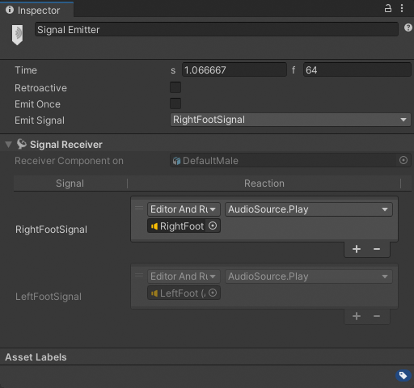
  _Inspector window for the first right footstep Timeline marker_

## Add markers and signals for additional footsteps

In this step, for the additional footsteps, you reuse each created Signal Asset based on which foot touches the floor. This is similar to adding a marker and signal in the previous steps.

The difference is that the Signal Assets for playing either footstep sound has already been created. Instead of creating new Signal Assets, you will reuse previous assets.

1. Move the Timeline Playhead until the character's next foot touches the floor. In this workflow, this occurs at frame 100.

2. On the Track Header for the `DefaultMale` Animation track, click the More (⋮) menu and choose **Add Signal Emitter from Signal Asset**. An Object Picker window displays prompting you to select a Signal Asset.

3. Because the `LeftFoot` touches the floor, select the `LeftFootSignal` Signal Asset and close the Object Picker window.

  This adds a new Timeline marker of the Signal Emitter type to the `DefaultMale` Animation track. The new Timeline marker is selected and its properties display in the Inspector window.

  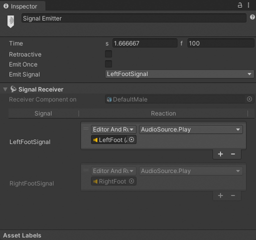

  _Inspector window for the second left footstep Timeline marker which reuses the LeftFootSignal Asset_

4. Repeat these steps for each remaining frame where either the `LeftFoot` or `RightFoot` of the `DefaultMale` character contacts the floor.

  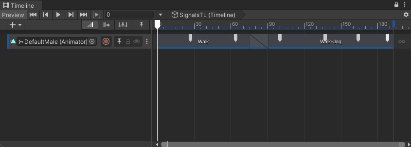

  _The SignalsTL Timeline instance with markers for each foot contact_

  For example, in this workflow, after adding Timeline markers for the first two foot steps, there are four additional frames where either foot of the `DefaultMale` character contacts the floor:
  * `LeftFoot` at frame 100 (set above)
  * `RightFoot` at frame 137
  * `LeftFoot` at frame 164
  * `RightFoot` at frame 188

## Play and adjust each marker

After you add a marker for every occurrence where the `LeftFoot` or `RightFoot` of the `DefaultMale` character touches the floor, click the Play button in the [Timeline Playback Controls](tl-play-ctrls.md) to preview the result.

As each foot touches the floor, you might need to adjust the location of each Timeline marker to ensure that the footstep sound corresponds with each footstep.
