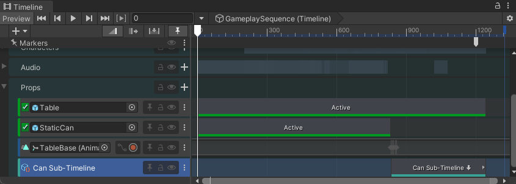
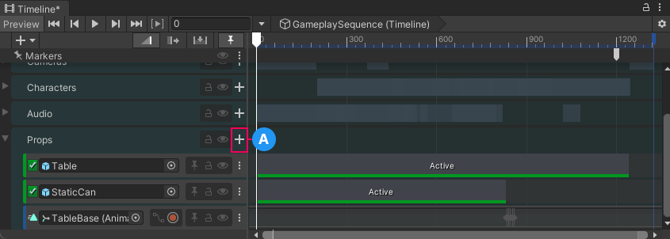
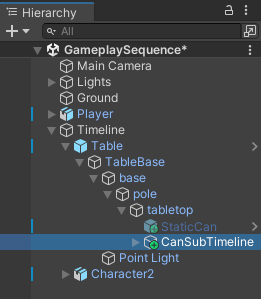
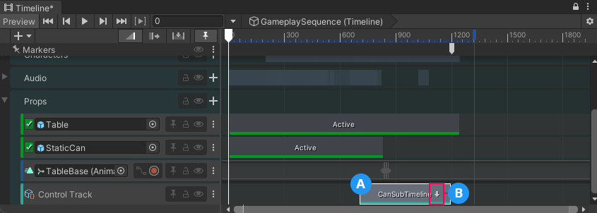
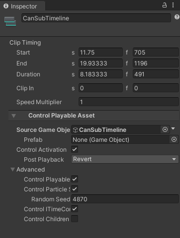

# Create a Sub-Timeline instance

This workflow demonstrates how to create a single cut-scene by nesting a Timeline instance within another Timeline instance.

This workflow uses the [Gameplay Sequence sample](samp-gameplay-demo.md). Consult [Timeline Samples](samp-overview.md) for information on the samples available from the Timeline package and how to import these samples into your projects.

To demonstrate how to combine two Timeline instances, this workflow is divided into the following main tasks:
1. [Set up the main Timeline instance](#setupinstance).
1. [Add a Control track and create a Sub-Timeline instance](#subtimeline).
1. [Adjust the Control clip](#adjclip).
1. [Play the result](#playresult).

## Set up the main Timeline instance

This workflow demonstrates how to combine two Timeline instances to create a single cut-scene. By default, in the Gameplay Sequence Demo scene, the `CanSubTimeline` Sub-Timeline instance is already combined with the `GameplaySequence` Timeline instance.

Before demonstrating how to combine two Timeline instances, remove the Sub-Timeline instance. To do this, follow these steps:

1. Load the `GameplaySequence` scene and open the `GameplaySequence` Timeline instance in the Timeline window.

    Consult [Gameplay Sequence Demo](samp-gameplay-demo.md) for the steps on how to load the `GameplaySequence` scene and display the `GameplaySequence` Timeline instance.

1. In the Timeline window, expand the Props Track group.

    The Props Track group contains tracks that activate and animate the `Table` and `Can` GameObjects. The Props Track group also contains the `Can Sub-Timeline` Control track that nests the `CanSubTimeline` Timeline instance. This Timeline instance animates the `Can` GameObject as it bounces and falls off the table.

    
    _The Props Track group expanded in the Timeline window with the Can Sub-Timeline track selected_

    Since this workflow demonstrates how to combine two Timeline instances, you should remove the nested `CanSubTimeline` Timeline instance.

1. To remove the nested `CanSubTimeline` Timeline instance, delete the `Can Sub-Timeline` Control track.

    To delete the `Can Sub-Timeline` Control track, select the More (⋮) menu from its Track Header and choose **Delete**. This is one way to delete a track from a Timeline instance. The Timeline window includes other ways [to delete a track](trk-delete.md).

## Add a Control track and create a Sub-Timeline instance

To nest the `CanSubTimeline` Timeline instance within the `GameplaySequence` Timeline instance, do the following:

1. In the scene, select the GameObject associated with the Timeline instance that will be the main Timeline instance.

    In this workflow, the `GameplaySequence` is the main Timeline instance. It is associated with the `Timeline` GameObject.

    

    _Select the `Timeline` GameObject to display the `GameplaySequence` Timeline instance in the Timeline window_

1. When the Timeline window displays the `GameplaySequence` Timeline instance, enable the Lock icon.

    When locked, the Timeline window does not change when you select GameObjects. This makes it easier to set up or modify a Timeline instance.

1. Add a Control track to the Props Track group.

    To do this, click the **Add** (**+**) button beside the Prop Track group name, and choose **Control Track**.

    

    _The Add button (A) beside the Prop Track group name._

    A new Control Track is added at the end of the Prop Track. You may have to scroll the Timeline window to view the new Control track.

    A Control track is a special track for adding a Particle System, a Prefab instance, a ITimeControl Script, or a nested Timeline instance.

1. In the Scene Hierarchy, find the GameObject that is associated with the Timeline instance to be nested.

    In this workflow, you want to nest the `CanSubTimeline` Timeline instance which is associated with the `CanSubTimeline` GameObject. This GameObject is within the `Table` hierarchy.

    

    _The CanSubTimeline is associated with CanSubTimeline GameObject_

1. Select and drag the `CanSubTimeline` GameObject into the Control track that you added to the Props Track group.

    The Timeline window places a Control clip where you release the `CanSubTimeline` GameObject. The Control clip is set to the same size as the `CanSubTimeline` Timeline instance.

    When a Timeline instance is nested within another Timeline instance, the nested instance is referred to as a Sub-Timeline instance.

    

    **(A)** Control track with a Control clip. 
    **(B)** Downward arrow in the Control clip indicates that the Control clip contains a Sub-Timeline instance. 

1. To view and Sub-Timeline instance, double-click its Control clip.

    The **Local** or **Global** button indicates whether the Timeline ruler displays the time local to the Sub-Timeline instance or the time global to the main Timeline instance.

    When you edit a Sub-Timeline instance, the Timeline title displays a breadcrumb list of Timeline and Sub-Timeline instances. There can be many nested Sub-Timeline instances.

    

    **(A)** Local or Global button. 
    **(B)** Sub-Timeline instance with breadcrumb list or nested Sub-Timeline instances. 

    You cannot change the duration of the Sub-Timeline instance. You must return to the main Timeline instance and change the duration of the Control clip to change the duration of the Sub-Timeline instance.

1. Click the name of the main Timeline instance, in the breadcrumb list beside the Timeline selector, to return to the main Timeline instance.

## Adjust the Control clip

After you create a Sub-Timeline instance, you may have to reposition its Control clip to ensure a smooth transition between the animation in the main Timeline instance and the Sub-Timeline instance.

For example, in this workflow, when the character bumps into the table, the `TableBase` Animation track animates the table before the Sub-Timeline takes control and animates the can.

To ensure a smooth transition between these two animations, the Control clip must be repositioned to when the table begins to move. To do this, follow these steps:

1. In the Timeline instance, select the Control clip for the Can Sub-Timeline.

    

    _The properties for the CanSubTimeline Control clip display in the Inspector window_

1. Set the **Start** for the Control clip to frame 833.

    This is the last frame when the `StaticCan` Activation clip is active. This is also the frame when the `TableBase` keyframe animation begins.

## Play the result

To properly preview the entire cut-scene, including the `Player` character with the looping jog animation, click [Play in the Game View](https://docs.unity3d.com/Manual/GameView.html).

If you attempt to preview this animation in the Timeline window, the `Player` character is shown in a T-Stance for most of the cut-scene because the `jog` Animator state is only available during runtime.
